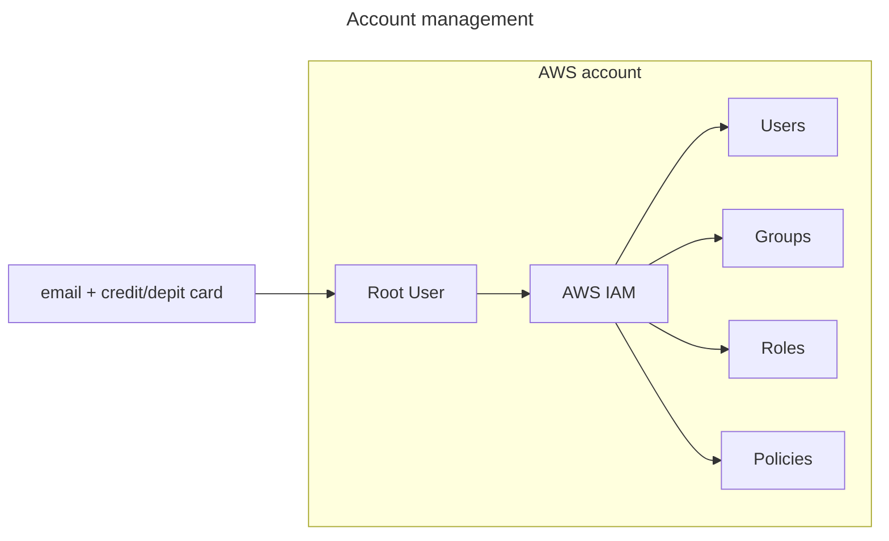

# AWS account

To create an AWS account, we need a `Credit/Debit Card` + `Unique email`. 

When we create a new user, we actually create an `Account Root User`.

## Best practices
* Optionally, with an `Account Root User`, you can create [IAM](../services/iam.md) accounts and use them instead of using the `Root User` directly.

* We can use a dynamic alias: e.g. `youremail+aws@gmail.com`

---
## !! START HERE !!

### 1. Create account
1. Search on google `AWS free tier` and create a new account
2. When finish, navigate to the `IAM` menu and create an `Account Alias`.
   We do this, because we need either the `Account-ID` or the alias, in order to 
   connect as a `IAM` user (see the `Sign-in URL`).
3. **Add `MFA` for `Root User`: Search `IAM` -> Add `MFA`**
    
### 2. Enable regions
In case you want to enable more regions follow these steps.
1. Login
2. `Upper right corner` --> `Account`
3. `AWS Regions`

### 3. Access billing to IAM
1. Login to AWS
2. Upper right
3. Account
4. Scroll down
5. In `IAM user and role access to Billing information` click on `edit`.
6. Activate `IAM Access`
7. Update
8. DONE!
   
### 4. Billing preferences
1. Login to AWS
2. Upper right
3. Account
4. `Preferences and Settings`
5. `Billing Preferences`
6. Enable `Alert preferences` (both of them)
7. Enable `Invoice delivery preferences via PDF`
8. DONE!
   

### 5. Budgets & Alarms
1. Login to AWS
2. Upper right
3. Account
4. `Billing and Payments`
5. `Budgets`
6. `Create a budget`
7. Select a template (e.g. `monthly cost budget`)
8. If needed add a budgeted amount 
9. Enter your email
10. Create budget
11. DONE!
    
### 6. Cloudwatch Notifications (associated to a specific region)
1. Login to AWS
2. Search for `Cloudwatch`
3. Alarms
4. All alarms
5. Create new
6. `Select metric`
7. `Billing`
8. `Total estimated charge`
9. Check `USD`
10. `Select metric`
11. Defile the threshold value
12. `Next`
13. `Create new topic`
14. Give email
15. `Create topic`
16. `Next`
17. Give a name
18. `Next`
19. `Create Alarm`
20. Comfirm email

#### 7. Monitor IP addresses (Optional)
1. Login to AWS
2. Search `IP Address Manager`
3. Create `IPAM`