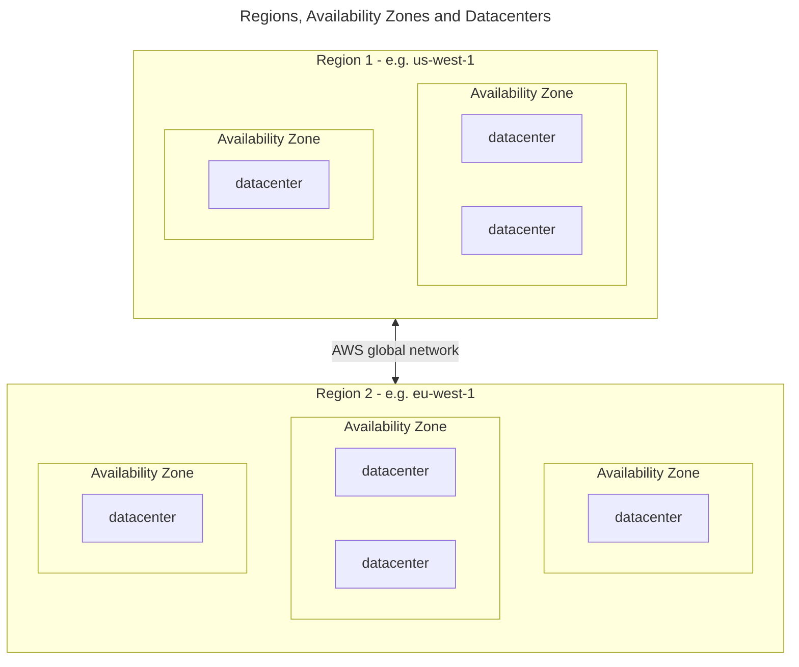

# AWS

---

### Regions
A Region is a physical location around the world where AWS clusters its data centers.

e.g., `us-east-1a`, `us-east-1b`, `us-east-1c`

**Use Cases:**
- Deploying applications closer to end-users to reduce latency.
- Meeting regulatory and compliance requirements for data locality.
- Setting up disaster recovery strategies with multi-region backups.

### Availability zones
An Availability Zone is one or more discrete data centers within a Region. Each AZ has independent power, cooling, and networking but is connected to other AZs in the same Region through low-latency links.

**Use Cases:**
- High availability architectures by distributing applications across multiple AZs.
- Fault tolerance by replicating data in multiple AZs.
- Running critical workloads without a single point of failure.

---

## Service types

### **1. Infrastructure as a Service (IaaS)**
Provides virtualized computing resources over the internet. This includes servers, storage, and networking.

**Examples:**
1. [Amazon EC2 (Elastic Compute Cloud):](./services/ec2.md)
Provides virtual servers to run applications.  

1. [Amazon S3 (Simple Storage Service):](./services/s3.md)
Scalable object storage for backup, data archiving, and big data analytics.  

1. **Amazon VPC (Virtual Private Cloud):**  
Allows you to define and control a virtual network isolated from other AWS customers.  

---

### **2. Platform as a Service (PaaS)**
Provides a managed platform for developing, running, and managing applications without dealing with the underlying infrastructure. Only provide code/app.

**Examples:**
1. **AWS Elastic Beanstalk:**  
Automatically handles deployment, scaling, and monitoring of web applications.  

2. [AWS Lambda:](../services/lambda.md)  
Serverless compute service where you run code in response to events.  

3. [AWS RDS (Relational Database Service):](../services/rds.md)
Managed database service for relational databases.  

---

### **3. Software as a Service (SaaS)**
Provides complete software applications that run on cloud infrastructure. Everything is managed.

**Examples:**
1. **Amazon WorkSpaces:**  
A managed, secure cloud desktop solution.  

2. **Amazon Chime:**  
A communication service for video conferencing, chat, and screen sharing.  

3. **Amazon QuickSight:**  
A business intelligence service to create interactive dashboards and visualizations.  

---

### Summary:

| Model   | Definition                                  | AWS Example                          | Use Case                                   |
|---------|--------------------------------------------|---------------------------------------|-------------------------------------------|
| **IaaS** | Virtualized computing resources            | Amazon EC2, Amazon S3                | Hosting a website, storing backups        |
| **PaaS** | Managed platform for application development | AWS Elastic Beanstalk, AWS Lambda    | Deploying web apps, running serverless code |
| **SaaS** | Ready-to-use software applications         | Amazon WorkSpaces, Amazon QuickSight | Remote work, data analysis                |

Full AWS services comparison is available [here](./saas-paas-vs-iaas.md).

---
