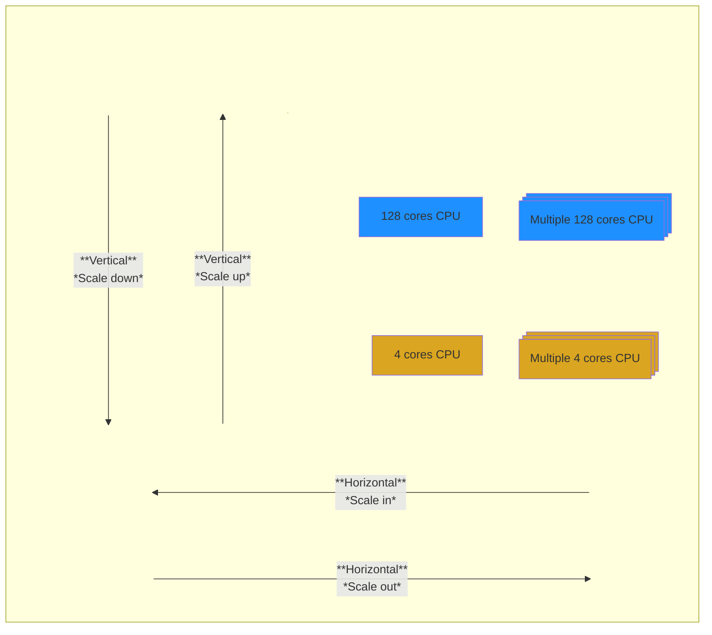

# Cloud Models

## Private Cloud
On-premises

## Public Cloud

Essential characteristics of cloud computing, as defined by the National Institute of Standards and Technology (NIST):

1. On-demand, self-service
2. Broad network access
3. Multi-tenancy & Resource pooling
4. Rapid elasticity & scalability
5. Measured services

## Hybrid Cloud
Merging private and public clouds.

> [!NOTE]
>
> One of the main advantages of the cloud is **Scalability** and **High availability**.
>
> **Scalability** is related but is NOT the same to **High availability**
> 
> **Scalability** can be:
>   * **Vertical**: Increase size of resource (limit is the hardware). E.g. 4 Cores -> 8 Cores
>   * **Horizontal** (= elasticity): Increase the number of used resources. E.g. 1 CPU -> 3 CPUs
>       This means that we have to handle a distributed system.
>
> **High availability**
>   * Closely related to elasticity.
>   * Running applications in independent physical systems, so, in case of a disaster, application
>       is still running.

## CapEx (Capital Expenditures) vs OpEx (Operational Expenditures)

| Aspect	| CapEx	| OpEx |
|-------| ------| ----- |
| Nature	| Long-term investment.	| Day-to-day operational costs. |
| Accounting	| Depreciated/amortized over time.	| Fully expensed in the period. |
| Cash Flow	| Large upfront cost.	| Regular, recurring payments. |
| Examples	| Buying equipment, property.	| Rent, utilities, cloud services. |
| Tax Treatment	| Deducted over years via depreciation.	| Fully deductible in the current year. |
| Recap | Purchase servers | Pay as you go |

## AWS Shared responsibility model
See: https://d1.awsstatic.com/security-center/Shared_Responsibility_Model_V2.59d1eccec334b366627e9295b304202faf7b899b.jpg
