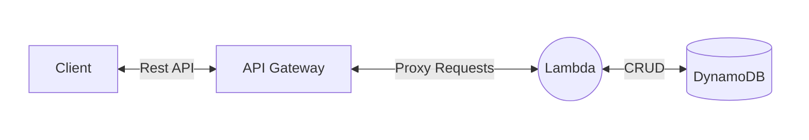

# API Gateway
AWS API Gateway is a **fully managed** service that allows you to create, publish, maintain, monitor, and secure APIs for your applications. It acts as an **interface** between clients (such as web or mobile applications) and backend services (such as AWS [Lambda](./lambda.md) functions, [EC2](./ec2.md) instances, or any HTTP endpoint).

| Feature | Description |
| ------- | ------------| 
| API Creation and Management | Easily create RESTful, WebSocket, or HTTP APIs with minimal setup and configuration.
| Serverless | Integrates seamlessly with AWS [Lambda](./lambda.md), allowing you to build [serverless](../onboarding/serverless.md) applications that don’t require you to manage servers.
| Scalable | Automatically scales to handle large numbers of API calls without any manual intervention.
| Routing and Transformation | You can route requests to different backend services and perform transformations (e.g., converting XML to JSON) before sending the request to the backend.
| Authentication and Authorization | Supports a variety of authentication mechanisms (IAM, Lambda authorizers, Amazon Cognito, etc.) to secure your APIs.
| Traffic Management |  Provides features like throttling, request validation, and rate limiting to ensure your API performs well under high traffic loads.
| Monitoring and Logging | Integrated with Amazon CloudWatch, allowing you to monitor API performance, track errors, and log requests/responses for debugging.
| API Versioning | Supports versioning, so you can manage different versions of your API without disrupting users.
| Cost-Effective |  Pay-as-you-go pricing model, where you only pay for the API calls you handle and the data transferred.

Example
