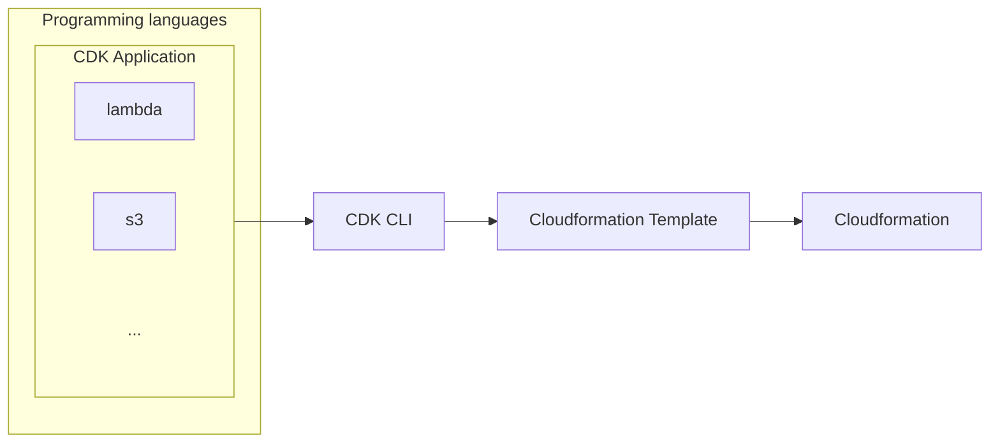

# Cloud Development Kit (CDK)
The AWS Cloud Development Kit (CDK) is an **Infrastructure as Code (IaC)** framework that allows you to define cloud infrastructure using programming languages like **TypeScript, Python, Java, C#, and Go** instead of writing raw **YAML/JSON** templates like in [AWS CloudFormation](./cloudformation.md).

> [!NOTE]
> Using **CDK** both application and infrastructure can be written together in the same language.

> [!WARNING]
> For a full comparison between different IaC solutions in AWS, read [this](./aws-iac-comparison.md).


**Example**:
```python
from aws_cdk import core
import aws_cdk.aws_s3 as s3

class MyS3Stack(core.Stack):
    def __init__(self, scope: core.Construct, id: str, **kwargs):
        super().__init__(scope, id, **kwargs)

        s3.Bucket(self, "MyBucket", bucket_name="my-cdk-bucket")

app = core.App()
MyS3Stack(app, "MyS3Stack")
app.synth()
```

**Use cases**:
- When deploying with docker via [ECS](./ecs.md)/[EKS](./eks.md).
- When deploying with [Lambda](./lambda.md) functions.

