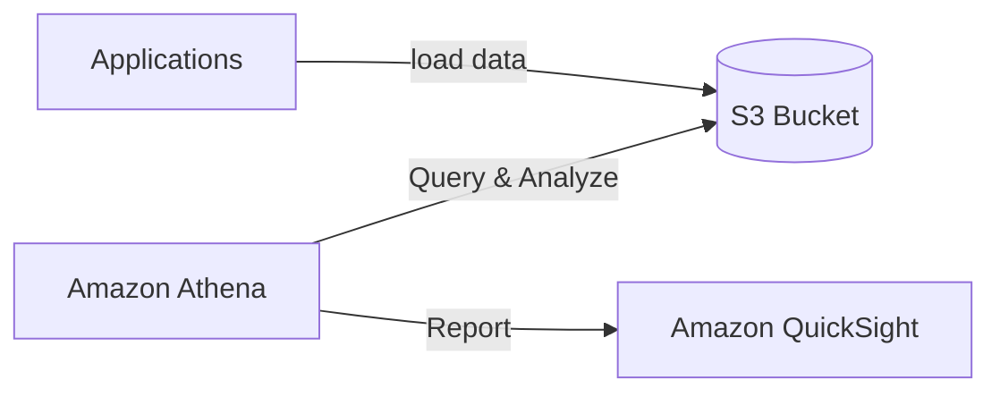
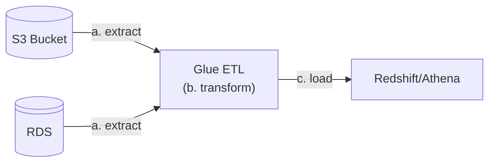
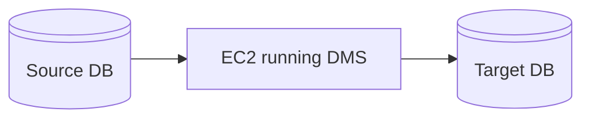

# Databases & Analytics Summary in AWS

| Service                     | Description                                                                                      |
|-----------------------------|--------------------------------------------------------------------------------------------------|
| [RDS & Aurora](#rds--aurora)           | Managed **relational** databases for **OLTP** with SQL engine support (MySQL, PostgreSQL, etc.).        |
| [ElastiCache](#elasticache)            | **In-memory** database service optimized for real-time applications (Redis, Memcached).             |
| [DynamoDB](#dynamodb)                 | Fully managed **NoSQL** key/value database with high throughput and serverless scalability.          |
| [Redshift](#redshift)                    | **OLAP** data **warehouse** designed for analytics and complex queries on large datasets.             |
| [Elastic MapReduce (EMR)](#elastic-mapreduce-emr)                 | Managed big data platform for creating **Hadoop** or Spark clusters.                                |
| [Athena](#athena)                | **Serverless** query engine for analyzing data in Amazon S3 using SQL.                         |
| [QuickSight](#quicksight)           | **Business Intelligence (BI)** service for interactive dashboards and real-time insights.   |
| [DocumentDB](#documentdb)            | Managed **NoSQL** database for JSON data, fully compatible with MongoDB.                   |
| [Quantum Ledger Database (QLDB)](#quantum-ledger-database-qldb)            | **Immutable** ledger database for tracking and verifying transactions cryptographically.               | 
| [Managed Blockchain](#managed-blockchain) | **Blockchain** service for creating private or public networks using Ethereum or Hyperledger Fabric.| 
| [Glue](#glue)          | **Serverless ETL** service for data preparation and transformation.                                 |
| [Database Migration Service (DMS)](#database-migration-service-dms)                     | **Migration** service to securely move databases with minimal downtime.                            |
| [Neptune](#neptune)                | Fully managed **graph database** for storing and querying highly connected datasets.                | 
| [Timestream](#timestream)            | **Serverless time-series** database for IoT and operational analytics.                             |

---

## [RDS](./rds.md) & Aurora
- Managed **relational database** services designed for **Online Transaction Processing (OLTP)**.
- Supports **SQL** engines like MySQL, PostgreSQL, Oracle, and SQL Server.
- Offers [Multi-AZ/Region deployments, read replicas,](./rds.md#rds-deployments) and automated backups.

---

## [ElastiCache](./elasticache.md)
- Managed **in-memory** data store service for **caching** and session management.
- Supports **Redis** and **Memcached**.
- Ideal for real-time applications requiring **low-latency** data access.

---

## [DynamoDB](./dynamodb.md)
- Fully managed **NoSQL** database for **key/value** storage.
- **Serverless** with high scalability and predictable performance.
- **DAX** (DynamoDB Accelerator) provides caching for faster queries.

---

## Redshift
- Fully managed **Online Analytical Processing (OLAP)** database for analytics and complex queries (analyzing data).
- Stores data in a **columnar format** (NOT rows), supports **Massively Parallel Processing** (MPP).
- Integrated with BI tools for data visualization and reporting.
- Pay-as-you-go
- SQL interface
- Not frequent data load, maybe every hour for example.

### Redshift Serverless
- **Pay-as-you-go** OLAP service.
- Automatically provisions and scales without managing warehouse infrastructure.
- Best for **Dashboards, real-time analytics**.

---

## Elastic MapReduce (EMR)
- Managed cluster platform for big data processing that support hundreds of EC2s.
- Supports frameworks like **Hadoop, Spark, and HBase**.
- Use cases include **machine learning**, data transformation, big data, data processing, and ETL workflows.

---

## Athena
- Serverless **SQL** query service for analyzing data in **Amazon S3**.
- Built on **Presto**, supports standard SQL and formats like **CSV, JSON**, and Parquet.
- Cost-effective (~$5 per TB of data scanned) can analyze compressed data too.
- Best for Business intelligence, analytics and reporting.

---

## QuickSight
- Scalable **Business Intelligence (BI)** service for creating **interactive dashboards** and **visualizations**.
- Supports both traditional data sources and streaming for **real-time analytics**.
- Integrates with AWS services like **S3, RDS, and Redshift**.
- Perfect for **ad-hoc analysis**.

---

## DocumentDB
- Managed **NoSQL** document database designed for **JSON** data storage.
- Fully compatible with **MongoDB**.
- **Automatically** replicates data across three availability zones, scales, and provides increment of 10GB.

---

## Quantum Ledger Database (QLDB)
- **Immutable** ledger database for tracking transactions.
- Cryptographically verifiable **history of changes**.
- Ideal for **financial** applications and compliance **tracking**.
- Serverless and centralized.

---

## Managed Blockchain
- Blockchain service for creating **decentralized** or **private networks**.
- Supports Ethereum and Hyperledger Fabric.
- Eliminates the need for a **trusted authority** to verify transactions.

---

## Glue
- Managed **Extract, Transform, Load (ETL)** service.
- **Prepares and transforms** data for analytics.
- Includes `Glue Data Catalog` (Catlog of datasets) for metadata management.

---

## Database Migration Service (DMS)
- Database Migration Service to securely move databases with minimal downtime, since the source remains available.
- Supports **homogeneous** (e.g., MySQL to MySQL) and **heterogeneous** (e.g., SQL Server to Aurora) migrations.

---

## Neptune
- Fully managed **graph** database optimized for connected datasets.
- Supports **billions of relationships** for use cases like **fraud detection**, **knownledge graph**, and **social networks**.

---

## Timestream
- **Serverless** time-series database for storing evolving data.
- Automatically scales to handle **trillions of events** per day.
- Ideal for IoT and operational analytics.

