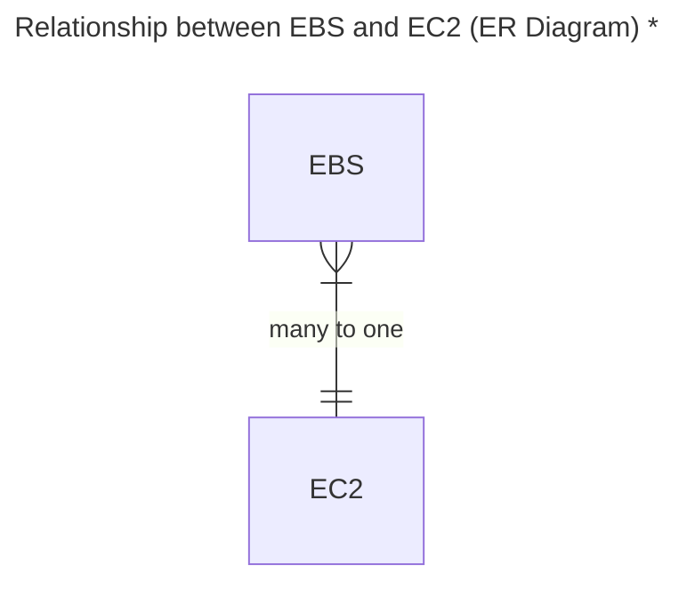
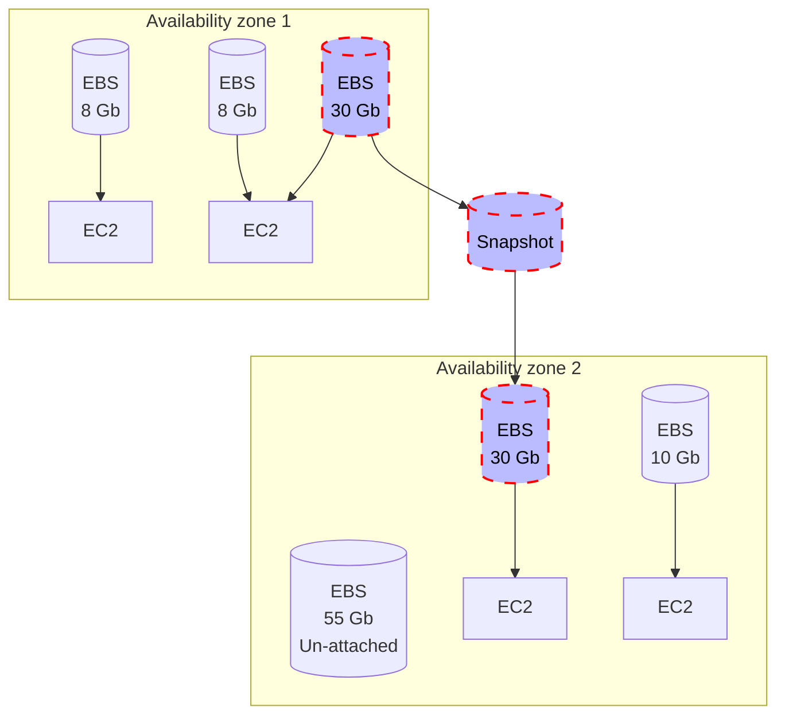

# Elastic Block Storage (EBS)
A high-performance block network storage service offered by AWS, designed to work with [EC2](./ec2.md) instances. 

It provides persistent, scalable, and reliable storage that can be used for a wide variety of workloads, including databases, file systems, and applications requiring low-latency and high-throughput.

> [!CAUTION]
> \* This is assumed in the Certified Cloud Practitioner. In the Associate Lever "multi-attach" is possible for some EBS.

**Volume and Instance need to be in the same Availability Zone!**
**To move an EBS to another AZ we need first to create a snapshot**

### Types of EBS Volumes

EBS offers different types of volumes optimized for specific use cases:

| Volume Type                   | Description                                                                                         |
|-------------------------------|-----------------------------------------------------------------------------------------------------|
| General Purpose SSD (gp3, gp2) | Ideal for most workloads, including boot volumes, small to medium-sized databases, and development environments. |
| Provisioned IOPS SSD (io2, io1) | High-performance volumes designed for latency-sensitive and transactional workloads such as large databases. |
| Throughput Optimized HDD (st1) | Cost-effective storage for workloads requiring high throughput, such as big data, data warehouses, and log processing. |
| Cold HDD (sc1)                 | Lowest-cost storage for infrequently accessed data, like archival storage.                         |
| Magnetic (Standard)            | Legacy storage option with lower performance, typically replaced by SSD or HDD options.           |

Read also [EFS differences to EBS](./efs-vs-ebs.md).

## Utilization Steps
1. Create Volume (must me in the same Availability zone as the EC2 that to use with)
2. Attach Volume
3. Login to your EC2
4. Create partition
5. Format partition
6. Mount partition
7. Utilize
8. At the end, umount from the EC2
9. Then, using AWS API detach volume and delete it to stop extra charges

## Snapshots (Back ups)
It is a good practice for applications, like databases, that handle data
to take snapshots of volumes, so, we can revert back to a previous stage.

In case of a disaster, data failure:
1. Stop any services that are running (EC2) 
2. Umount partition (EC2)
3. Rename the volume as failure or anything else for easier handling (AWS API)
4. Detach volume (AWS API)
5. Create new volume from snapshot (AWS API)
6. Attach the newly created volume (AWS API)
7. Mount partition (EC2)

---

## CLI

