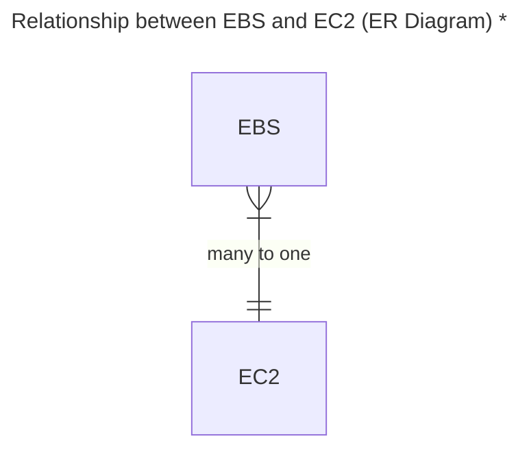
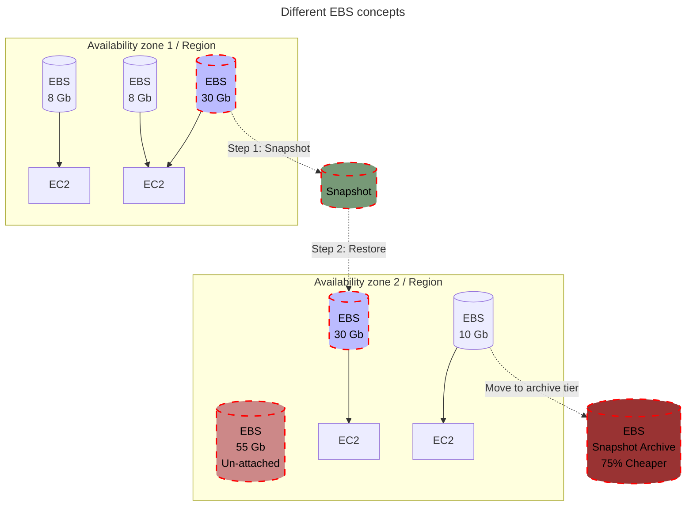

# Elastic Block Storage (EBS)
A high-performance block network storage service offered by AWS, designed to work with [EC2](./ec2.md) instances. 

It provides persistent, scalable, and reliable storage that can be used for a wide variety of workloads, including databases, file systems, and applications requiring low-latency and high-throughput.

> [!IMPORTANT]
> To find differences between `EBS`, `EFS` and `Instance store` read [this](./ebs-vs-efs-vs-instance-store.md).

---

> [!CAUTION]
> \* This is assumed in the Certified Cloud Practitioner. In the Associate Level "multi-attach" is possible for some EBS.

**Points to consider:**
1. **Volume and Instance need to be in the same Availability Zone!**
2. **To move an EBS to another AZ we need first to create a snapshot**
3. **To restore from archive tier it can take 24-72 hours**
4. **We can also enable a Recycle Bin**

---

### Types of EBS Volumes

EBS offers different types of volumes optimized for specific use cases:

| Volume Type                   | Description                                                                                         |
|-------------------------------|-----------------------------------------------------------------------------------------------------|
| General Purpose SSD (gp3, gp2) | Ideal for most workloads, including boot volumes, small to medium-sized databases, and development environments. |
| Provisioned IOPS SSD (io2, io1) | High-performance volumes designed for latency-sensitive and transactional workloads such as large databases. |
| Throughput Optimized HDD (st1) | Cost-effective storage for workloads requiring high throughput, such as big data, data warehouses, and log processing. |
| Cold HDD (sc1)                 | Lowest-cost storage for infrequently accessed data, like archival storage.                         |
| Magnetic (Standard)            | Legacy storage option with lower performance, typically replaced by SSD or HDD options.           |

---

## Utilize EBS volumes from EC2
1. Create Volume (must me in the same Availability zone as the EC2 that to use with)
2. Attach Volume to the desired EC2
3. Login to your EC2
4. Create partition (e.g. `sudo fdisk -l`, then `sudo fdisk <disk_path>`)
5. Format partition (e.g. `sudo mkfs -t <filesystem_type> <partition_path>`)
6. Mount partition (e.g. `sudo mount <partition_path> <mount_point_path>`)
7. Utilize
8. At the end, umount from the EC2
9. Then, using AWS API detach volume and delete it to stop extra charges

## Snapshots (Back ups)
It is a good practice for applications, like databases, that handle data
to take snapshots of volumes, so, we can revert back to a previous stage.

> [!TIP]
> When creating the snapshot even thought it is not mandatory to detach the volume, it is recommended to do so.

In case of a disaster or data failure, to recreate a volume from a snapshot:
1. Stop any services that are running (EC2) 
2. Umount partition (EC2)
3. Rename the volume as failure or anything else for easier handling (AWS API)
4. Detach volume (AWS API)
5. Create new volume from snapshot (AWS API)
6. Attach the newly created volume (AWS API)
7. Mount partition (EC2)

### Snapshot vs AMI 
| **Aspect**                | **Amazon Machine Image (AMI)**                | **Snapshot**                                |
|---------------------------|-----------------------------------------------|--------------------------------------------|
| **Scope**                 | Entire EC2 instance (root + additional volumes). | Single EBS volume only.                     |
| **Purpose**               | Launch new EC2 instances with the same setup.  | Backup or replicate specific EBS volumes.  |
| **Components Included**   | OS, software, configurations, and volumes.     | Data stored in the specific EBS volume.    |
| **Region Flexibility**    | AMIs can be copied across regions.             | Snapshots can be copied across regions.    |
| **Incremental Backup**    | No. A full instance backup is created.         | Yes. Only changed blocks are saved after the first snapshot. |
| **Usage**                 | Used to launch EC2 instances.                  | Used to create or restore EBS volumes.     |

---

## CLI

