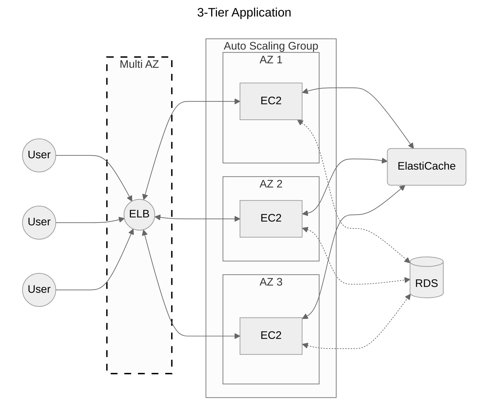

# [EC2](./ec2.md) vs [Beanstalk](./beanstalk.md)

## "Traditional deployment"

**PROBLEM?**
If we want to focus more on the code instead of focusing with infrastructure, we can use [Beanstalk](./beanstalk.md).

| Feature |  Elastic [Beanstalk](./beanstalk.md) |  [EC2](./ec2.md) (Manual Deployment) |  AWS [Lambda](./lambda.md)   |
| -----| ------------------- | -------------------------| --------------|
| Use Case |  Web applications with managed infra |  Full control over servers |  Serverless apps with event-driven execution
| Infrastructure Management |  Fully managed |  Manual |  Fully managed
| Auto Scaling |  Built-in |  Requires configuration |  Automatic
| Customization |  Moderate |  High |  Limited
| Supported Languages |  Python, Java, Node.js, .NET, PHP, Ruby, Go |  Any |  Any
| Pricing Model |  Pay for underlying AWS resources |  Pay for EC2 resources |  Pay per execution