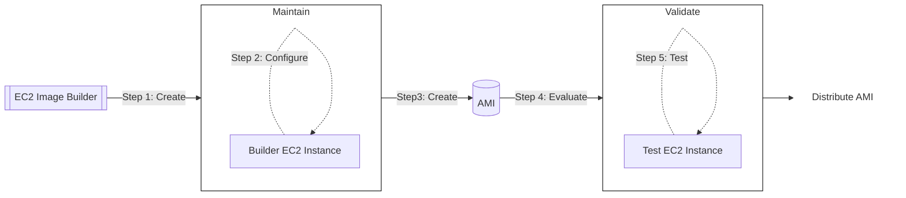

# Elastic Compute Cloud (EC2)

---

## Components

What need to be configured when creating a new EC2:
1. **OS:** [AMI](#1-amazon-machine-image-ami)
2. **CPU Cores:** [Instance type](#2-instance-type)
3. **Ram size:** [Instance type](#2-instance-type)
4. **Storage space:**  
   * Network attached ([EBS](#3-amazon-elastic-block-store-ebs)/[EFS](#4-amazon-elastic-file-system-efs))
   * H/W ([EC2 Instance store](#4-ec2-instance-store))
5. **Network:** Bandwidth
6. **Firewall:** [Security Groups](#5-security-groups)
7. **Provisioning:** (Bootstrap sequence - EC2 User Data)

---

### 1. Amazon Machine Image (AMI)
Pre-configured templates used to launch instances. AMIs include operating systems, application servers, and applications.

> [!WARNING]
> Attach to specific region

1. Public AMIs
2. Marketplace
3. Create your own AMI (Help lauch faster instanses)
   ```mermaid
    flowchart LR
    
    subgraph az2["Availability zone x"]
        direction LR
        az2-ec2-1["Instance"]
    end

    subgraph az1["Availability zone x"]
        direction LR
        az1-ec2-1["Instance"]
    end

    az1-ec2-1 --> |Create AMI| iam
    iam["AMI"]
    iam --> |Launch from AMI| az2-ec2-1
   ```
    There are two ways to create AMIs. Either create them manually or using Image Builder. 

##### Create AMI manually
**Steps:**
1. First create your instance
2. Install dependencies/applications, configure the system
3. Then, go to `EC2` menu
4. `Instances`
5. Select desired instance
6. `Action`
7. `Image and templates`
8. `Create image`
9. Give a name

> [!NOTE]
> You can also right click on a resource, instead of clicking on `Action`.

##### EC2 Image Builder

Automates the whole process and can be automatically executed.



> [!NOTE]
> We only pay for the underlying resources

### 2. Instance Type
Defines the compute, memory, storage configuration, etc. of the instance, details are available [here](https://aws.amazon.com/ec2/instance-types/).

#### Instance Types
| Instance Types	| Description |
| ----------------- | ------------|
| General Purpose	| Balanced compute, memory, and networking resources. Suitable for web servers, dev/test, and small databases. Example: t2, m5.
| Compute Optimized	 | Optimized for compute-intensive workloads requiring high performance, like batch processing or HPC. Example: c5.
| Memory Optimized	| Designed for memory-intensive tasks, such as in-memory databases and real-time big data analytics. Example: r5.
| Accelerated Computing	| Leverages GPUs or FPGAs for compute-intensive applications, such as ML, AI, or video processing. Example: g4dn, p3.
| Storage Optimized |	High, sequential read/write access to large datasets, such as NoSQL databases or big data workloads. Example: i3.
| High Performance Computing (HPC)	|Purpose-built for HPC with low-latency networking and enhanced scalability. Example: hpc6id.

> [!NOTE]
> Visit [https://instances.vantage.sh/](https://instances.vantage.sh/) to compare EC2 instances.


#### Instance family examples:

| Instance family    | Purpose/Category          | vCPU | Memory (GiB) | Storage          | Network Performance     | Example Use Case                      |
|------------------|---------------------------|------|--------------|------------------|-------------------------|---------------------------------------|
| **t2.micro**     | General Purpose (Burstable)| 1    | 1            | EBS-Only         | Low to Moderate         | Low-traffic websites, testing         |
| **m5.large**     | General Purpose           | 2    | 8            | EBS-Only         | Up to 10 Gbps           | Databases, app servers, caching       |
| **c5.large**     | Compute Optimized         | 2    | 4            | EBS-Only         | Up to 10 Gbps           | Batch processing, web servers         |
| **r5.large**     | Memory Optimized          | 2    | 16           | EBS-Only         | Up to 10 Gbps           | High-memory apps, in-memory databases |
| **g4dn.xlarge**  | GPU-Optimized             | 4    | 16           | NVMe + EBS-Only  | Up to 25 Gbps           | Machine learning, AI inference        |
| **i3.large**     | Storage Optimized         | 2    | 15.25        | 1 x 475 NVMe SSD | Up to 10 Gbps           | High-speed storage, NoSQL databases   |

#### Naming convetion
Example: m5.2xlarge

* **m**: Instance class
* **5**: Hardware Generation
* **2xlarge**: Instance class size (higher the size --> higher the specs)

### 3. [Amazon Elastic Block Store (EBS)](./ebs.md)
Persistent **network block storage volumes** that can be attached to EC2 instances but specific to an Availability Zone. 
Snapshot usage for transfers between zones and Backups.

> [!NOTE]
> By default, when creating an instance, the root volute has `Delete on termination` enabled.
> When creating a new volume however, this is will not enabled by default when attached to an instance.

### 4. [Amazon Elastic File System (EFS)](./efs.md)
Elastic File System  is a fully managed, scalable, and highly available **network file system** provided by AWS. It allows you to create file systems that can be mounted by **multiple** EC2 instances simultaneously, enabling shared storage across applications and services.

### 5. EC2 Instance Store
A **temporary hardware block storage** available for Amazon EC2 instances.
It is physically attached to the host computer where the instance is running and provides **high-performance ephemeral** storage

`Instance store` is good for cache or buffers.

> [!IMPORTANT]
> In case we need the data used here, we MUST take backups ourselves!.

<br>

> [!IMPORTANT]
> To find the differences between [EBS](./ebs.md), [EFS](./efs.md), [Instance Store](./ec2.md#5-ec2-instance-store), and [S3](./s3.md), read [this](./ebs-vs-efs-vs-instance-store-vs-s3.md).
> Other storage services: [Amazon FSx](./fsx.md).

### 6. Tag
Key-value pairs. Good for filtering and billing.

E.g.
```
Project: Dummy-application
Environment: Development
Owner: Their name
```

### 7. Security Groups
Virtual firewalls that control inbound and outbound traffic to EC2 instances.


> [!IMPORTANT]
> Secury Groups contain **ONLY** allow rules
> By default, all **INBOUND** traffic is **DENIED**
> Remember **least privilege principle** is used throughtout the AWS.
> So, we only **ALLOW** what we need.
>
> On the other hand, by default all **OUTBOUND** traffic is **ALLOWED**

Example:
| Type | Protocol | Port | Source    | Description |
| ---- | ---------| -----| -------   | ------------|
| SSH  |  TCP     | 22   | 0.0.0.0/0 | Control     |


> [!IMPORTANT]
> Use a specific Security Group for SSH and maintain it with care!

#### Troubleshooting:
* **Connection timeout**: Related to Security Group rules
* **Connection refused**: Related to Application/Server

#### Limitations:
* Depend on region/VPC combination

### 8. Key Pairs
Secure authentication for EC2 instances. A key pair consists of a public key stored on the instance and a private key used to log in.

#### Steps:
1. Create key pairs
2. Download .pem file on the device of your desire
3. Run `chmod 400 <key-pair-file>.pem`
4. Then `ssh -i <key-pair-file.pem> <user>@<public-ip>`

> [!TIP]
> Best practice: 
> Different keys, based on the environment (e.g. different key for production, developmen, QA, etc.)

As an alternative, from the `Management Console` we can use `Instance Connect` to connect to the Instance,
without utilizing/generating a `Key Pair`. In this case though, maybe **IPv6** for `SSH` should be also enabled.
1. `EC2` menu
2. Select desired instance
3. `Connect`

#### 9. IAM Roles
> [!CAUTION]
> NEVER store Access keys in EC2 instances (or other resources), use roles instead!

Create a [role](./iam.md#roles) and attach that role to your EC2 in order to be able to access resources from it.


---

## Creating an EC2 Instance
1. Choose an AMI
2. Choose an instance type
3. Configure the Instance
4. Add storage
5. Add tags
6. Configure Security Group
7. Review

---

## EC2 Instance creation best practices
1. Gather Requirements of the application
   - OS, 
   - Ram Size, CPU, Networks 
   - Storage size
   - Services/applications running
   - Environment type (Dev/Prod)
2. Create key-pairs
    Give good names to your keys based on the project related to.
3. Create Security Group
4. Instance Launch

---
> [!NOTE]
> ❓ Whats next ❓
>
> Read about [Scaling & High availability](../onboarding/cloud-models.md).
> Then to implement them in AWS read the following materials.
>
> **Horizontal Scaling** (= elasticity): 
>   * [Auto Scaling Groups]()
>   * [Elastic Load Balancer](./elb.md)
>
> **High availability**
>   * Auto Scaling Groups multi AZ
>   * Load Balancer multi AZ
>
> | **Aspect**       | **Scalability**                                                | **Elasticity**                                          | **Agility**                                              |
> |-------------------|----------------------------------------------------------------|--------------------------------------------------------|----------------------------------------------------------|
> | **Focus**         | Utilize stronger hardware and increase resources               | Auto-scaling based on the load                         | Easiness of utilizing more/less resources                |
> | **Use Case**      | Handle larger load                                             | Automation, to support pay-per-use, and optimize cost  | Fast adaptation to changes                               |
> 

---

> [!TIP]
> To monitor IP addresses:
>
> Search `IP Address Manager`
> From there you are able to find public IP addresses 

---

## CLI

List Instances
`aws ec2 describe-instances`

Start an Instance
`aws ec2 start-instances --instance-ids <i-1234567890abcdef0>`

Stop an Instance
`aws ec2 stop-instances --instance-ids <i-1234567890abcdef0>`

Terminate an Instance
`aws ec2 terminate-instances --instance-ids <i-1234567890abcdef0>`