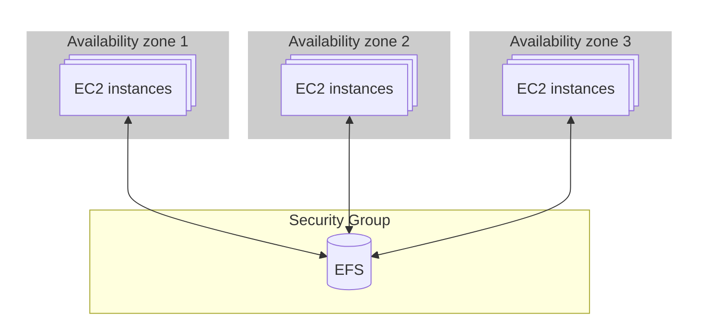
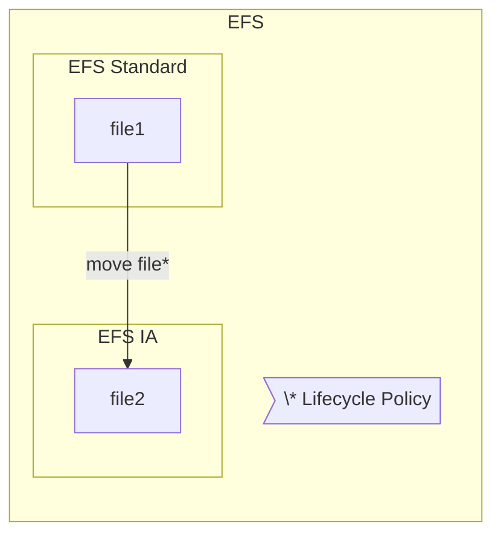

# Elastic File System (EFS)
Amazon Elastic File System (EFS) is a fully managed, scalable cloud-based file storage service provided by AWS. It is designed for use with Amazon [EC2](./ec2.md) instances, containers, and on-premises servers, offering a shared file system that supports concurrent access by multiple compute resources.

> [!IMPORTANT]
> To find the differences between [EBS](./ebs.md), [EFS](./efs.md), [Instance Store](./ec2.md#5-ec2-instance-store), and [S3](./s3.md), read [this](./ebs-vs-efs-vs-instance-store-vs-s3.md).
> Other storage services: [Amazon FSx](./fsx.md).

--- 


---

## Utilize EFS example

### A. Create EFS

EFS is a network based shared file system, for this reason it is good practise to create a security group before using it.

#### 1. Create Security Group
The security group should be as follows:

**Inbound rules** 
- Type: `nfs`
- Port range: `2049`
- Source: `security group of EC2s that we want to connect`

#### 2. Create actual EFS

- Search for `EFS`
- Click on `Create file system`
- Give a name
- Click on `Customize`
- Select either `Enhanced` or `Bursting` for free tier
- Click on `Next`
- Select VPC
- Select on all mount points the security group that we just created and delete the default SG.
- Click on `Next`
- Default values on `File system policy`
- Click on `Next`

Congrats! Now we can access this via multiple ways, as an example with IAM users or Access points.

### B. Create access points
- Search for `EFS`
- `Access Points`
- `Create access point`
- Select the file system we created
- Give a name
- Create it

### C. Mount to EC2 instance ([documentation](https://docs.aws.amazon.com/efs/latest/ug/using-amazon-efs-utils.html) & [repo](https://github.com/aws/efs-utils?tab=readme-ov-file#on-other-linux-distributions))

#### 1a. Install efs utils on CentOS
- Install dependencies `sudo yum install -y git rpm-build make`
- Clone `efs-utils` repo `git clone https://github.com/aws/efs-utils`
- Change directory `cd efs-utils`
- Build package `sudo make rpm`
- Install amazon-efs-utils `sudo yum -y install ./build/amazon-efs-utils*rpm`
  
#### 1b. Install efs utils on Ubuntu
- Install dependencies `sudo apt -y install git binutils rustc cargo pkg-config libssl-dev gettext`
- Clone `efs-utils` repo `git clone https://github.com/aws/efs-utils`
- Change directory `cd efs-utils`
- Build `./build-deb.sh`
- Install amazon-efs-utils `sudo apt-get -y install ./build/amazon-efs-utils*deb`

#### 2. Mount EFS using access point ([documentation](https://docs.aws.amazon.com/efs/latest/ug/mounting-access-points.html))
- Edit `/etc/fstab`, and append the following:
```
# <file-system-id>  <efs-mount-point> efs _netdev,tls,accesspoint=<access-point-id> 0 0 
```

> [[Notes]]
> **file-system-id:** Can be extracted from EFS menu -> `File System`
> **access-point-id:** Can be extracted from EFS menu -> `Access Point`
> **efs-mount-point:** Your desired path

---

## EFS Infrequent Access (EFS-IA)
Provide lower-cost storage for files that are not frequently accessed.

**Save up to 94% on file storage**

Automatically move files here using lifecycle policies.



\* Moves file based on the lifecycle policy
