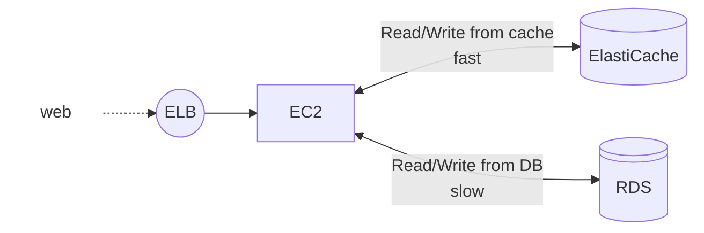

# ElastiCache
ElastiCache is a fully managed, **in-memory** **data store** and **caching** service provided by AWS. It is designed to improve the performance of applications by enabling low-latency access to frequently accessed data. ElastiCache supports two popular open-source engines: **Redis** and **Memcached**.

Concept:
