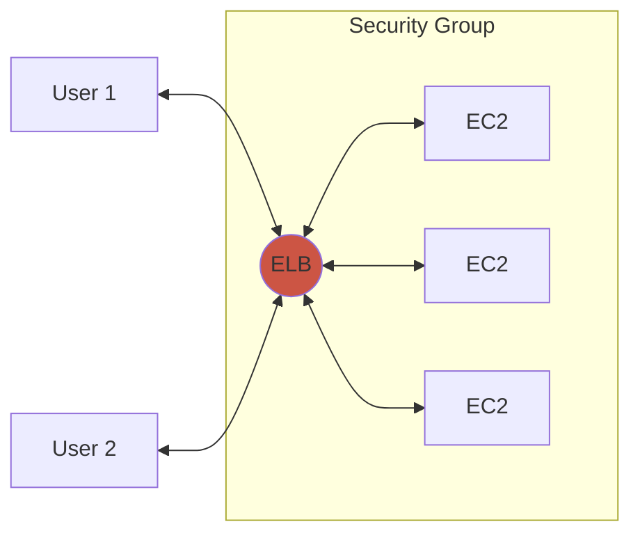
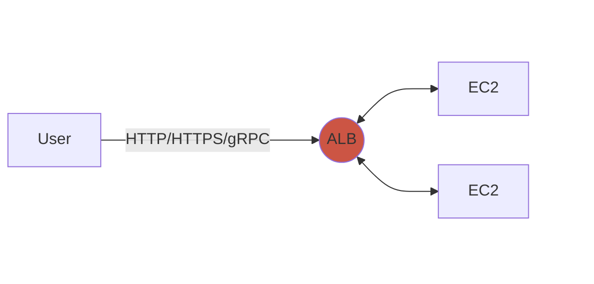
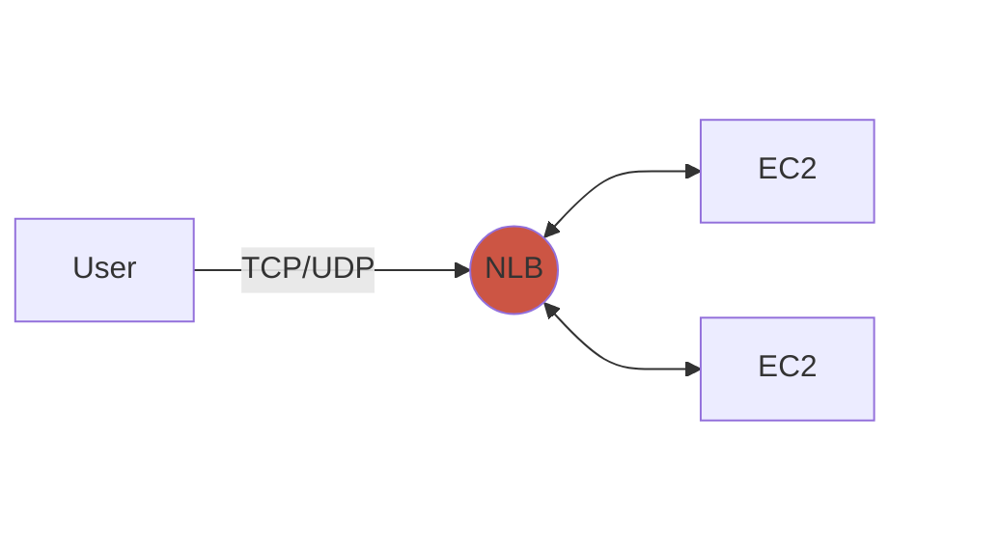
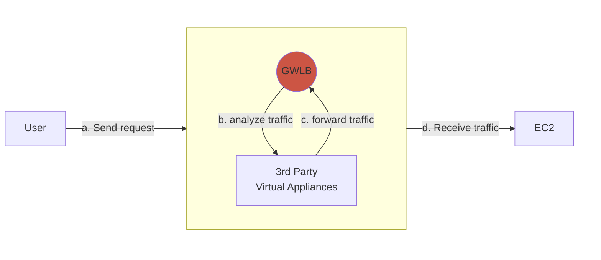

# Elastic Load Balancer (ELB)
A managed load balancer.

* Spread load accross multiple resources
* Handle failures
* Single point of access (DNS)
* Security (reverse proxy) provide HTTPS

---

## Types of ELBs

### 1. Application Load Balancer (ALB)
Best suited for **HTTP** and **HTTPS** traffic, ALBs operate at the Application layer **(Layer 7)**. They support advanced routing features such as host-based and path-based routing. 

### 2. Network Load Balancer (NLB)
Operates at the transport layer **(Layer 4)** and is designed for **ultra high-performance** scenarios. NLBs handle **TCP, UDP, and TLS** traffic and are ideal for low-latency and high-throughput applications. 

### 3. Gateway Load Balancer (GWLB)
Designed for deploying, scaling, and managing third-party virtual appliances like firewalls, intrusion detection, and deep packet inspection. Runs on **Layer 3**.

### 4. Classic Load Balancer (CLB)
An older generation load balancer supporting both **Layer 4 and Layer 7**. It's more basic and suitable for simple use cases. Replaced in most cases by **ALB** and **NLB**.

Differences:
| Type    | Protocols Used             | Access                     | Use Case    |                                         
|---------|----------------------------|----------------------------|-------------|
| **ALB** | HTTP, HTTPS, gRPC (Layer 7)| **Gives Static DNS (URL).**| HTTP Routing   |
| **NLB** | TCP, UDP, TLS  (Layer 4)   | **Static IP (Elastic IP)**.| Handling very high-performance   |
| **GWLB** | GENEVE (Layer 3)           | **Firewalls or VPNs**      | Intrusion detection/Deep packet inspection

---

## Example:
Create LB for EC2 that handles an http site

### A. First Create a Target Group
Target Group is basically a group of instances with health checks.

1. `EC2` -> `Load Balancing` -> `Target Groups` 
2. Select in `Choose a target type` the `Instances`
3. Give a `Target group name`
4. Enable `Health checks` and modify details.
5. Click next
6. Select the instances you want to include
7. Click on `Include as pending below`
8. Then click on `Create target group`

### B. Create LB
1. `EC2` -> `Load Balancing` -> `Load Balancers`
2. `Application Load Balancer`
3. Give a name
4. Select at least 2 Availability Zones
5. Create a new security group for the external usage
6. Add the `Target Group` you created earlier to the `Listeners and routing` section
7. Create Load Balancer

---

## CLI

List All Load Balancers
`aws elbv2 describe-load-balancers`

Get Details of a Specific Load Balancer
`aws elbv2 describe-load-balancers --names <load-balancer-name>`

List Load Balancers by Type
`aws elbv2 describe-load-balancers --query "LoadBalancers[?Type=='<type>']"`
Where <type> can be:
    - `application` for ALB
    - `network` for NLB
    - `gateway` for GWLB

List Target Groups
`aws elbv2 describe-target-groups`