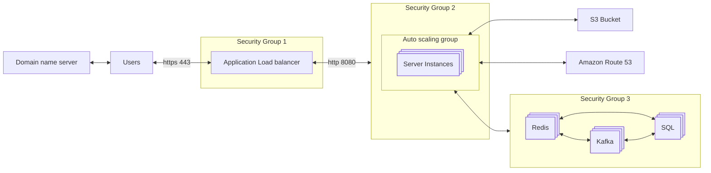

## Example

## IaaS implementation

## Steps
1. Create each `Security Group
   1. Modify ONLY inbound rules!
   2. Tip: We can enable All traffic -> to the same `security group`: to enable internal connections
2. Create `Key pairs`
3. Create needede `EC2` instances and make sure that they have provision code.
4. Create in `Route 53` a `Hosted zone` to resolve internal domains

## PaaS/SaaS implementation

```mermaid
architecture-beta
    
    %% ====================================================
    %% SERVICES/GROUPS
    %% ====================================================

    %% [Initial connections]
    service users(internet)[Users]
    service AmazonRoute53(A)[Amazon Route 53]
    service AmazonCloudFront(cloud)[Amazon CloudFront]

    %% [Elastic Beanstalk]
    group ElasticBeanstalk[Elastic Beanstalk]
    group AutoScalingGroup[Autoscaling Group Security Group] in ElasticBeanstalk
    service ApplicationLoadBalancer(A)[Application Load Balancer] in ElasticBeanstalk
    service ServerInstances(server)[Instances] in AutoScalingGroup

    %% [To instances]
    service AmazonCloudWatch(A)[Amazon CloudWatch]
    service S3Articasts(disk)[Artifacts in S3 Bucket]

    %% [Backend]
    group backendSecurityGroup[Security Group]
    service AMQ(A)[Amazon MQ] in backendSecurityGroup
    service AmazonElasticCache(A)[Amazon Elastic Cache] in backendSecurityGroup
    service memcached(A)[Memcached] in backendSecurityGroup
    service AmazonRDS(A)[Amazon RDS] in backendSecurityGroup
    
    %% ====================================================
    %% CONNECTIONS
    %% ====================================================

    %% [Initial connections]
    users:R                     -->     L:AmazonRoute53
    AmazonRoute53:R             -->     L:AmazonCloudFront

    %% [Elastic Beanstalk]
    AmazonCloudFront:R          -->     L:ApplicationLoadBalancer
    ApplicationLoadBalancer:R   -->     L:ServerInstances

    %% [To instances]
    AmazonCloudWatch:B          -->     T:ServerInstances
    AmazonCloudWatch:B          -->     T:ApplicationLoadBalancer
    S3Articasts:L               -->     R:ServerInstances
    ServerInstances:B           -->     T:AmazonElasticCache
    ServerInstances:B           -->     T:AMQ


    %% [Backend]
    AmazonElasticCache:B        -->     T:memcached
    memcached:B                 <-->    T:AmazonRDS
```

### Steps
1. Create `Key pairs`
2. Create `Security Groups`: `RDS`, `Amazon Elastic Cache` & `Amazon Active MQ` 
3. Create services: `RDS`, `Amazon Elastic Cache` & `Amazon Active MQ`
4. Create `Elastic Beanstalk`

---

