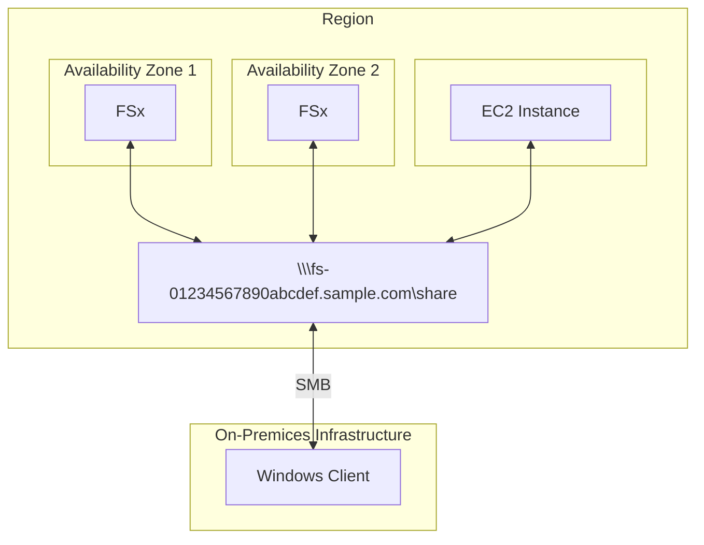
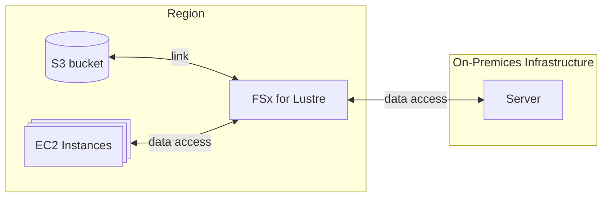

# Amazon FSx
Amazon FSx is a **fully managed & reliable** service by AWS that provides cloud-based **file storage** with support for various file systems. Launch **high-performance 3rd party** file systems.

## 1. Amazon FSx for Windows File Server
Use in Windows-based applications requiring shared file storage. File share storage for Windows applications, such as SQL Server or shared folder access. Applications needing Active Directory integration for access control.

### Supported protocols:
  * SMB
  * NTFS

## 2. Amazon FSx for Lustre:
Big data analytics and workloads requiring fast, parallel file systems. High-performance computing (HPC) applications like financial simulations, genomics, or weather forecasting. Media rendering or video processing workflows that require large, fast file system access.

> [!NOTE]
> About the naming: Lustre = Linux + cluster

> [!IMPORTANT]
> When **HPC** is considered, then Lustre most propably will be the option.

## 3. Amazon FSx for NetApp ONTAP: