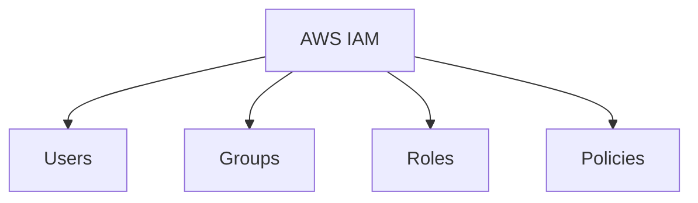
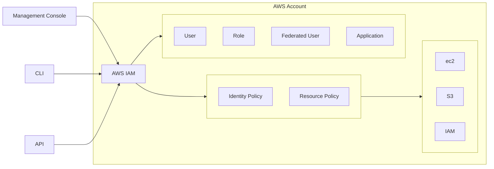
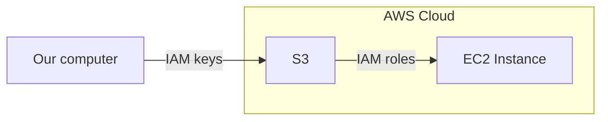

# IAM 
IAM is a global service

--- 

### 1. Create IAM user
1. Login to AWS
2. Search for `IAM`
3. In `User Managment`
4. `Users`
5. `Create User`
6. Give username
7. `Next`
8. Permissions options set to `Attach policies directly`
9. Give the permissions that you want (e.g. `AdministratorAccess`)
10. `Next`
11. `Create User`
12. DONE!

### 2. Create password
1. Login to AWS
2. Search for `IAM`
3. In `User Managment`
4. `Users`
5. Choose your user
6. `Security Credentials`
7. `Manage console access`
   
### 3. Enable MFA (if needed)
1.  Login as this user
2.  Search `IAM`
3. Add `MFA`

---

## Access Management

* **Users**: Users gain permissions from a policy that is applied to a group.
* **Users Groups**: Attach multiple users to a User group, in order to attach policies to this group.
* **Roles**: Used for delegation (assumed).
* **Policies**: What users are allowed to do.

To connect via **console** we need a password (and MFA if enabled), and for **CLI** & **API** we need [access keys](../onboarding/aws-cli.md#2-create-access-keys).

---

### IAM keys vs IAM roles example

---

## CLI

List Users
`aws iam list-users`

Create a User
`aws iam create-user --user-name <username>`

Attach a Policy to a User
`aws iam attach-user-policy --user-name <username> --policy-arn arn:aws:iam::aws:policy/AmazonS3FullAccess`

List Policies Attached to a User
`aws iam list-attached-user-policies --user-name <username>`
