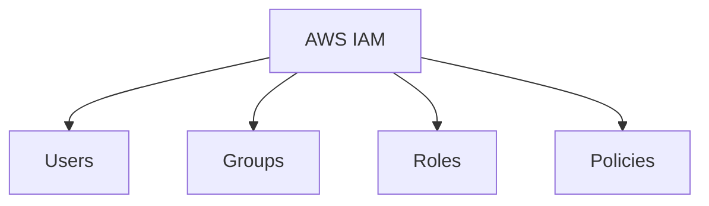
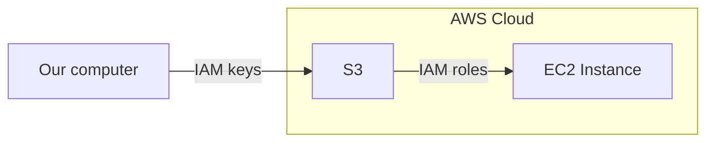

# IAM 
IAM is a global service

--- 

### Create IAM user
1. Login to AWS
2. Search for `IAM`
3. In `User Managment`
4. `Users`
5. `Create User`
6. Give username
7. `Next`
8. Permissions options set to `Attach policies directly`
9. Give the permissions that you want (e.g. `AdministratorAccess`)
10. `Next`
11. `Create User`
12. DONE!

### Create password
1. Login to AWS
2. Search for `IAM`
3. In `User Managment`
4. `Users`
5. Choose your user
6. `Security Credentials`
7. `Manage console access`
   
### Enable MFA
1.  Login as this user
2.  Search `IAM`
3. Add `MFA`

---

### IAM keys vs IAM roles example

---

## CLI

List Users
`aws iam list-users`

Create a User
`aws iam create-user --user-name <username>`

Attach a Policy to a User
`aws iam attach-user-policy --user-name <username> --policy-arn arn:aws:iam::aws:policy/AmazonS3FullAccess`

List Policies Attached to a User
`aws iam list-attached-user-policies --user-name <username>`
