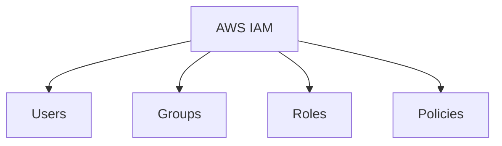
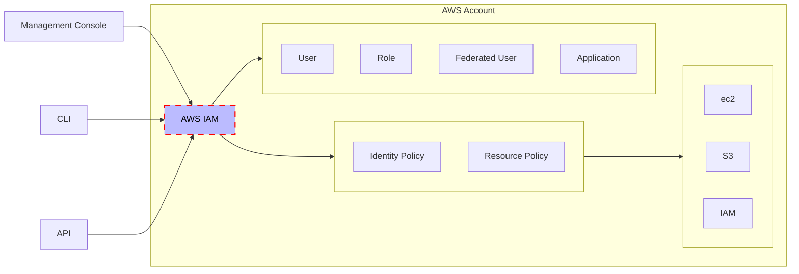
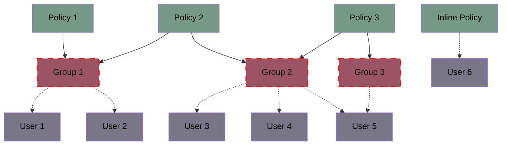
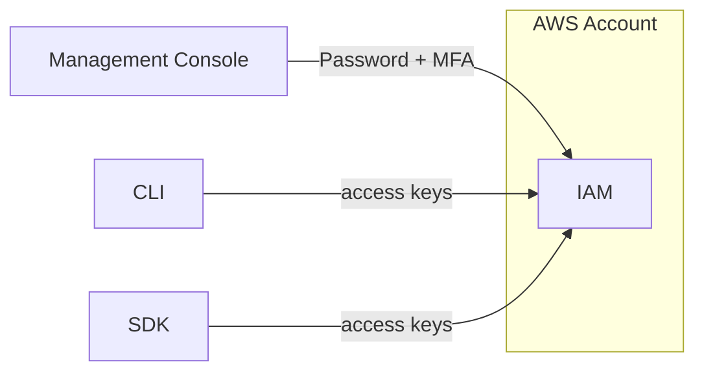
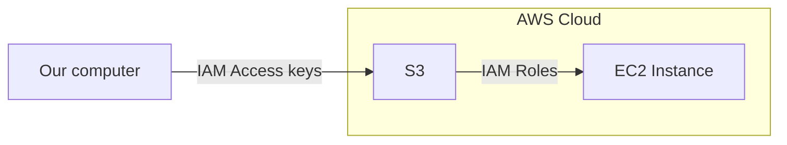

# Identity and Access Management (IAM) 
IAM is a global service that handles access control to different resources.



--- 

### 1. Create IAM user
1. Login to AWS
2. Search for `IAM`
3. In `User Managment`
4. `Users`
5. `Create User` *
6. Give username
7. Provide `Management Console` access if needed
8. `Next`
9. Permissions options set to `Attach policies directly`
10. Give the permissions that you want (e.g. `AdministratorAccess`)
11. `Next`
12. `Create User`
13. DONE!

\* Preferably first create a `Group`, attach `AdministratorAccess` policy to this group, and then add user to the group. 

### 2. Create password
1. Login to AWS
2. Search for `IAM`
3. In `User Managment`
4. `Users`
5. Choose your user
6. `Security Credentials`
7. `Manage console access`
   
### 3. Enable MFA (if needed)
1.  Login as this user
2.  Search `IAM`
3. Add `MFA`

---

## Access Management



### Identity based policy
* **Users**: Users gain permissions from a policy that is applied to a group.
* **Users Groups**: Attach multiple users to a User group, in order to attach policies to this group.
* **Roles**: Used for delegation (assumed).
* **Policies**: What users are allowed to do.

To connect via **console** we need a password (and MFA if enabled), and for **CLI** & **API** we need [access keys](../onboarding/aws-cli.md#2-create-access-keys).

### Resource based policy
Is applies to resources such as buckets.

---
## Groups - Policies
Groups contain ONLY `Users`. A `User` can be part of multiple `Groups`.

Generally, the **least privilege principle** is used, which means by default nothing is allowed, and we give only the privides needed.



IAM Policies structure (example)
```
{
  "Version": "2012-10-17",
  "Id": "Account-permissions <optional>",
  "Statements": [
    {
      "Sid": "1 <statementID - optional>",
      "Effect": "Allow/Deny",
      "Principal": {
        "AWS": ["arn:aws:iam::<AccountID>:root"]
      },
      "Action": [
        "s3:GetObject"
      ],
      "Resource": ["arn:aws:s3::<bucket-name>/*"]
    }
  ]
}
```
Where: 
* Principal: The account/role/user on which it has effect

---

### Access keys
These are credentials that are intended to be used by users.



> [!IMPORTANT]
> **ACCESS KEYS are secrets! Don't share them!**

---

## Roles

Are mostly intended to be used by services.


Example


Common Roles:
* EC2 Instance
* Lambda Function
* CloudFormation

| **Aspect**            | **Roles**                                   | **User Groups**                               |
|-----------------------|--------------------------------------------|----------------------------------------------|
| **Purpose**           | Temporary permissions for services or users | Manage permissions for multiple users        |
| **Associated With**   | No specific user; assumed temporarily       | IAM users                                    |
| **Ideal For**         | Temporary or cross-account access           | Grouping users for easier management         |
| **Credentials**       | No permanent credentials                    | Users in the group have their own credentials |
| **Example Use Case**  | Allow an EC2 instance to access S3          | Developers group with access to EC2          |

### Create Roles and Assign to Users

#### 1. Create Role
1. `IAM` Menu
2. `Roles`
3. `Create role`
4. `AWS Account` & `This Account`
5. The policy we need (e.g. `AmazonEC2FullAccess`)
6. Give role name
7. Create role

#### 2. Assign `sts:AssumeRole` permission to user
1. `IAM` Menu
2. `Users`
3. Select user
4. `Add permissions`
5. `Create inline policy`
6. `JSON`
7. Add this policy to the user you want (make sure that both `account-id` and `role-name` are correct)
  ```
  {
    "Version": "2012-10-17",
    "Statement": [
      {
        "Sid": "Statement1",
        "Effect": "Allow",
        "Action": ["sts:AssumeRole"],
        "Resource": ["arn:aws:iam::<account-id>:role/<role-name>"]
      }
    ]
  }
  ```

#### 3. Connect using this Role
1. Connect as normal with the target user
2. Upper right corner
3. Account
4. Switch user
5. Give `Account ID` and `Role name`

---

### Security

#### Define Password Policy for IAM users (ADMIN)
1. `IAM` Menu
2. `Account settings`
3. `Password policy` --> `Edit`

#### Credentials Report (ADMIN)
1. `IAM` Menu
2. `Access reports`
3. `Credential report`

#### Access Advisor/Last Accessed (ADMIN -> per users)
1. `IAM` Menu
2. `Users`
3. Select one user
4. `Last Accessed`
5. This will show, which services where used by this user and when.

This is very handy when we need to change the granularity of access for a user.

> [!IMPORTANT]
> Remember **least privilege principle** is used throughtout the AWS.

> [!TIP]
> **Best Practicies**
> * Admin user only for initial account setup, and in some specific cases.
> * Create groups and assign users to them. Create policies and assign policies to groups.
> * Enforce password policy and make sure users have MFA enabled.
> * Create roles to be used by services.
> * For CLI/SKD create access keys.
> * Audit users (Credentials Report & Last Accessed) 

---

### IAM Identity Center
AWS IAM and IAM Identity Center, formerly AWS Single Sign-On (SSO), are both designed to manage access to AWS resources, but they serve different purposes and operate in different contexts.

| **Aspect**                  | **IAM**                                     | **IAM Identity Center**                       |
|-----------------------------|---------------------------------------------|----------------------------------------------|
| **Purpose**                 | Manage access for a single AWS account      | Centralized access for multiple AWS accounts |
| **User Management**         | Create and manage users in AWS directly     | Integrates with external identity providers  |
| **SSO**                     | Not supported                              | Supported with a user-friendly portal        |
| **Use Case**                | Single-account access management            | Multi-account and application access         |
| **Integration**             | Limited identity provider federation       | Integrates with enterprise identity systems  |
| **Permissions Management**  | Policies for users, groups, and roles       | Centrally manage permissions for users       |
| **Session Management**      | Supports long-term credentials              | Uses short-lived, federated credentials      |

---

## CLI

List Users
`aws iam list-users`

Create a User
`aws iam create-user --user-name <username>`

Attach a Policy to a User
`aws iam attach-user-policy --user-name <username> --policy-arn arn:aws:iam::aws:policy/<PolicyName>`

List Policies Attached to a User
`aws iam list-attached-user-policies --user-name <username>`
