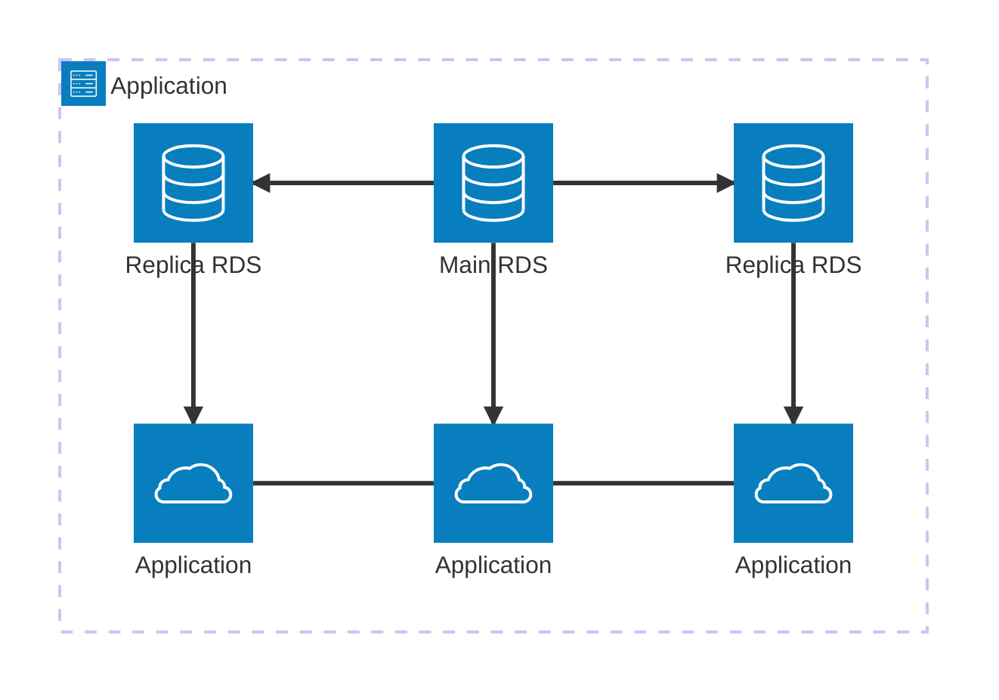
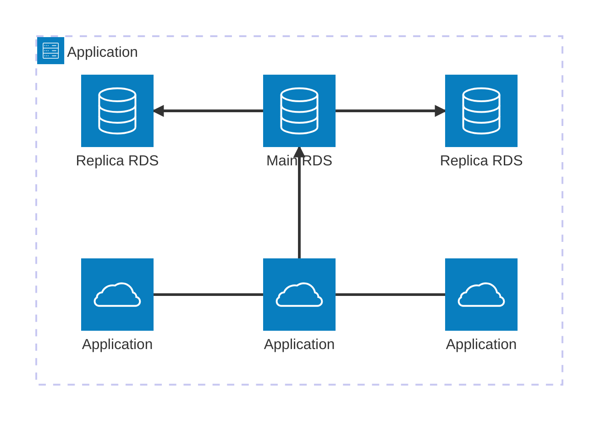
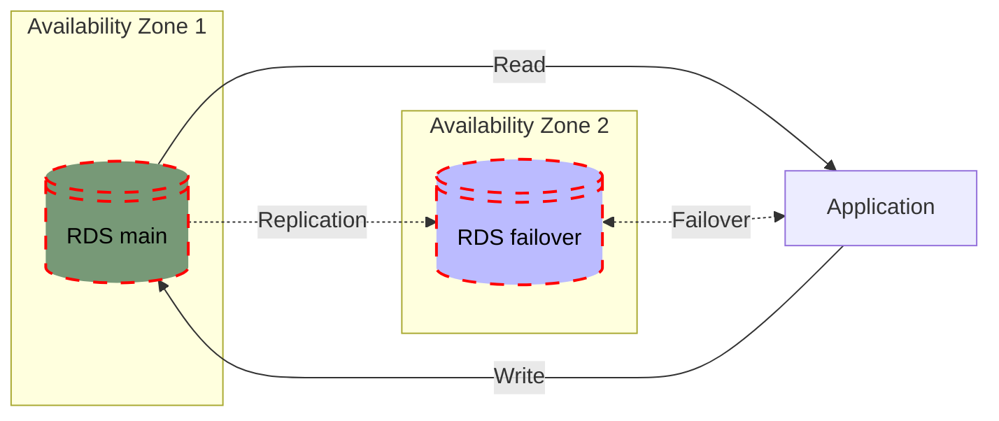
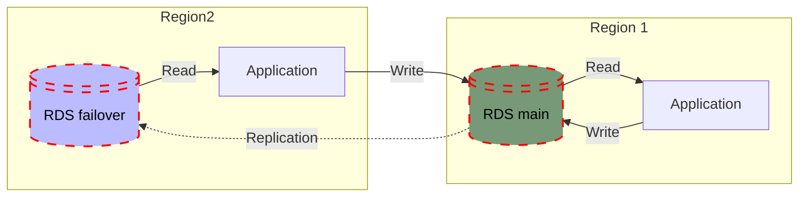

# Relational Database Service (RDS)
Is a **managed** database service offered by AWS that simplifies setting up, operating, and scaling relational databases in the cloud. 

> [!CAUTION]
> Although it's possible to create and run databases on EC2, in this implementation, we have to **back up** and **patch** the database or to make it **highly available**, **fault-tolerant**, etc.
>
> On the other hand, **AWS RDS** will handle **backups**, **upgrades**, **system patching**, etc. for us. It will also enable [vertical and horizontal scaling](../onboarding/cloud-models.md#hybrid-cloud), as well as its [high availability](../onboarding/cloud-models.md#hybrid-cloud) features.

> [!IMPORTANT]
> For **in-memory** databases use [Elasticache](./elasticache.md).
---

## Key Features of Amazon RDS
- **Automated Backups**: Daily backups and point-in-time recovery.
- **Scaling**: Vertical and horizontal scaling to meet demand.
- **High Availability**: Multi-AZ deployments for redundancy and failover support.
- **Security**: Integration with IAM, VPC, encryption at rest, and in transit.
- **Performance Monitoring**: Tools like CloudWatch for metrics and performance insights.

> [!WARNING]
> WE CANNOT HAVE DIRECT ACCESS TO THE DATABASE (LIKE USING SSH)!

---

## Common Use Case 
For security reasons, it is common to have RDS in a private network.

## Databases Options

| **Database**       | **Overview**                                                                 | **Use Cases**                                                                                   | **Key Features**                                                                                 |
|---------------------|-----------------------------------------------------------------------------|-----------------------------------------------------------------------------------------------|--------------------------------------------------------------------------------------------------|
| **Amazon Aurora**   | Cloud-optimized DB compatible with MySQL and PostgreSQL.                   | High-performance and scalable apps, SaaS, web apps.                                           | Auto-scaling storage, multi-master capabilities, global databases, 5x faster than MySQL and 3x that Postgress        |
| **MySQL**           | Popular open-source database.                                              | Web apps, CMS (WordPress, Joomla), small to medium OLTP systems.                              | Community support, suitable for read-intensive workloads, cost-effective.                      |
| **PostgreSQL**      | Feature-rich and standards-compliant open-source database.                 | Complex queries, GIS (PostGIS), enterprise apps, data analytics.                              | Robust data integrity, extensibility, support for JSON and ANSI SQL.                           |
| **MariaDB**         | Community-driven MySQL fork focusing on performance and innovation.        | Medium-scale apps needing thread pooling, innovation-focused workloads.                       | Enhanced JSON handling, faster replication, and query execution.                               |
| **Oracle Database** | Enterprise-grade commercial database.                                      | Large-scale enterprise apps (ERP, CRM), high-security and disaster recovery requirements.     | Multi-tenant architecture, in-memory processing, advanced analytics.                          |
| **SQL Server**      | Relational database for Windows-based applications.                        | Microsoft ecosystem (.NET apps, SharePoint), transactional systems, BI and reporting needs.   | Integration with Microsoft services, Always On Availability Groups, advanced reporting tools.  |

### Aurora Serverless
Amazon Aurora is an ideal choice for applications that require high performance and scalability but have **unpredictable** or **infrequent** workloads. It eliminates the need for complex capacity planning and offers a fully managed database solution that automatically adjusts to changing demands.

Concept:

- **Auto Scaling:** Automatically adjusts to meet application demands.
- **Compatible with PostgreSQL and MySQL:** Supports both databases for flexible deployment.
- **Pay-per-Second Pricing:** Charges are based on actual usage, billed per second.
- **Minimal Management Overhead:** Designed for ease of use with automatic management features.
- **No Capacity Planning Required:** Scales automatically to accommodate workload fluctuations.

---
## RDS Deployments

### RDS Replicas
Improve read performance and distribute the read workload across multiple nodes.
Can scale up to 15 nodes.

#### Read Data
Application can read from all RDS

#### Write Data
Application can write only in the main RDS.

### Multi-AZ
Enhance high availability (failover) and durability for production workloads. Can have only 1 AZ as failover.

### Multi-Regions
Provide disaster recovery and improve performance for globally distributed applications. However, there are replication costs, because we need to transfer data between regions.

---

## Create a basic DB for testing
Create a DB with the following options.
- `Standard create`
- Either `MySQL` or `PostgreSQL`
- Templates: `Dev/Test` or `Free Tier`
- Availability: `Single DB instance`
- DB instance identifier: `give name`
- Credentials management: `Self managed`
- Instance configuration:
  - Burstable classes
  - `db.t3.micro`
- Storage type: either `gp3`  or `gp2`
- Allocated Storage: `20Gb`
- Connectivity:
  - `Don't connect to EC2`
  - `IPv4`

---

## CLI

List DB Instances
`aws rds describe-db-instances`

Create a DB Instance
`aws rds create-db-instance --db-instance-identifier mydb --db-instance-class db.t3.micro --engine mysql --allocated-storage 20 --master-username admin --master-user-password password`

Delete a DB Instance
`aws rds delete-db-instance --db-instance-identifier mydb --skip-final-snapshot`
