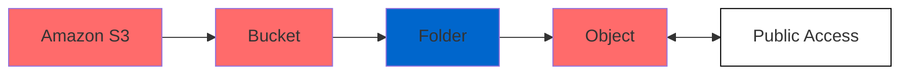
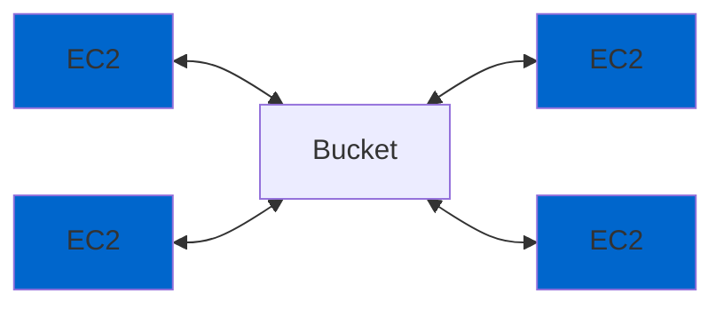
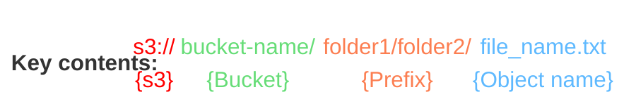
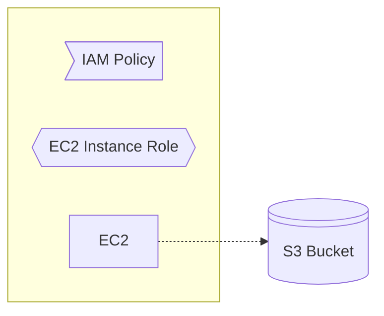
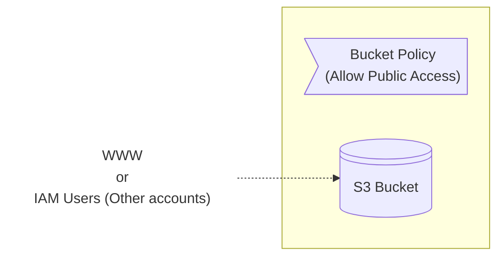

# Simple Storage Service (S3)

Is a global storage service that can be accessed over the internet. Can be used to store and retrieve **any amount** ("infinitely scaling") of data, from anywhere.

It automatically handles backups (stores data across multiple facilities)

Data are stored as `objects` within `buckets`, and the name of each bucket must be **unique**.

Properties exist on both levels (`objects` & `buckets`) so permissions can be set.

In conjunction with [EFS](./efs.md) we do not need to mount a file system. We can programmatically access the data, even though it is possible to mount to a drive.

> [!IMPORTANT]
> To find differences between [EBS](./ebs.md), [EFS](./efs.md), [Instance store](./ec2.md#5-ec2-instance-store) and [S3](./s3.md) read [this](./ebs-vs-efs-vs-instance-store-vs-s3.md).
> Other storing services: [Amazon FSx](./fsx.md).

> **Note**
> Useful info:
> 
> **Bucket** is actually a kind of directory
> **Object** is the file that is stored
> **Bucket name** must be unique across all regions
> **Buckets** are defined at a region level but are accessable globally
>

## Common Use Case

## Objects
Objects have **keys**, which is the **FULL** path of the file. There are **NOT** actually directories, even though the key seems to contain them.

> [!WARNING]
> Limitations:
>
> * For files > 5Gb use `multi-part upload`
> * Object size must be <= 5TB

Each object can also have **metadata** and **tags**.

### Example: Create a public bucket
By default all objects that stored in buckets are private. To create a bucket and make it publicly available:

#### 1. Enable ACL
- Select bucket
- `Permissions`
- `Object Ownership`
- `Enable ACLs`
- Set also `Block public access (bucket settings)` to `off`

#### 2. Make them public 
- Select bucket
- `Actions`
- `Make public using ACL`

---

## [Storage Classes](https://aws.amazon.com/s3/storage-classes/)
| Storage Class                          | S3 Standard                     | S3 Intelligent-Tiering*         | S3 Express One Zone**            | S3 Standard-IA                   | S3 One Zone-IA**                 | S3 Glacier Instant Retrieval       | S3 Glacier Flexible Retrieval***  | S3 Glacier Deep Archive***         |
|----------------------------------------|----------------------------------|----------------------------------|-----------------------------------|----------------------------------|-----------------------------------|------------------------------------|------------------------------------|------------------------------------|
| **Use Cases**                          | General purpose storage for frequently accessed data | Automatic cost savings for data with unknown or changing access patterns | High performance storage for your most frequently accessed data | Infrequently accessed data that needs millisecond access | Re-creatable infrequently accessed data | Long-lived data that is accessed a few times per year with instant retrievals | Backup and archive data that is rarely accessed and low cost | Archive data that is very rarely accessed and very low cost |
| **First Byte Latency**                 | milliseconds                    | milliseconds                    | single-digit milliseconds         | milliseconds                    | milliseconds                     | milliseconds                       | minutes or hours                   | hours                              |
| **Durability**                         | Amazon S3 provides the most durable storage in the cloud. Based on its unique architecture, S3 is designed to exceed 99.999999999% (11 nines) data durability. Additionally, S3 stores data redundantly across a minimum of 3 Availability Zones by default, providing built-in resilience against widespread disaster. Customers can store data in a single AZ to minimize storage cost or latency, in multiple AZs for resilience against the permanent loss of an entire data center, or in multiple AWS Regions to meet geographic resilience requirements. |
| **Designed for Availability**          | 99.99%                          | 99.9%                           | 99.95%                            | 99.9%                           | 99.5%                            | 99.9%                              | 99.99%                             | 99.99%                             |
| **Availability SLA**                   | 99.9%                           | 99%                             | 99.9%                             | 99%                              | 99%                               | 99.9%                              | 99.9%                              | 99.9%                              |
| **Availability Zones**                 | ≥3                              | ≥3                              | 1                                 | ≥3                              | 1                                | ≥3                                 | ≥3                                 | ≥3                                 |
| **Minimum Storage Duration Charge**    | N/A                             | N/A                             | 1 hour                            | 30 days                          | 30 days                          | 90 days                            | 90 days                            | 180 days                           |
| **Retrieval Charge**                   | N/A                             | N/A                             | N/A                               | per GB retrieved                | per GB retrieved                | per GB retrieved                  | per GB retrieved                  | per GB retrieved                  |
| **Lifecycle Transitions**              | Yes                             | Yes                             | No                                | Yes                             | Yes                              | Yes                               | Yes                               | Yes                               |

## Security
| Category              | Description                                                                                                           |
|-----------------------|-----------------------------------------------------------------------------------------------------------------------|
| **1. User-Based**     | **IAM Policies** – Define user access to resources. Ensure that policies follow the principle of least privilege and are scoped to the minimum necessary actions. Use IAM roles for more scalable and granular access control.                            |
| **2. Resource-Based** | **a. Bucket Policies** – Apply policies at the bucket level for comprehensive access management. Useful for restricting access based on specific conditions, such as IP addresses or VPCs.                                             |
|                       | **b. Object Access Control List (ACL)** – Provide fine-grained access control for individual objects. Ensure that ACLs are not overly permissive and align with security best practices.                                                    |
|                       | **c. Bucket Access Control List (ACL)** – Used for controlling access to an entire bucket, though this method is less common. Often combined with other resource-based policies. IAM roles are generally preferred for better security and flexibility. |

### Additional Context

- **IAM Policies vs. Resource Policies:**
  - IAM policies define what actions a user or role can perform on a resource.
  - Resource policies (like bucket policies) specify who has access to the resource and under what conditions.

> [!CAUTION]
> To allow an IAM user access to a bucket, either an **IAM policy** or a **resource policy** must explicitly **ALLOW** it and there is not explicit **DENY**.

### 1. IAM Policy

#### IAM User Policy

#### IAM Roles Policy

### a.  Bucket Policies
| Use Case                     | Description                                                                                     |
|------------------------------|-------------------------------------------------------------------------------------------------|
| **Make Buckets Public**      | Configure bucket policies to grant public access. Ensure this is done only for intended use cases, like static website hosting. |
| **Enable Object Encryption** | Enforce encryption for all objects uploaded to the bucket by requiring specific encryption headers.   |
| **Grant Access to Other Accounts** | Allow cross-account access by specifying the AWS Account ID in the bucket policy. Ensure policies are restrictive to minimize potential risks. |

> [!WARNING]
> As the last step of protection `Block Public Access` has to be disabled if we need to make public a bucket.

---

## CLI

List Buckets
`aws s3 ls`

List Objects in a Bucket
`aws s3 ls s3://<bucket-name>/`

Create a Bucket
`aws s3 mb s3://<bucket-name>`

Upload a File
`aws s3 cp <myfile.txt> s3://<bucket-name>/`

Download a File
`aws s3 cp s3://<bucket-name>/myfile.txt <local-file-path>`

Delete an Object
`aws s3 rm s3://<bucket-name>/<file-name>`

Delete a Bucket
`aws s3 rb s3://<bucket-name> --force`