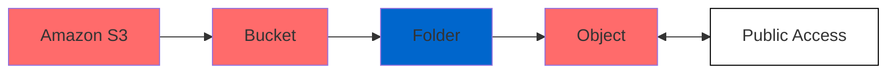

# Simple Storage Service (S3)

Is a global storage service that can be accessed over the internet. Can be used to store and retrieve **any amount** ("infinitely scaling") of data, from anywhere.

It automatically handles backups (stores data across multiple facilities)

Data are stored as `objects` within `buckets`, and the name of each bucket must be unique.

Properties exist on both levels (`objects` & `buckets`) so permissions can be set.

In conjunction with [EFS](./efs.md) we do not need to mount a file system. We can programmatically access the data, even though it is possible to mount to a drive.

> [!IMPORTANT]
> To find differences between [EBS](./ebs.md), [EFS](./efs.md), [Instance store](./ec2.md#5-ec2-instance-store) and [S3](./s3.md) read [this](./ebs-vs-efs-vs-instance-store-vs-s3.md).
> Other storing services: [Amazon FSx](./fsx.md).

> **Note**
> Useful info:
> 
> **Bucket** is actually a kind of directory
> **Object** is the file that is stored
> **Bucket name** must be unique across all regions
> **Buckets** are defined at a region level but are accessable globally
>
