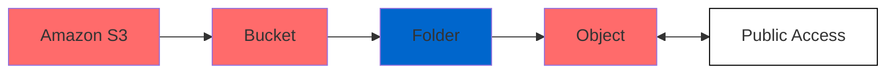
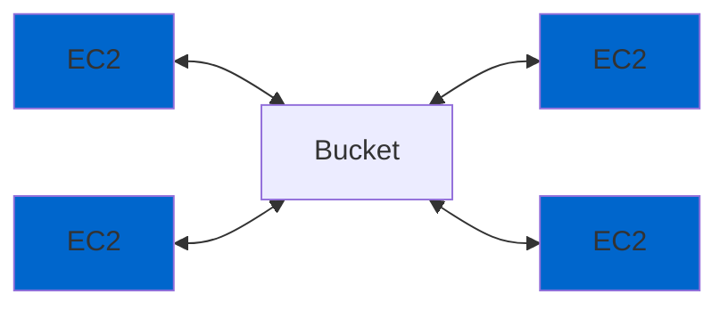
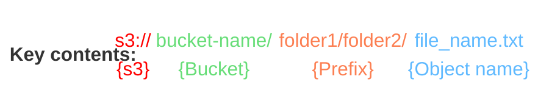
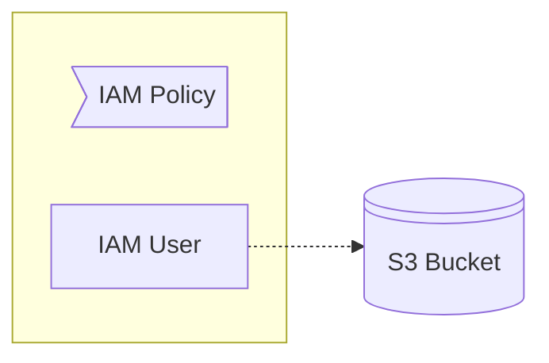
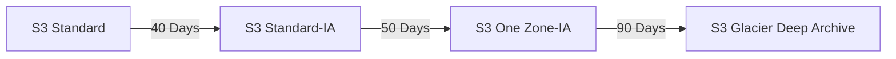

# Simple Storage Service (S3)

Is a global storage service that can be accessed over the internet. Can be used to store and retrieve **any amount** ("infinitely scaling") of data, from anywhere.

It automatically handles backups (stores data across multiple facilities)

Data are stored as `objects` within `buckets`, and the name of each bucket must be **unique**.

Properties exist on both levels (`objects` & `buckets`) so permissions can be set.

In conjunction with [EFS](./efs.md) we do not need to mount a file system. We can programmatically access the data, even though it is possible to mount to a drive.

> [!IMPORTANT]
> To find differences between [EBS](./ebs.md), [EFS](./efs.md), [Instance store](./ec2.md#5-ec2-instance-store) and [S3](./s3.md) read [this](./ebs-vs-efs-vs-instance-store-vs-s3.md).
> Other storing services: [Amazon FSx](./fsx.md).

> **Note**
> Useful info:
> 
> **Bucket** is actually a kind of directory
> **Object** is the file that is stored
> **Bucket name** must be unique across all regions
> **Buckets** are defined at a region level but are accessable globally
>

## Common Use Case

## Objects
Objects have **keys**, which is the **FULL** path of the file. There are **NOT** actually directories, even though the key seems to contain them.

> [!WARNING]
> Limitations:
>
> * For files > 5Gb use `multi-part upload`
> * Object size must be <= 5TB

Each object can also have **metadata** and **tags**.

---

## Security
| Category              | Description                                                                                                           |
|-----------------------|-----------------------------------------------------------------------------------------------------------------------|
| **1. User-Based**     | **IAM Policies** – Define user access to resources. Ensure that policies follow the principle of least privilege and are scoped to the minimum necessary actions. Use IAM roles for more scalable and granular access control.                            |
| **2. Resource-Based** | **a. Bucket Policies** – Apply policies at the bucket level for comprehensive access management. Useful for restricting access based on specific conditions, such as IP addresses or VPCs.                                             |
|                       | **b. Object Access Control List (ACL)** – Provide fine-grained access control for individual objects. Ensure that ACLs are not overly permissive and align with security best practices.                                                    |
|                       | **c. Bucket Access Control List (ACL)** – Used for controlling access to an entire bucket, though this method is less common. Often combined with other resource-based policies. IAM roles are generally preferred for better security and flexibility. |

### Additional Context

- **IAM Policies vs. Resource Policies:**
  - IAM policies define what actions a user or role can perform on a resource.
  - Resource policies (like bucket policies) specify who has access to the resource and under what conditions.

> [!CAUTION]
> To allow an IAM user access to a bucket, either an **IAM policy** or a **resource policy** must explicitly **ALLOW** it and there is not explicit **DENY**.

### 1. IAM Policy

#### IAM User Policy

#### IAM Roles Policy

### a.  Bucket Policies
| Use Case                     | Description                                                                                     |
|------------------------------|-------------------------------------------------------------------------------------------------|
| **Make Buckets Public**      | Configure bucket policies to grant public access. Ensure this is done only for intended use cases, like static website hosting. |
| **Enable Object Encryption** | Enforce encryption for all objects uploaded to the bucket by requiring specific encryption headers.   |
| **Grant Access to Other Accounts** | Allow cross-account access by specifying the AWS Account ID in the bucket policy. Ensure policies are restrictive to minimize potential risks. |

> [!WARNING]
> As the last step of protection `Block Public Access` has to be disabled if we need to make public a bucket.

#### Example: Make whole bucket public (Using Bucket Policy)

#### Steps: 
1. Select bucket -> `Permissions` -> `Block public access`
2. Select bucket -> `Permissions` -> `Bucket policy` -> [AWS Policy generator](https://awspolicygen.s3.amazonaws.com/policygen.html)
3. **Type of Policy** : `S3 Bucket Policy`
4. **Effect** : `Allow`
5. **Princical** : `*`
6. **AWS Service** : `Amazon S3`
7. **Actions** : `GetObject`
8. **Amazon Resource Name (ARN)** : `<Bucket ARN>` + `/*` (This way will apply to all objects in this bucket)
9. Generate & Copy policy
10. Paste Policy to `Bucket policy editor`

#### Example: Make an object public (Using ACL)
By default all objects that stored in buckets are private. To create a bucket and make it publicly available:

##### 1. Enable ACL
- Select bucket
- `Permissions`
- `Object Ownership`
- `Enable ACLs`
- Set also `Block public access (bucket settings)` to `off`

##### 2. Make them public 
- Select bucket
- `Actions`
- `Make public using ACL`

> [!CAUTION]
> You can use **IAM Access Analyzer** for S3 to monitor and analyze the access policies of your 
> Amazon S3 buckets and ensure they align with your security and compliance requirements. 
> It provides visibility into which resources are accessible from outside your AWS account and 
> identifies potential misconfigurations.
>
> To achieve this, it evaluates `Bucket policies`, `ACLs`, etc.

### Encryption

| Aspect                       | Server-Side Encryption (SSE)                                           | Client-Side Encryption (CSE)                                      |
|------------------------------|------------------------------------------------------------------------|-------------------------------------------------------------------|
| **Where Encryption Happens** | Encryption occurs on the AWS server side before data is written to disk. | Encryption happens on the client side, before data is sent to AWS. |
| **Supported by AWS**         | Fully supported by AWS services like S3, RDS, EBS, and more.           | Supported indirectly; clients must implement or use SDKs for encryption. |
| **Enabled by Default**       | **Enabled by default** | Not enabled by default; client is responsible for encryption and key management. |
| **Key Management**           | Keys managed by AWS KMS, AWS-managed keys, or customer-provided keys (SSE-KMS, SSE-C, SSE-S3). | Keys fully managed by the client, ensuring no access by AWS.       |
| **Performance Impact**       | Minimal; encryption/decryption is handled transparently by AWS.         | Can impact performance on the client side, depending on implementation. |

---

## Static Website Hosting
We can host in S3 Static Websites

`Bucket` -> `Select Bucket` -> `Proporties` -> `Static website hosting` -> `Edit`

The URL of the bucket when we host a static website, depends on the region. Two different options are possible.

---

## Versions
When versioning is enabled, every change to a file creates a new version stored in the bucket. Additionally, even if an object is deleted, its versions will remain in the bucket. This means you may incur extra costs for storing all versions. To save space, focus on deleting versions rather than objects.

Versioning is enabled at the bucket level. To enable it.
`Bucket` -> `Select Bucket` -> `Proporties` -> `Bucket Versioning` -> `Edit`

> [!WARNING]
> Enable Versioning ONLY if it is absolutely necessary!

## Replication

| Feature                          | **Same-Region Replication (SRR)**                            | **Cross-Region Replication (CRR)**                           |
|----------------------------------|--------------------------------------------------------------|--------------------------------------------------------------|
| **Replication Scope**            | Replicates objects within the same AWS Region.               | Replicates objects across different AWS Regions.              |
| **Use Cases**                    | Compliance, backups, and log aggregation within a region.    | Disaster recovery, geographic data distribution, and compliance. |
| **Cost**                         | Typically lower, as data transfer occurs within the same region. | Higher, as data transfer incurs inter-region costs.            |
| **Latency**                      | Lower latency due to the same region replication.            | Higher latency due to cross-region data transfer.             |
| **Data Transfer**                | No data transfer costs (within the same region).             | Data transfer costs apply (due to cross-region transfer).     |
| **Versioning**                   | Works with versioned buckets to replicate all object versions. | Works with versioned buckets to replicate all object versions. |
| **Replication Rules**            | Can filter by prefix, tags, or object versions within the same region. | Can filter by prefix, tags, or object versions across regions. |
| **Bucket Ownership**             | Can be within the same AWS account or different accounts.    | Can be within the same AWS account or different accounts.     |
| **Primary Goal**                 | Backup, compliance, or additional copies within the region.  | High availability, disaster recovery, and regional data distribution. |

> [!IMPORTANT]
> In order to work, we must enable `Versioning` in all buckets.

Process:
1. On the `origin` bucket 
2. Go to `Management`
3. `Replication rules`
4. Give a name
5. Enable the replication rule
6. `Choose a rule scope`
7. Give **Destination bucket**
8. Create a new IAM role

> [!IMPORTANT]
> For compliance related reasons we occasionally need to replicate buckets

---

## [Storage Classes](https://aws.amazon.com/s3/storage-classes/)
| Storage Class                          | S3 Standard                     | S3 Express One Zone            | S3 Standard-IA                   | S3 Intelligent-Tiering         | S3 One Zone-IA                 | S3 Glacier Instant Retrieval       | S3 Glacier Flexible Retrieval  | S3 Glacier Deep Archive         |
|----------------------------------------|----------------------------------|-----------------------------------|----------------------------------|----------------------------------|-----------------------------------|------------------------------------|------------------------------------|------------------------------------|
| **Use Cases**                          | General purpose storage for frequently accessed data | High performance storage for your most frequently accessed data | Infrequently accessed data that needs millisecond access | Automatic cost savings for data with unknown or changing access patterns | Re-creatable infrequently accessed data | Long-lived data that is accessed a few times per year with instant retrievals | Backup and archive data that is rarely accessed and low cost | Archive data that is very rarely accessed and very low cost |
| **First Byte Latency**                 | milliseconds                    | single-digit milliseconds         | milliseconds                    | milliseconds                    | milliseconds                     | milliseconds                       | minutes or hours - Expected (1-5m), Standard (3-5h), Bulk (5-12h)                   | hours - Standard (12h), Bulk (48h)                         |
| **Designed for Availability**          | 99.99%                          | 99.95%                            | 99.9%                           | 99.9%                           | 99.5%                            | 99.9%                              | 99.99%                             | 99.99%                             |
| **Availability SLA**                   | 99.9%                           | 99.9%                             | 99%                              | 99%                             | 99%                               | 99.9%                              | 99.9%                              | 99.9%                              |
| **Availability Zones**                 | ≥3                              | 1                                 | ≥3                              | ≥3                              | 1                                | ≥3                                 | ≥3                                 | ≥3                                 |
| **Minimum Storage Duration Charge**    | N/A                             | 1 hour                            | 30 days                          | N/A                             | 30 days                          | 90 days                            | 90 days                            | 180 days                           |
| **Retrieval Charge**                   | N/A                             | N/A                               | per GB retrieved                | N/A                             | per GB retrieved                | per GB retrieved                  | per GB retrieved                  | per GB retrieved                  |
| **Lifecycle Transitions**              | Yes                             | No                                | Yes                             | Yes                             | Yes                              | Yes                               | Yes                               | Yes                               |

**Durability (Same for all classes) :** Amazon S3 provides the most durable storage in the cloud. Based on its unique architecture, S3 is designed to exceed 99.999999999% (11 nines) data durability. Additionally, S3 stores data redundantly across a minimum of 3 Availability Zones by default, providing built-in resilience against widespread disaster. Customers can store data in a single AZ to minimize storage cost or latency, in multiple AZs for resilience against the permanent loss of an entire data center, or in multiple AWS Regions to meet geographic resilience requirements.

---

## Lifecycle policies
We can also set `Lifecycle policies` to **automatically** move data from one storage class to another based on their 'age'.

To enable it.
`Bucket` -> `Select Bucket` -> `Management` -> `Lifecycle configuration`

E.g.

To add a Lifecycle policy, go to your desired bucket -> `Management` -> Lifecycle configuration

---

## Costs
- For the actual amount of storage
- The storage class
- Number of requests
- Data transfers 
- The replication of data between regions

---

## CLI

List Buckets
`aws s3 ls`

List Objects in a Bucket
`aws s3 ls s3://<bucket-name>/`

Create a Bucket
`aws s3 mb s3://<bucket-name>`

Create a Bucket in specific region
`aws s3 mb s3://<bucket-name> --region <region-name>`

Upload a File
`aws s3 cp <myfile.txt> s3://<bucket-name>/`

Download a File
`aws s3 cp s3://<bucket-name>/myfile.txt <local-file-path>`

Delete an Object
`aws s3 rm s3://<bucket-name>/<file-name>`

Delete a Bucket
`aws s3 rb s3://<bucket-name> --force`