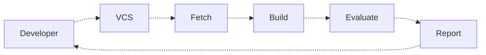
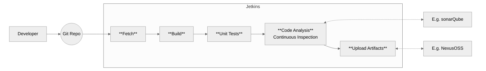

# Jenkins

Jenkins is an **extensible** and **open-source** automation server used primarily for **Continuous Integration (CI)** and **Continuous Deployment (CD)**. 

| Feature | Description |
| ------- | ------------| 
| Automates Builds & Deployments |  Helps automate software development workflows.
| Plugin-Based |  Supports 1,800+ plugins for integration with various tools (Git, Docker, Kubernetes, etc.).
| Pipeline as Code |  Uses Jenkinsfile (written in Groovy) to define CI/CD pipelines.
| Distributed & Scalable |  Can run jobs on multiple nodes to speed up execution.
| Supports Various Environments |  Works with Linux, Windows, macOS, and containers.
| Web-Based UI & CLI |  Provides a user-friendly dashboard and command-line interface.
| Triggers & Notifications |  Can execute builds on Git commits, pull requests, cron jobs, etc.
| Open-Source & Free |  Actively maintained by the community with frequent updates.

> [!TIP]
> If you're using Jetkins in Portainer and need access to Docker, ensure that Docker is installed within the container running Jetkins.

## Continuous Integration


## Freestyle vs Pipeline as a Code

| Feature |  Freestyle Job |  Pipeline as Code |
| ------| --------------| -------------------|
| Definition |  Traditional GUI-based jobs with a simple configuration |  Script-based jobs defined using Groovy in a Jenkinsfile*
| Complexity |  Easy to set up but limited flexibility |  More complex but allows for advanced workflows
| Customization |  Limited customization using UI plugins |  Highly customizable using Groovy scripting. Two options: a. Scripted and b. Declarative
| Version Control |  Not stored in version control (unless manually backed up) |  Stored as a Jenkinsfile* in Git, making it reproducible
| Stages & Parallelism |  No built-in stage support |  Supports stages, parallel execution, and error handling
| Extensibility |  Relies on GUI plugins |  Fully extensible with shared libraries and scripts
| Best For |  Simple, standalone tasks (e.g., compiling, running scripts) |  Complex CI/CD pipelines with branching, approvals, and integrations

> [!NOTE]
> To change timezone: `User` > `Account` > `Time zone`

### \* Jenkinsfile example
```groovy
pipeline {
    /************ AGENT CONFIGURATION ************/
    // The agent determines where the pipeline runs
    agent {
        label 'docker-agent'  // Runs only on agents with this label (change as needed)
        // Use 'any' to allow execution on any available Jenkins node
        // agent any
        
        // For Docker-based builds:
        // agent {
        //     docker {
        //         image 'node:18'  // Replace with your build environment
        //         args '--network host'  // Additional Docker run arguments
        //     }
        // }
    }

    /************ TOOLS CONFIGURATION ************/
    tools {
        // Define required tools that Jenkins should install (if needed)
        // Example: Use a specific JDK and Maven version
        jdk 'OpenJDK-17'
        maven 'Maven-3.8.6'
    }

    /************ ENVIRONMENT VARIABLES ************/
    environment {
        IMAGE_NAME = "my-app"
        REGISTRY = "my-docker-registry.com"
        DEPLOY_ENV = "staging"
    }

    /************ STAGES ************/
    stages {
        // 1. Fetch source code
        stage('Checkout') {
            steps {
                git branch: 'main', url: 'https://github.com/your-repo.git'
            }
        }

        // 2. Build process (replace with actual build command)
        stage('Build') {
            steps {
                sh './build.sh'  // Replace with the appropriate build command
            }
        }

        // 3. Run tests (unit tests, integration tests, etc.)
        stage('Test') {
            steps {
                sh './run-tests.sh'  // Adjust based on the project
            }
        }

        // 4. Create a container image (if applicable)
        stage('Docker Build') {
            steps {
                sh "docker build -t $REGISTRY/$IMAGE_NAME:latest ."
            }
        }

        // 5. Push image to registry (only if on main branch)
        stage('Docker Push') {
            when {
                branch 'main'
            }
            steps {
                withDockerRegistry([credentialsId: 'docker-credentials', url: "https://$REGISTRY"]) {
                    sh "docker push $REGISTRY/$IMAGE_NAME:latest"
                }
            }
        }

        // 6. Deployment step (Kubernetes, SSH, etc.)
        stage('Deploy') {
            when {
                branch 'main'
            }
            steps {
                sh './deploy.sh $DEPLOY_ENV'  // Replace with actual deployment command
            }
        }
    }

    /************ POST ACTIONS ************/
    post {
        always {
            echo 'Pipeline execution completed.'
        }
        success {
            echo 'Pipeline succeeded!'
        }
        failure {
            echo 'Pipeline failed!'
        }
    }
}
```

---

## Tools

### 1. JDK/MAVEN
1. Login to Jetkins VM/Container and run
```bash
apt install openjdk-17-jdk -y
```

2. In the `Jetkins Manage`, give a nake in the JDK installation, like `JDK17`  and fill this:
```text
JAVA_HOME='/usr/lib/jvm/java-17-openjdk-amd64'
```

3. In the `Maven installation` just give a name.

---

## Plugins

### 1. Build Time stamp

1. Go to `Manage Jetkins` -> `Available Plugins` -> Search Build timestamp -> `Install`
2. Go to `Manage Jetkins` -> `System` -> `Build Timestamp` -> Setup

---

## Example



Steps:
- Jetkins/NexusOSS/Sonarqube Setup
- Plugins
- Integrate NexusOSS/Sonarqube
- Pipeline script
- Notifications

Plugins
- `Build Timestamp`
- `Pipeline Utility Steps`
- `Pipeline Maven Integration`
- `Nexus Artifact Uploader`
- `Sonarqube Scanner`

