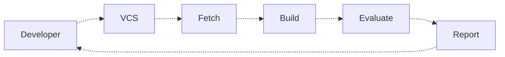

# Jenkins

Jenkins is an **extensible** and **open-source** automation server used primarily for **Continuous Integration (CI)** and **Continuous Deployment (CD)**. 

| Feature | Description |
| ------- | ------------| 
| Automates Builds & Deployments |  Helps automate software development workflows.
| Plugin-Based |  Supports 1,800+ plugins for integration with various tools (Git, Docker, Kubernetes, etc.).
| Pipeline as Code |  Uses Jenkinsfile (written in Groovy) to define CI/CD pipelines.
| Distributed & Scalable |  Can run jobs on multiple nodes to speed up execution.
| Supports Various Environments |  Works with Linux, Windows, macOS, and containers.
| Web-Based UI & CLI |  Provides a user-friendly dashboard and command-line interface.
| Triggers & Notifications |  Can execute builds on Git commits, pull requests, cron jobs, etc.
| Open-Source & Free |  Actively maintained by the community with frequent updates.

> [!TIP]
> If you're using Jetkins in Portainer and need access to Docker, ensure that Docker is installed within the container running Jetkins.

## Continuous Integration


## Freestyle vs Pipeline as a Code

| Feature |  Freestyle Job |  Pipeline as Code |
| ------| --------------| -------------------|
| Definition |  Traditional GUI-based jobs with a simple configuration |  Script-based jobs defined using Groovy in a Jenkinsfile
| Complexity |  Easy to set up but limited flexibility |  More complex but allows for advanced workflows
| Customization |  Limited customization using UI plugins |  Highly customizable using Groovy scripting
| Version Control |  Not stored in version control (unless manually backed up) |  Stored as a Jenkinsfile in Git, making it reproducible
| Stages & Parallelism |  No built-in stage support |  Supports stages, parallel execution, and error handling
| Extensibility |  Relies on GUI plugins |  Fully extensible with shared libraries and scripts
| Best For |  Simple, standalone tasks (e.g., compiling, running scripts) |  Complex CI/CD pipelines with branching, approvals, and integrations

---

## Tools

### JDK/MAVEN
1. Login to Jetkins VM/Container and run
```bash
apt install openjdk-17-jdk -y
```

2. In the `Jetkins Manage`, give a nake in the JDK installation, like `JDK17`  and fill this:
```text
JAVA_HOME='/usr/lib/jvm/java-17-openjdk-amd64'
```

3. In the `Maven installation` just give a name.

