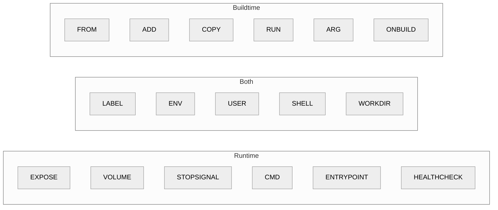
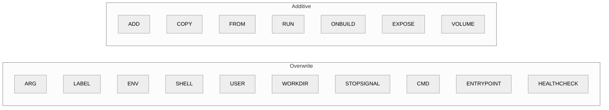
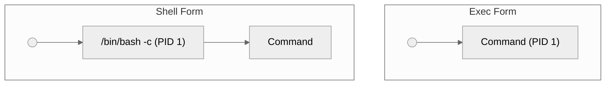

# Dockerfile

---

## Statements
Docker staments are used to declare `images` which will be used to initiate `containers` and run applications on them.

### Statements List
Here is a list of some commonly used statemets:
| Statement   | Description | Example | Extra Notes |
|-------------|-------------|---------|-------------|
| **FROM**    | Declares the base image for the Docker build. | `FROM python:slim` | Must be the first statement in a Dockerfile. You can also use `scratch` as a no-op for an empty image. | 
| **ARG**     | Defines build-time variables that users can pass at build time. | `ARG APP_VERSION=1.0` | Values are only available during the build process and cannot be accessed at runtime. | 
| **LABEL**   | Adds metadata to an image in the form of key-value pairs. | `LABEL maintainer="name@example.com"` | Useful for documentation, versioning, and other metadata. | 
| **ENV**     | Sets environment variables within the image. | `ENV EXAMPLE_ENV=1` | Useful for configuring settings in the container without hardcoding them; values can be overridden at runtime. |
| **WORKDIR** | Sets the working directory for subsequent commands and creates it if it doesn't exist. | `WORKDIR /home` | Ensures that all relative paths used later refer to the specified directory. | 
| **COPY**    | Copies files or directories from the build context into the image. | `COPY . .` | Often used to include source code or configuration files. Consider using a `.dockerignore` file to exclude unnecessary files. | 
| **ADD**     | Similar to COPY but with additional features such as extracting compressed files or downloading from URLs. | `ADD file.tar.gz /destination` | Use COPY when extra features are not needed, as ADD can have unintended side effects. | 
| **RUN**     | Executes commands during the build process of the image. | `RUN pip install virtualenv` | Each RUN creates a new layer; combining commands can help minimize the number of layers for a more efficient image. | 
| **EXPOSE**  | Documents the port(s) on which the container listens at runtime. | `EXPOSE 8080` | Does not actually publish the port – use `docker run -p` or `docker-compose` to map ports to the host. | 
| **CMD**     | Specifies the default command to run when the container starts. Only the last CMD is used, if multiple exist. | `CMD ["python", "hello.py"]` | Can be overridden by providing a command at runtime; consider using ENTRYPOINT if you need a fixed command. | 
| **ENTRYPOINT** | Configures a container to run as an executable. | `ENTRYPOINT ["python", "app.py"]` | Defines the primary command; CMD arguments can be appended if both are specified. | 
| **VOLUME**  | Creates a mount point for externally mounted volumes. | `VOLUME ["/data"]` | Helps in persisting data generated by and used by Docker containers. | 
| **USER**    | Specifies the user to run the container process. | `USER myuser` | Ensure that the user exists in the image; important for running containers with non-root privileges. | 
| **ONBUILD** | Adds a trigger instruction to be executed when the image is used as a base for another build. | `ONBUILD COPY . /app/src` | Useful for creating images meant to be extended by other images; triggers execute during the child image build. |

### Buildtime vs Runtime
#### Buildtime
When executing `docker build ...`

#### Runtime
When executing `docker run ...`



### Additive vs Overwrite 


### Command execution
`CMD`, `ENTYPOINT` and `RUN` are the only ways to run commands either during buildtime or runtime. 

There are also two formats:
| Name         | Format | Description | 
| ------------ | ------ | ----------- | 
| `Shell form` |  `RUN apt install package ` | Takes everything after the statement and executes it in a shell (it is just a string )
| `Exec form`  | `EXEC ["python3", "myapplication.py", "arg1"]` | It is in a json array syntax. This informs docker that it does not need a shell

> [!IMPORTANT]
> When using `Exec Form` we loose shell features like, variable substitution, chaining commands, etc.

- `SHELL` statement is used in every statement that used the `shell form`.
- `SHELL` default in Linux containers is `SHELL ["/bin/sh". "-c"]` and for Windows `SHELL ["cmd", "/S", "/C"]`.

> [!CAUTION]
> `SHELL` **ALWAYS** need to use the `Exec form`!

##### When to use `Shell Form` and `Exec Form`
- For `RUN` use `Shell Form`
- For `ENTRYPOINT` always use `Exec Form`
- For `CMD` prefer `Exec Form` but if you need shell features use `Shell Form`
- When `CMD` + `ENTRYPOINT` as used together, use `Exec Form`


#### `CMD` vs `ENTRYPOINT`

CMD:
- Specifies the default command and arguments for the container.
- Can be overridden when you run the container (e.g., using command-line arguments with `docker run`).
- Typically used to provide defaults that make sense for the container if no command is provided.

ENTRYPOINT:
- Configures a container to run as an executable.
- Often used to set up a fixed command that always runs, making it difficult to override without using additional parameters like `--entrypoint`.
- Commonly paired with CMD so that CMD supplies default arguments to the fixed command specified by ENTRYPOINT.
  
If you have to use one of them (like an application similar to a server that runs background process) use `CMD`. `ENTRYPOINT` makes more sense to be used in combination with `CMD`.

When both are used, docker will use the following as a starting command:
```bash
> ENTRYPOINT [space] CMD
```

Which is useful when you want to treat the container:
- As a CLI tool
    Example
    ```bash
    ENTRYPOINT ["myapplication"]
    CMD ["--help"]
    ```

- To run a startup script before executing a command.
    Example:

    Dockerfile
    ```bash
    ...
    ENTRYPOINT ["startup.sh"]
    CMD ["myapplication", "arguments"]
    # Will be executed: > startup.sh myapplication arguments
    ```

    startup.sh
    ```bash
    ...

    # Execute anything passed as input
    exec $@ # Instead of spawning a new process, exec hands over the current process's PID to the new command.
    ```


---

## Debian based packages

How to properly install them
```bash
RUN apt update && \   # Update package DB
    apt install -y --no-install-recommends <package> && \ # Install package
    rm -rf /var/lib/apt/lists/* # Cleanup package DB to save image size 
```
