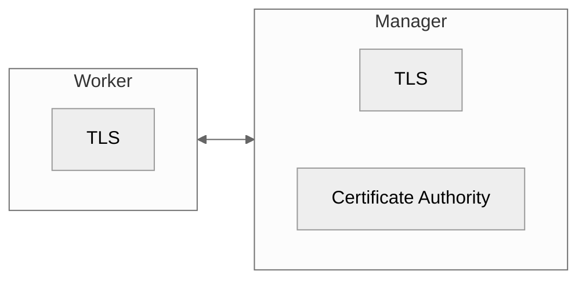
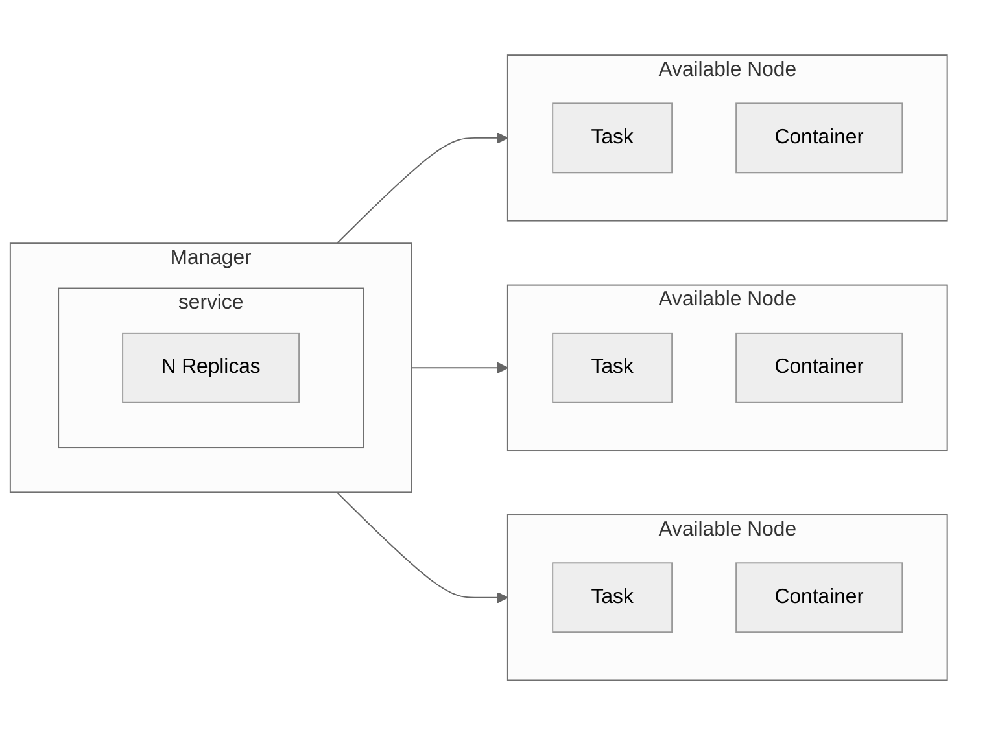

# Docker Swarm

Swarm in build-in Orchestration, a server clustering solution.

## Manager - Worker Nodes
Inside the swarm there are manager and worker nodes.
- Each one could be a VM or a physical host.
- Managers store the configuration
- Multiple managers can communicate together
- Managers can also be workers. Actually is a worker with swarm control privileges.
- A Manager can become a worker and vice versa.
- Only 1 Leader can exist at a time in the network.

## Swarm concept

Each **service** can have one or more **tasks**, then each **task** will handle each **container**.

## Setup Process
1. Inspect the output of `docker info`. Is '**Swarm**' enabled?
2. To initialize the Swarm run `docker swarm init`. Run it from the Leader node.
   1. This will create in the background root Certificates
3. To add a worker in the swarm, run the command that is provided after step 2 on the desired machine. The command should look like this:
   `docker swarm join --token <your-token> <ip-or-domain>:<port>`
4. By running `docker node ls` we can verify that the Leader node an the proper worker nodes exist in the network.