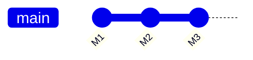
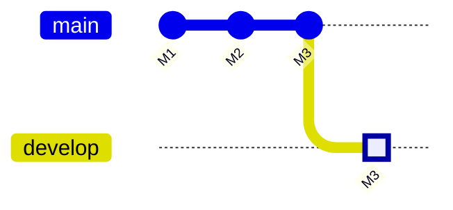
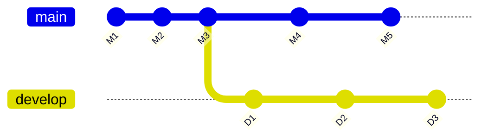
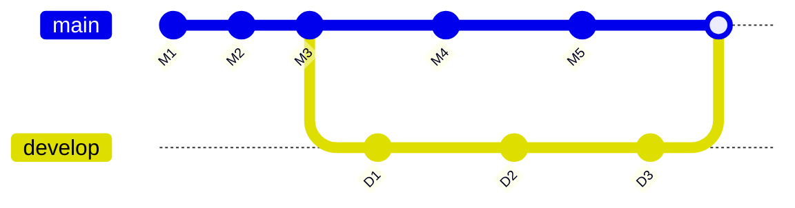
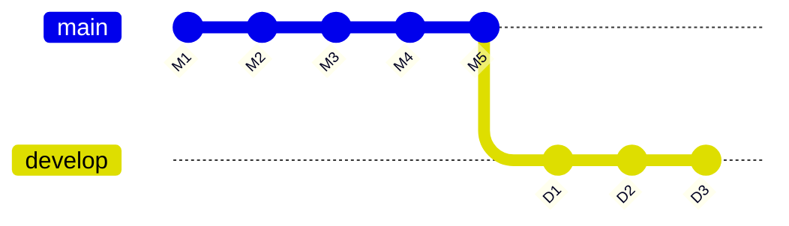
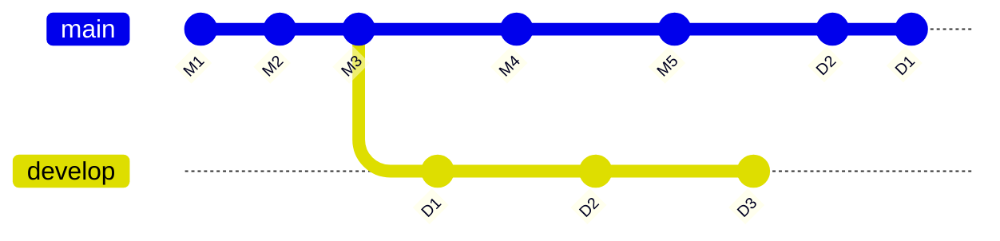

# Git

## Log

Simple
```bash
git log --oneline --graph --decorate --all --color --date=short --pretty=format:"%C(yellow)%h%Creset %C(green)(%ad)%Creset %C(blue)%an%Creset %C(red)%d%Creset - %s"
```

Extended
```bash
git log --oneline --graph --decorate --all --color --date=short --stat --pretty=format:"%C(yellow)%h%Creset %C(green)(%ad)%Creset %C(blue)%an%Creset %C(red)%d%Creset - %s"
```

---

## Pull vs Fetch

- **git fetch**: Downloads changes from the remote repository but doesn’t automatically merge them, allowing you to review changes before merging.
- **git pull**: Downloads and integrates changes (fetch + merge) from the remote repository into your local branch.

---

## Create branch
Before


```bash
# Option 1:
git branch develop      # Create new branch
git checkout develop    # Switch to new branch

# Option 2:
git checkout -b develop

git branch # (Optional) Verify in which branch you are

```

After


---

## Checkout vs Switch
Git `Checkout` is a versatile command but can be confusing because it serves multiple purposes, hence `Switch` was introduced in Git 2.23 as a simpler and more intuitive way to switch branches.

| Feature                          | `git checkout`                              | `git switch`                                    |
|----------------------------------|---------------------------------------------|------------------------------------------------|
| **Purpose**                      | Multi-functional: switch branches, restore files, or check out commits. | Focused on switching branches only.           |
| **Simplicity**                   | Can be confusing because of its multiple roles. | Intuitive, as it's specific to branch switching. |
| **New Branch Creation**          | `git checkout -b <branch>`                  | `git switch -c <branch>`                       |
| **Restoring Files**              | Yes (e.g., `git checkout <commit> -- <file>`). | No. Use `git restore` instead.                |
| **Detached HEAD**                | Supports checking out commits directly, leading to a detached HEAD state. | Supports detached HEAD state via `--detach`.


### Checkout
Switch branches:
`git checkout <branch-name>`

Create a new branch and switch to it:
`git checkout -b <new-branch-name>`

Restore a specific file to a previous state:
`git checkout <commit-hash> -- <file-path>`

Check out a specific commit (detached HEAD state):
`git checkout <commit-hash>`

### Switch
Switch branches:
`git switch <branch-name>`

Create a new branch and switch to it:
`git switch -c <new-branch-name>`

Switch to a specific commit (detached HEAD state):
`git switch --detach <commit-hash>`

---

## Git Merge
Combines the histories of two branches by creating a **merge commit**.

Before


```bash
git checkout main
git merge develop
```

After


**Key Characteristics:**
- Retains the history of both branches as-is.
- Maintains the context of branches (e.g., shows the branches diverged and then merged).
- Produces a non-linear history (with multiple parent commits).

**Use Case:**
- When you want to preserve the full history of changes.
- Collaborative workflows where you need a clear record of branch merges.

---

## Git Rebase
Moves (or replays) commits from one branch onto another branch, rewriting history.

Before


```bash
git checkout develop
git rebase main
```

After


**Key Characteristics:**
- Creates a linear history by applying commits sequentially.
- Results in a clean, linear history without merge commits.
- Original branch history is rewritten, so it changes commit hashes.

**Use Case:**
- When you want a clean history, such as for feature branches before merging into main.
- Preferable in personal or solo projects to avoid cluttered commit logs.

### Other commands
1. Interactive Rebase (Allow you to edit, squash, reorder, or remove commits during the rebase process).
`git rebase -i <branch>`
2. If a Rebase results in conflicts:
  - Git will pause and notify you of the conflict.
  - Resolve the conflicts manually.
  - After resolving conflicts, complete the rebase:
  `git rebase --continue`
  - If you want to cancel the rebase after a conflict:
  `git rebase --abort`

---

## Cherry-pick
Useful when you want to copy individual changes from a branch without merging it entirely.

Before


```bash
git checkout main
git cherry-pick D2 D1 # Commit hashes, comma separated list, the order matters
```

After


**Limitations**
- Avoid cherry-picking large numbers of commits, as it can complicate history and lead to conflicts.
- Be cautious with cherry-picking between branches that have diverging histories, as it might create inconsistencies.

**Key Takeaways**
- Cherry-pick is ideal for selective changes between branches.
- It does not merge branches or their histories, only the changes from specific commits.
- Always resolve conflicts carefully when cherry-picking across branches with differences.

### Other commands

1. Cherry-pick a Range of Commits
`git cherry-pick a1b2c3d..e4f5g6h`

2. If a cherry-pick results in conflicts:
  - Git will pause and notify you of the conflict.
  - Resolve the conflicts manually.
  - After resolving conflicts, complete the cherry-pick:
  `git cherry-pick --continue`
  - If you want to cancel the cherry-pick after a conflict:
  `git cherry-pick --abort`

3. Add a reference to the original commit in the new commit message.
`git cherry-pick -x <commit-hash>`

4. Appliy changes without creating a commit, leaving the changes staged.
`git cherry-pick --no-commit <commit-hash>`

5. Open an editor to modify the commit message during the cherry-pick process.
`git cherry-pick --edit <commit-hash>`

---

## Stash
Temporarily save changes in your working directory (both tracked and untracked files) without committing them, allowing you to switch branches or work on something else without losing progress.

1. Stash Changes
`git stash`
2. Stash with a Custom Message
`git stash push -m "WIP: Implementing feature X"`
3. View Stashed Changes
`git stash list`
4. Apply Stashed Changes (optional: give specific stash)
`git stash apply # stash@{n}`
5. Apply and Drop the Stash (optional: give specific stash)
`git stash drop # stash@{n}`
6. Clear All Stashes
`git stash clear`
7. Show Details of a Stash (`-p` is for full diff)
`git stash show -p stash@{n}`
8. Create a new branch from a stash and apply the changes in one step.
`git stash branch <branch-name> stash@{n}`

---

## Revert & Reset 
Both `revert` and `reset` are used to undo changes, but they work differently and serve distinct purposes.

| **Aspect**                  | **`git revert`**                                                                 | **`git reset`**                                                                 |
|-----------------------------|----------------------------------------------------------------------------------|--------------------------------------------------------------------------------|
| **Purpose**                 | Creates a new commit that undoes the changes introduced by a specific commit.   | Moves the branch pointer to a previous commit, effectively removing subsequent commits. |
| **History**                 | **Preserves history** (does not rewrite commit history).                        | **Rewrites history** (removes commits from the history for the current branch). |
| **Use Case**                | Safe for shared/public branches (e.g., undo changes in `main`).                 | Used for private branches or local changes.                                     |
| **Effect on Commits**       | Leaves the original commit intact and creates a new commit to reverse it.       | Deletes or unstages commits based on the reset type.                           |
| **Types**                   | No variants; always creates a new commit.                                       | Has three modes: `--soft`, `--mixed`, `--hard`.                                |
| **Conflict Handling**       | May require conflict resolution if the revert affects later changes.            | Conflicts arise only with unmerged changes during `--hard` reset.              |


| Scenario	| Use git revert	| Use git reset | 
| ----------| --------------- | --------------|
| Undo a specific commit in a shared branch.	| ✅	| 🚫
| Maintain history while undoing changes.	| ✅	| 🚫
| Undo changes in a private/local branch.	| 🚫	| ✅
| Completely remove commits from history. |	🚫	| ✅

### Reset
| Mode	| Effect on Staging Area	| Effect on Working | Directory	Use Case |
| ------| ------------------------| ------------------| -------------------|
| --soft	| Retains changes in the staging area.	| Keeps all working directory changes.	| Undo commits but keep changes staged for editing or recommitting.
| --mixed	| Clears the staging area.	| Keeps all working directory changes.	| Default reset, undo commits and changes but don't delete them.
| --hard |	Clears the staging area.	| Discards all working directory changes.	| Permanently delete commits and changes.

**Key Takeaways**

- git revert is safer for shared branches, as it keeps history intact.
- git reset is powerful for local work but can rewrite history, so use it cautiously.
- Choose the right tool depending on whether your branch is public or private.
