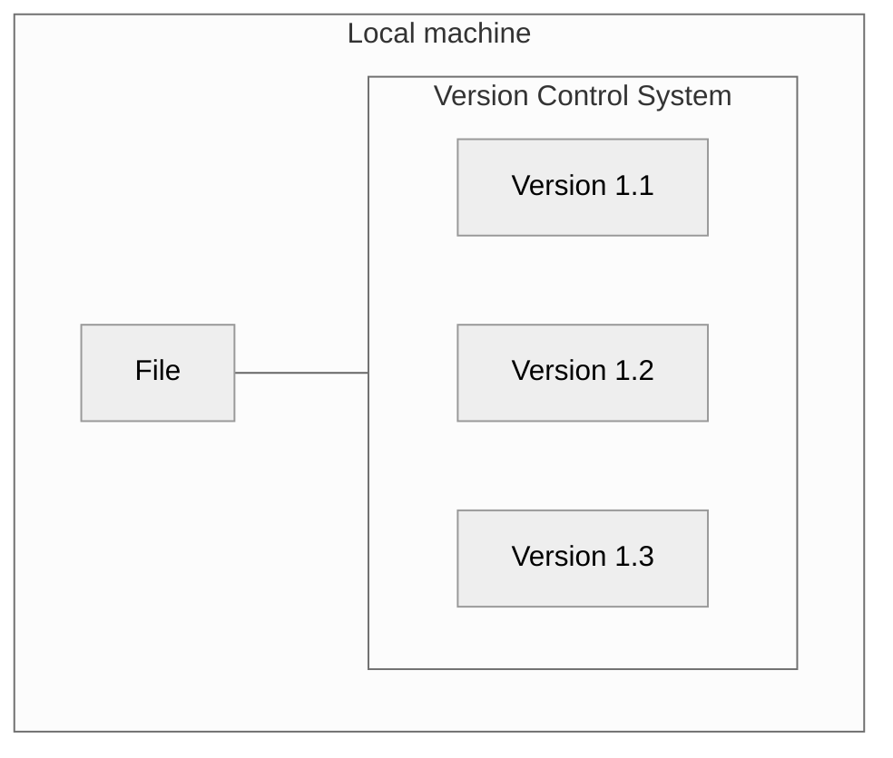
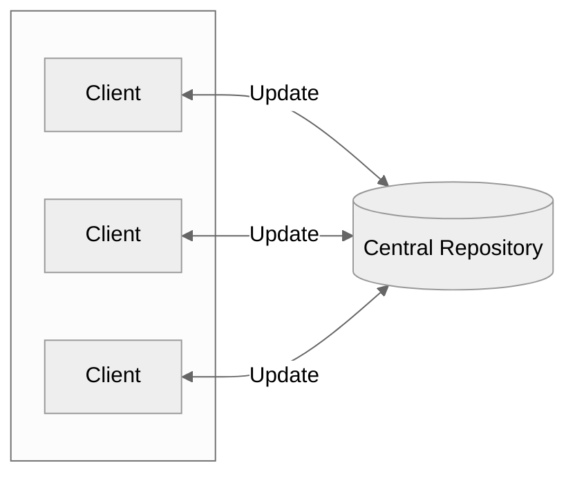
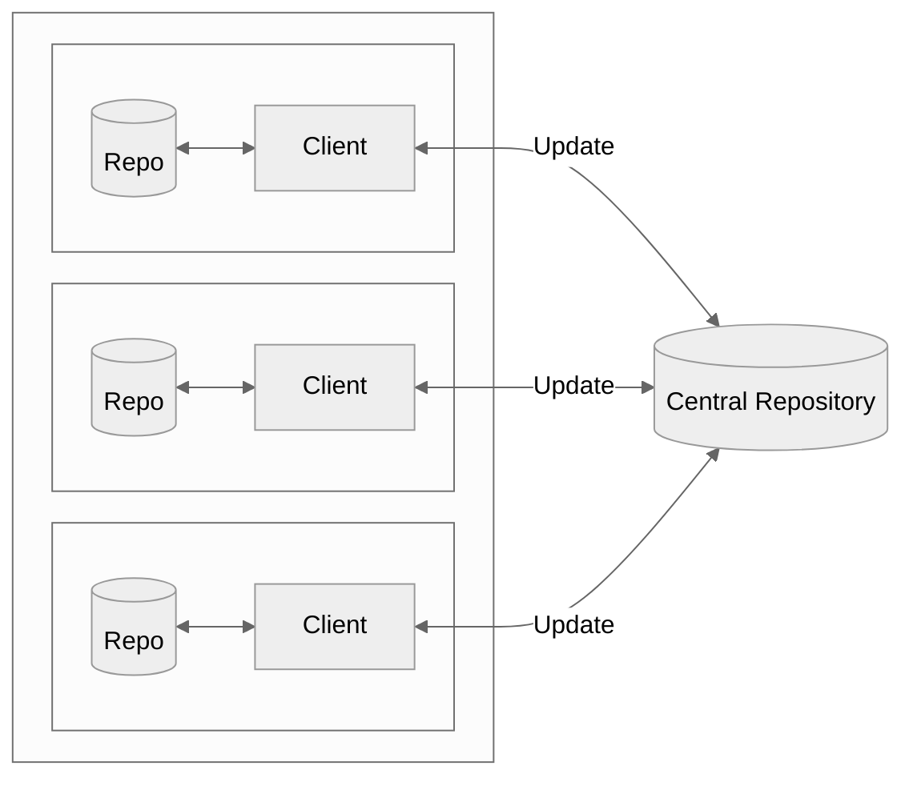

## Localized

```mermaid
%%{init: {'theme':'neutral'}}%%
graph TB

subgraph local["Local machine"]
direction LR
    subgraph vsc["Version Control System"]
        direction LR
        ver1["Version 1.1"]
        ver2["Version 1.2"]
        ver3["Version 1.3"]
    end

File --- vsc
end
```

## Centralized

```mermaid
%%{init: {'theme':'neutral'}}%%
graph LR

subgraph local[" "]
direction LR
    local-copy1["Client"]
    local-copy2["Client"]
    local-copy3["Client"]
end
cental-repo[("Central Repository")]

local-copy1 <--> | Update | cental-repo
local-copy2 <--> | Update | cental-repo
local-copy3 <--> | Update | cental-repo
```

## Distributed

```mermaid
%%{init: {'theme':'neutral'}}%%
graph LR

subgraph locals[" "]
direction TB
    subgraph local1[" "]
    direction TB
        local-copy1["Client"]
        local-repo1[("Repo")]
        local-repo1 <--> local-copy1 
    end
    subgraph local2[" "]
    direction TB
        local-copy2["Client"]
        local-repo2[("Repo")]
        local-repo2 <--> local-copy2
    end
    subgraph local3[" "]
    direction TB
        local-copy3["Client"]
        local-repo3[("Repo")]
        local-repo3 <--> local-copy3 
    end
end 

cental-repo[("Central Repository")]
local-copy1 <--> | Update | cental-repo
local-copy2 <--> | Update | cental-repo
local-copy3 <--> | Update | cental-repo
```
