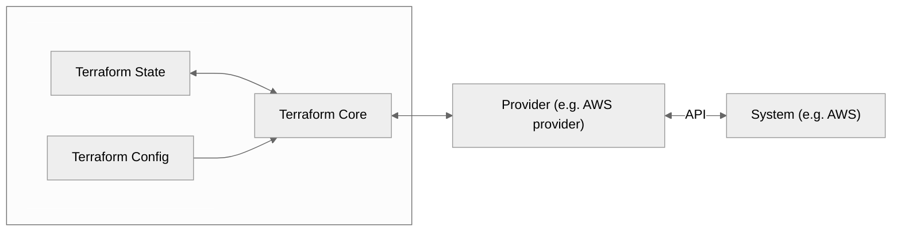

# Terraform Notes

**Terraform** is a Cloud Agnostic **Infrastructure as Code (IaC)** tool developed by HashiCorp, allowing you to **provision, manage, and version** infrastructure across multiple providers like AWS, Azure, GCP, etc or even private infrastructure like Proxmox. Terraform uses the **HashiCorp Configuration Language (HCL)** to achieve that.

---

## Why Terraform?

- **IaC**: Define infrastructure in code for repeatability and auditability.  
- **Agentless**: No agents required on managed nodes.  
- **Multi-cloud**: Supports many cloud providers.  
- **Stateful**: Tracks deployed infrastructure in a state file.  
- **Version Controlled**: Code stored in Git, enabling collaboration and history.  
- **Declarative**: Define what you want, not how to do it.  
- **Avoid Click-Ops**: Prevent manual UI errors.  
- **Save Time & Money**: Automated provisioning reduces mistakes and costs.  
- **Disaster Recovery**: Easily recreate infrastructure.  
- **Minimize Human Error**: Automated, repeatable, and validated workflows.

## Basic Concepts

| Term             | Description |
|------------------|-------------|
| **Provider**     | Plugin to interact with APIs of different platforms (e.g., AWS, Azure). |
| **Resource**     | A single infrastructure object (e.g., EC2 instance, S3 bucket). |
| **Module**       | A container for multiple resources used together. Promotes reuse. |
| **State**        | Keeps track of infrastructure. Stored locally or remotely (e.g., S3). |
| **Data Source**  | Reads information from the cloud provider for use in configuration. |
| **Output**       | Values shown after execution (e.g., IPs, DNS names). |
| **Variable**     | Dynamic input to Terraform configurations. |

## Installation (Debian)

```bash
sudo apt-get update && sudo apt-get install -y gnupg software-properties-common curl
curl -fsSL https://apt.releases.hashicorp.com/gpg | sudo gpg --dearmor -o /usr/share/keyrings/hashicorp-archive-keyring.gpg
echo "deb [signed-by=/usr/share/keyrings/hashicorp-archive-keyring.gpg] https://apt.releases.hashicorp.com $(lsb_release -cs) main" | sudo tee /etc/apt/sources.list.d/hashicorp.list
sudo apt update
sudo apt install terraform
```

## Common Commands

```bash
terraform init        # Initialize the configuration directory
terraform validate    # Validate the config
terraform fmt         # Format the code
terraform plan        # Show what will be created/changed
terraform apply       # Apply the changes
terraform destroy     # Tear down infrastructure
terraform output      # Show output values
terraform state list  # Show managed resources
terraform providers   # Show used providers
```

---

## Project Structure

```bash
my-terraform-project/
├── main.tf          # Main config file
├── variables.tf     # Declares input variables
├── outputs.tf       # Declares output values
├── terraform.tfvars # Sets the values for variables
├── modules/         # Reusable modules
└── .terraform/      # Internal Terraform files
```

---

## Core Concepts

### 1. Provider

Specifies the platform (cloud or service) you want to manage. You must configure it before using provider-specific resources.

**Example (AWS)**  
Requires AWS CLI installed and credentials configured:
```
provider "aws" {
  profile = "default"
  region  = "us-east-1"
}
```

Browse available [providers](https://registry.terraform.io/).

### 2. Resource

Represents the components of your infrastructure (e.g., EC2 instances, S3 buckets).

```
resource "aws_instance" "my_ec2" {
  ami           = "ami-0c55b159cbfafe1f0"
  instance_type = "t2.micro"
}
```

Inside the resource, expept from the provider/resource specific arguments, we can also have meta arguments which are used in any situation. 
Exaples:
  - `count`
  - `depends_on`
  - `for_each`
  - `provider`
  - `lifecycle`

### 3. Variables

See [examples](./3-variables/variables.tf)

#### A. Input Variables
Used to parameterize your configuration and make it reusable.

```
variable "region" {
  description = "Location"
  type        = string
  default     = "us-east-1"
  sensitive   = false
}

provider "aws" {
  region = var.region
}
```

You can pass variables through:
- `terraform.tfvars` file
- `-var` CLI argument
- Environment variables

#### B. Output Variables

Used to display useful info after `apply`.

```
output "instance_id" {
  value = aws_instance.my_ec2.id
}
```

#### C. Local 

```
locals {
  greeting = "Hello, Terraform!"
}

resource "aws_instance" "example" {
  ami           = "ami-12345678"
  instance_type = "t2.micro"
  
  tags = {
    Name = local.greeting
  }
}
```

### 4. State

See [examples](./2-tfstate-backends/)

Terraform tracks infrastructure with a local or remote **state file** (`terraform.tfstate`). This file contains the current known configuration and helps calculate deltas during `plan` and `apply`.

> [!CAUTION]
> Protect the State file, because it contains sensitive info like passwords.

State is stored in a state file, which is a JSON file that include details regarding every resource and data object.

Use `terraform state list` and `terraform state show <type>.<custom-name>` to display info about resources.

> 📌 For teams: Use **remote backends** (e.g., S3 + DynamoDB) for shared state + locking.

Example:
```
terraform {
  backend "s3" {
    bucket          = "bucket-name"
    key             = "infra/terraform.tfstate"
    region          = "us-east-1"
    dynamodb_table  = "tf-state"
    encrypt         = true
  }
}
```
In this example: S3 is used for the state file storage and DynamoDB for resource locking (it provides atomic operations), so, only one at a time can make changes.

> [!CAUTION]
> **State Drift**
> One terminology is **State Drift**. This terminology is used whenever the actual infrastructure
> is **NOT** the same as the tfstate 
>
> Solution:
> To fix **State Drift** you can:
> 1. Rerun `terraform plan`: .tf --> tf.state --> infrastructure
> 2. Run `terraform refresh`: tf.state <-- infrastructure **! THIS IS NOT THE BEST PRACTICE TO DO ON A WORKING ENVIRONMENT !** Use it only for experimentation.

To reconfigure after an update the statefile run `terraform init -reconfigure`

### 5. Modules

Think of modules as functions or packages. They encapsulate and reuse infrastructure components. A self-contain package for multiple resources.

It is implemented as numerout `*.tf` & `*.tfvars` files in a directory.

#### Module types: 
1. Root (default)
2. Child
3. Published (fetch existing moduled from the [Terraform registry](https://registry.terraform.io/))

Example 1
```
Infrastructure/    # Root module
├── S3/            # Child module
└── RDS/           # Child module
```

Example 2
```
module "vpc" {
  source = "./modules/vpc"
  cidr_block = "10.0.0.0/16"
}
```

### 6. Data

Sometimes we need to reference external data that:
- already exists (e.g. VPC, AMI, certificates)
- is generated dynamically
- must not be recreated or owned by our Terraform project

Instead of hardcoding values, you fetch them dynamically =
more flexible, more maintainable, more robust.

```yml
data "<resource>" "<name>" {
  ...
  
  # We can filter retrieved values
  filter {
    name   = "<what-to-filter>"
    values = ["<desired-value>"]
  }
}
```

### Concept

```text
Provider ➝ Resource ➝ Variables ➝ State ➝ Output ➝ Modules
```



---

## Terraform Workflow

1. **Install Terraform**  
   - From [terraform.io](https://terraform.io)  
   - macOS: 
    ```
    brew tap hashicorp/tap
    brew install hashicorp/tap/terraform
    ```  
   - Windows: `choco install terraform`
   - Linux: 
    ```
    wget -O - https://apt.releases.hashicorp.com/gpg | sudo gpg --dearmor -o /usr/share/keyrings/hashicorp-archive-keyring.gpg
    echo "deb [arch=$(dpkg --print-architecture) signed-by=/usr/share/keyrings/hashicorp-archive-keyring.gpg] https://apt.releases.hashicorp.com $(lsb_release -cs) main" | sudo tee /etc/apt/sources.list.d/hashicorp.list
    sudo apt update && sudo apt install terraform
    ```

1. **Write Configuration**  
   - Create a `.tf` file (e.g., `main.tf`)

2. **Initialize Project**  
   - `terraform init`  
   - Downloads providers, sets up backend, etc.

3. **Preview Changes**  
   - `terraform plan`  
   - Shows what will change without applying
   - To store the plan file use `terraform plan -out=./plan`

4. **Apply Configuration**  
   - `terraform apply`  
   - Provisions infrastructure
   - If you want to apply from a plan file use `terraform apply "./plan"`
 -  If you want to apply the changing without verification run `terraform apply -auto-aprove` **! THIS IS NOT THE BEST PRACTICE TO DO ON A WORKING ENVIRONMENT !** Use it only for experimentation.

5. **Destroy Infrastructure (optional)**  
   - `terraform destroy`  
   - Tears down what was provisioned
   - If you want to apply the changing without verification run `terraform destroy -auto-aprove` **! THIS IS NOT THE BEST PRACTICE TO DO ON A WORKING ENVIRONMENT !** Use it only for experimentation.
   - Or you can destroy specific targets `terraform destroy -target=<type>.<custom-name>` **! THIS IS NOT THE BEST PRACTICE TO DO ON A WORKING ENVIRONMENT !** Use it only for experimentation.

---

## Best Practices (For Beginners)

- Use **variables**, **outputs**, and **modules** for reusability.
- Keep the **state file secure** (never commit it).
  - Use remote state (S3 + DynamoDB) for collaboration.
- Commit only `.tf` files to Git. Add `.terraformignore` to skip secrets or local files.
- Organize projects by separating modules and environments (e.g., dev, staging, prod).
- Use `terraform fmt` for formatting and `terraform validate` to catch issues early.
- Pin provider versions for consistency.

---

## Learning Resources

- **[HashiCorp Learn - Terraform](https://developer.hashicorp.com/terraform/learn)**  
- *Terraform: Up & Running* by Yevgeniy Brikman  
- YouTube channels like *FreeCodeCamp*, *TechWorld with Nana*  
- Official documentation: https://developer.hashicorp.com/terraform/docs