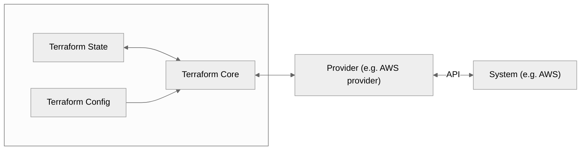

# Terraform Notes

**Terraform** is a Cloud Agnostic **Infrastructure as Code (IaC)** tool developed by HashiCorp, allowing you to **provision, manage, and version** infrastructure across multiple providers like AWS, Azure, GCP, etc or even private infrastructure like Proxmox. Terraform uses the **HashiCorp Configuration Language (HCL)** to achieve that.

---

## Why Terraform?

- **IaC**: Define infrastructure in code for repeatability and auditability.  
- **Agentless**: No agents required on managed nodes.  
- **Multi-cloud**: Supports many cloud providers.  
- **Stateful**: Tracks deployed infrastructure in a state file.  
- **Version Controlled**: Code stored in Git, enabling collaboration and history.  
- **Declarative**: Define what you want, not how to do it.  
- **Avoid Click-Ops**: Prevent manual UI errors.  
- **Save Time & Money**: Automated provisioning reduces mistakes and costs.  
- **Disaster Recovery**: Easily recreate infrastructure.  
- **Minimize Human Error**: Automated, repeatable, and validated workflows.

---

## Core Concepts

### 1. Provider

Specifies the platform (cloud or service) you want to manage. You must configure it before using provider-specific resources.

**Example (AWS)**  
Requires AWS CLI installed and credentials configured:
```
provider "aws" {
  profile = "default"
  region  = "us-east-1"
}
```

Browse available [providers](https://registry.terraform.io/).

### 2. Resource

Represents the components of your infrastructure (e.g., EC2 instances, S3 buckets).

```
resource "aws_instance" "my_ec2" {
  ami           = "ami-0c55b159cbfafe1f0"
  instance_type = "t2.micro"
}
```

### 3. Variables

Used to parameterize your configuration and make it reusable.

```
variable "region" {
  default = "us-east-1"
}

provider "aws" {
  region = var.region
}
```

You can pass variables through:
- `terraform.tfvars` file
- `-var` CLI argument
- Environment variables

### 4. Output

Used to display useful info after `apply`.

```
output "instance_id" {
  value = aws_instance.my_ec2.id
}
```

### 5. State

Terraform tracks infrastructure with a local or remote **state file** (`terraform.tfstate`). This file contains the current known configuration and helps calculate deltas during `plan` and `apply`.

> [!CAUTION]
> Protect the State file, because it contains sensitive info like passwords.

State is stored in a state file, which is a JSON file that include details regarding every resource and data object.

> 📌 For teams: Use **remote backends** (e.g., S3 + DynamoDB) for shared state + locking.

Example:
```
terraform {
  backend "s3" {
    bucket          = "bucket-name"
    key             = "infra/terraform.tfstate"
    region          = "us-east-1"
    dynamodb_table  = "tf-state"
    encrypt         = true
  }
}
```
In this example: S3 is used for the state file storage and DynamoDB for resource locking (it provides atomic operations), so, only one at a time can make changes.

### 6. Modules

Think of modules as functions or packages. They encapsulate and reuse infrastructure components.

```
module "vpc" {
  source = "./modules/vpc"
  cidr_block = "10.0.0.0/16"
}
```

### Concept

```text
Provider ➝ Resource ➝ Variables ➝ State ➝ Output ➝ Modules
```



---

## Terraform Workflow

1. **Install Terraform**  
   - From [terraform.io](https://terraform.io)  
   - macOS: 
    ```
    brew tap hashicorp/tap
    brew install hashicorp/tap/terraform
    ```  
   - Windows: `choco install terraform`
   - Linux: 
    ```
    wget -O - https://apt.releases.hashicorp.com/gpg | sudo gpg --dearmor -o /usr/share/keyrings/hashicorp-archive-keyring.gpg
    echo "deb [arch=$(dpkg --print-architecture) signed-by=/usr/share/keyrings/hashicorp-archive-keyring.gpg] https://apt.releases.hashicorp.com $(lsb_release -cs) main" | sudo tee /etc/apt/sources.list.d/hashicorp.list
    sudo apt update && sudo apt install terraform
    ```

1. **Write Configuration**  
   - Create a `.tf` file (e.g., `main.tf`)

2. **Initialize Project**  
   - `terraform init`  
   - Downloads providers, sets up backend, etc.

3. **Preview Changes**  
   - `terraform plan`  
   - Shows what will change without applying

4. **Apply Configuration**  
   - `terraform apply`  
   - Provisions infrastructure

5. **Destroy Infrastructure (optional)**  
   - `terraform destroy`  
   - Tears down what was provisioned

---

## Best Practices (For Beginners)

- Use **variables**, **outputs**, and **modules** for reusability.
- Keep the **state file secure** (never commit it).
  - Use remote state (S3 + DynamoDB) for collaboration.
- Commit only `.tf` files to Git. Add `.terraformignore` to skip secrets or local files.
- Organize projects by separating modules and environments (e.g., dev, staging, prod).
- Use `terraform fmt` for formatting and `terraform validate` to catch issues early.
- Pin provider versions for consistency.

---

## Learning Resources

- **[HashiCorp Learn - Terraform](https://developer.hashicorp.com/terraform/learn)**  
- *Terraform: Up & Running* by Yevgeniy Brikman  
- YouTube channels like *FreeCodeCamp*, *TechWorld with Nana*  
- Official documentation: https://developer.hashicorp.com/terraform/docs