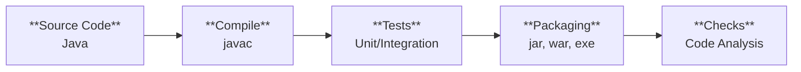

# Maven

Build process


## Creating a Project
```bash
mvn archetype:generate -DgroupId=com.example.app -DartifactId=my-maven-app -DarchetypeArtifactId=maven-archetype-quickstart -DarchetypeVersion=1.5 -DinteractiveMode=false
```

## [Maven Phases](https://maven.apache.org/guides/getting-started/maven-in-five-minutes.html)
- validate
- compile
- test
- package
- integration-test
- verify
- install
- deploy

## Useful Commands
| Command | Description |
| ------- | ------------| 
| `mvn compile` | Compile the Project |
| `mvn package` | Package the project into a JAR |
| `mvn exec:<target>` | Run the Project |
| `mvn clean` | Clean the project (delete the target directory) |
| `mvn clean package` | Everytime we make changes to `pom.xml` run this |

