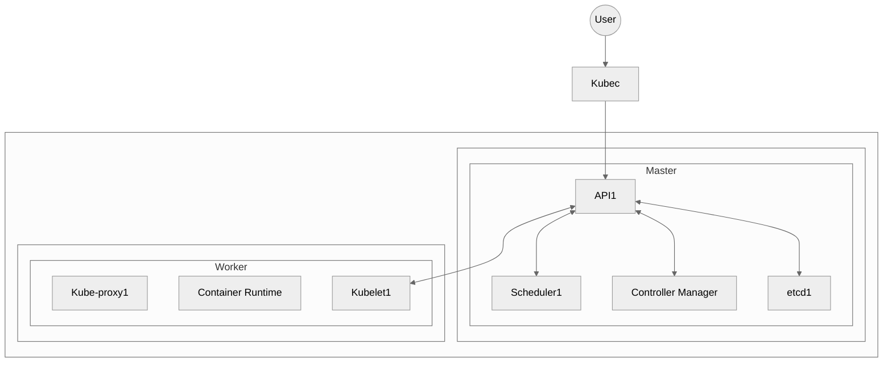
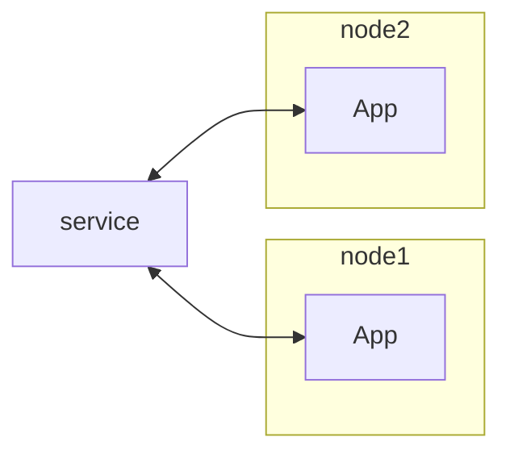

# Kuberneter

**Kubernetes** (K8s) is an open-source container orchestration platform that automates:

- Deployment
- Scaling
- Load balancing
- Management of containerized applications

It groups **containers** into **pods** and runs them across a cluster of **machines**.

The machines can be:
- Physical Devices
- Virtuam Machines
- Cloud Environments
- Hybrid implementations

**Features:**
Kubernetes can handle thousand of containers and provide the following features:
- High Availability
- Scalability
- Disaster Recovery

---

## Architecture
```
(User)
   ↓
[kubectl CLI]
   ↓
[Control Plane / Master Node]
   ├── API Server
   ├── Scheduler
   ├── Controller Manager
   └── etcd (cluster state DB)
   ↓
[Worker Nodes]
   ├── Kubelet (agent)
   ├── Container Runtime (e.g., containerd, Docker)
   └── Kube-proxy (networking)
```



### Terminology

1. **kubctl**: The CLI tool to manage apps and configure K8s
2. **Control Plane** (Master Nodes), making decisions in the cluster
   - **API Server**: talks to you (takes your commands)
   - **Scheduler**: decides where to run things
   - **Controller Manager**: keeps everything healthy
   - **etcd**: key-value data store (like a database)

3. **Worker Nodes**: where apps run. Each one can have multiple Pods
    - **Kubelet**: The agent running and manages the containers
    - **Container Runtime**: runs the actual containers (Docker, containerd)
    - **Kube Proxy**: inteligent networking management

4. **Node**: A worker machine (virtual or physical) where pods run
5. **Cluster**: A group of nodes managed by the Kubernetes control plane.
6. **Pod**: Smallest deployable unit in Kubernetes; it can contain one or more containers.

7. **Service**: Exposes pods internally or externally via a stable IP address or DNS name.
8.  **Ingress**: Manages external HTTP(S) access to services within the cluster, often with routing rules.

9.  **ConfigMap**: Provides non-sensitive configuration data (like environment variables) to pods.
10. **Secret**: Used to inject sensitive data (like passwords, tokens) into pods securely.

11. **Volume**: Persistent storage that can be attached to pods, surviving container restarts.
    
12. **Deployment**: Manages pod replicas, rolling updates, and rollbacks for stateless applications.
13. **StatefulSet**: Manages stateful applications by giving each pod a unique identity and persistent storage.
    

---

## Pods

Pods group one or more containers into the same deployment unit. It's an abstraction layer for deploying containers together with the same IP address.

Pods are created using YAML, CLI, or other APIs.

Usually, one application runs per pod.

Each pod gets its own IP address.

Pod components are **ephemeral** → when a pod is recreated, a new IP address is assigned.

To maintain consistent access, we use `Service` objects.

---

## Service and Igress

A **Service** provides a static IP address to access Pods.

[Pod] --> [Service]

If a Pod dies and a new one is created, the Service keeps the same IP.

Service usages:
- Static IP
- Load balancing



**Ingress** routes external HTTP(S) traffic to Services.

[Services]  <--> [Ingress]  <--> [Web]

---

## ConfigMap & Secrets

- **ConfigMap**: Stores external config (e.g., URLs) in plaintext.
  [ConfigMap] <--> [Pod]

- **Secret**: Stores sensitive data (e.g., credentials) in base64-encoded form.
  [Secrets] <--> [Pod]

Both can be used as environment variables or mounted into files.

---

## Volume

Pods are ephemeral. To handle persistent data, attach volumes (local or remote) to your Pods.

[Volume] <--> [Pod]

> [!IMPORTANT]
> Kubernetes does not store data by default!

---

## Deployments & StatefulSet

We use **Deployments** to define blueprints for Pods.

- Pod is an abstraction for containers.
- Deployment abstracts ReplicaSets.
- ReplicaSet manages Pods.

[Deployment] <--> [ReplicaSet] <--> [Pod]

For stateful services (e.g., databases), use **StatefulSet** which assigns unique identities and persistent volumes.

Stateful apps are harder to manage inside Kubernetes. For this reason, databases are sometimes deployed outside the cluster.

> ⚠️ We are not directly creating Pods; we create **Deployments**.

---

## Cluster

- **Master nodes** manage the cluster, requiring fewer resources (>= 2cores and 2Gb of RAM).
- **Worker nodes** run workloads and require more resources (>= 2cores and 2Gb of RAM).

### To add a Master/Worker node:

1. Install node processes.
2. Join it to the cluster.

For testing, use **Minikube**, which runs both master and worker on the same machine using VirtualBox.

Use `kubectl` to interact with the cluster.

---

## Common commands
There also a cheat sheet available [here](https://kubernetes.io/docs/reference/kubectl/quick-reference/).

### CRUD
CRUD operations happen in the deployment level

#### Create
| Command                                  | Description                                           |
|------------------------------------------|-------------------------------------------------------|
| `kubectl create deployment <name> --image=<image>` | 
| `kubectl apply -f <file>.yaml`           | Create or update resources from a YAML file    |

#### Read
| Command                                  | Description                                           |
|------------------------------------------|-------------------------------------------------------|
| `kubectl get pods`                       | List all pods in the current namespace                |
| `kubectl get pods -o wide`               |                 |
| `kubectl get all`                        | List all resources (pods, services, deployments, etc) |
| `kubectl get services`                   | List all services                                     |
| `kubectl get deployments`                | List all deployments                                  |
| `kubectl get replicaset`                 | List all                                   |

#### Update
| Command                                  | Description                                           |
|------------------------------------------|-------------------------------------------------------|
| `kubectl edit deployment <name>`         | Edit a deployment in-place                            |

#### Delete
| Command                                  | Description                                           |
|------------------------------------------|-------------------------------------------------------|
| `kubectl delete deployment <name>`       | Delete a deploymen             |

---

### Info & Logs

| Command                                  | Description                                           |
|------------------------------------------|-------------------------------------------------------|
| `kubectl version`                        | 
| `kubectl get nodes`                      | List all nodes in the cluster                         |
| `kubectl logs <pod-name>`                | View logs of a pod                                    |
| `kubectl describe pod <pod-name>`        | Show detailed info about a specific pod               |
| `kubectl describe services <service-name>`|                |
| `kubectl config view` |
| `kubectl get events` |

### Deploy Pods
| Command                                  | Description                                           |
|------------------------------------------|-------------------------------------------------------|
| `kubectl run <name> --image=<image>`     | Run a pod with a specific container image             |
| `kubectl create -f <file>.yaml`          | Create a resource from a YAML file                    |

### Debugging

| Command                                  | Description                                           |
|------------------------------------------|-------------------------------------------------------|
| `kubectl exec -it <pod> -- /bin/bash`    | Execute a shell inside a running pod                  |

### Misc

| Command                                  | Description                                           |
|------------------------------------------|-------------------------------------------------------|
| `kubectl cluster-info`                   | Show cluster info                                     |
| `kubectl scale deployment <name> --replicas=N` | Scale a deployment to N replicas              |
| `kubectl port-forward svc/<svc-name> 8080:80` | Forward port 8080 on local to 80 on service     |
| `kubectl expose pod <pod-name> --port=80 --target-port=8080` | Expose a pod as a service              |
| `kubectl config get-contexts`            | Show available contexts from kubeconfig               |
| `kubectl config use-context <name>`      | Switch between clusters/contexts                      |
| `kubectl expose deployment <deployment-name> --type=LoadBalancer --port=<port-number>` | Expose deployment to the web


