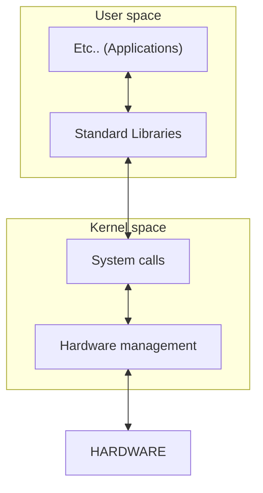

# Kernel

The Linux kernel is the core component of a Linux OS.

It manages hardware resources, processes, memory, device drivers, file systems, and networking.

---

## Types of Kernels

**Monolithic**: Linux is monolithic, i.e. everything (drivers, filesystem, networking) runs in kernel space.

**Modular**: Linux supports loadable kernel modules (LKMs) that can be inserted/removed at runtime (e.g. modprobe, insmod).

--- 

## Kernel Versioning

Format: `major`**.**`minor`**.**`patch` (e.g., 6.1.15)
- Even minor numbers used to mean "stable"; this is no longer the case.

LTS (Long Term Support) kernels are maintained for years (e.g., 5.10, 6.1).

Get version: `uname -r`

---

## Modules
List kernel modules
```
sudo lsmod
```



---
## Important Directories & Files

| **Path**                         | **Purpose**                               |
|----------------------------------|--------------------------------------------|
| `/proc`                          | Virtual filesystem for kernel info         |
| `/sys`                           | Kernel exposes hardware & device info      |
| `/boot`                          | Stores kernel images and initramfs         |
| `/lib/modules/$(uname -r)`       | Kernel modules for the current kernel      |

---

## Common Commands
| **Task**                     | **Command**                                 |
|------------------------------|----------------------------------------------|
| View kernel version          | `uname -r`                                   |
| List loaded modules          | `lsmod`                                      |
| Load a module                | `modprobe <module>`                          |
| Unload a module              | `modprobe -r <module>` or `rmmod <module>`   |
| Show kernel log (ring buffer)| `dmesg`                                      |
