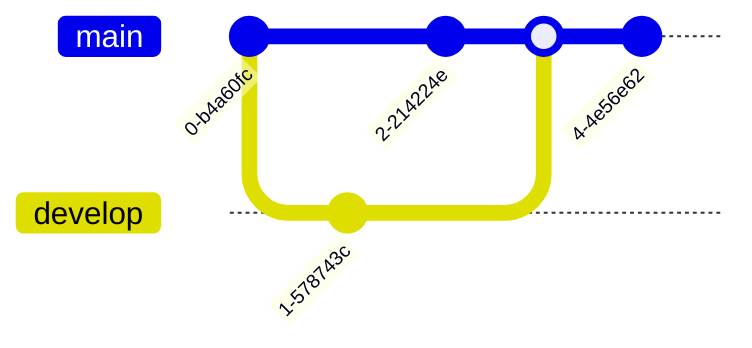

# Mermaid diagrams

Mermaid's [Documentation](https://mermaid.js.org/).

---

## Styling & Interactive Links & Icons

* **Styling:** Use `class`, or `classDef` or `style`
* **Interactive links:** click ID "link"
* **Icons:** `fa:fa-<icon-name>` from [here](https://fontawesome.com/icons)

```
flowchart TD
A["fa:fa-link URL Click on me fa:fa-link"] --> C[C]:::important
B["B"]:::classB --> D["fa:fa-hashtag D"]
class D classD;

%% Interactive Links
click A "https://google.com"

%% Styling
style A opacity:0,width:10px,height:20px,color:#007,padding:0px,margin:0px
classDef classB,classD fill:#712,stroke:#00f,stroke-width:3px,color:#555,stroke-dasharray: 5 5,font-size:14pt;
classDef important fill:#bbf,stroke:#f00,stroke-width:2px,color:#888,stroke-dasharray: 10 10
```


---

## Flowchart

### Top to Down

```
---
title: Node with text
---
flowchart TD
  %% Comment
  A[Start] --> B{Is it raining?}
  B -- Yes --> C[Take umbrella]
  B -- No --> D[Go outside]
  C --> E[End]
  D --> E[End]
```


### Left to Right
```
flowchart LR
  A[Start] --> B{Is it raining?}
  B -- Yes --> C[Take umbrella]
  B -- No --> D[Go outside]
  C --> E[End]
  D --> E[End]
```


### Subgraphs

```
flowchart TD
  A[Start]

  %% Sub 1
  subgraph Sub1["Sub1 title"]
    direction LR
    B[(Task 1)]
    C(Task 2)

    %% Sub 2
    subgraph Sub2["Sub2 title"]
      direction LR
      D((Task 3))
    end
  end

  %% Connections
  A --> B --> C
  Sub2 -- Line --> H[out]
```


---

### Styles
```
flowchart LR
subgraph Sub1
  direction TB
  B[(Style 1)]
  C(Style 2)
  D([Style 3])
  E([Style 4])
  F[[Style 5]]
  G{Style 6}
  H((Style 7))
  I>Style 8]
  J{{Style 9}}
end

subgraph Sub2
  direction TB
  K[Style 10]
  L[\Style 11\]
  M[/Style 12\]
  N[\Style 13/]
  K(((Style 14)))
end
```


---

## Sequence
```
sequenceDiagram
  Alice->>John: Hello, how are you?
  John->>Alice: I'm good, thanks!
  Alice->>John: That's great to hear!
```


---

## Gantt Chart

```
gantt
  title A Gantt Chart Example
  dateFormat  YYYY-MM-DD

  section Section 1
  Task 1 :a1, 2025-01-10, 3d
  Task 2 :after a1  , 5d

  section Section 2
  Task 3 : 2025-01-15  , 2d
```


---

## Pie Chart

```
pie
  title Favorite Fruits
  "Apple" : 40
  "Banana" : 20
  "Orange" : 40
```


---

## Class Diagram

```
classDiagram
  Animal <|-- Dog
  Animal <|-- Cat

  Dog : +bark()
  Cat : -meow()
```


---

## State Diagram

```
stateDiagram-v2
  [*] --> Idle
  Idle --> Moving
  Moving --> Stopped
  Stopped --> Idle
```


---

## Entity Relationship Diagram (ERD)

```
erDiagram
  CUSTOMER {
    string name
    string address
  }

  ORDER {
    int order_id
    date order_date
  }

  CUSTOMER ||--o| ORDER : places
```


---

## Git Graph

```
gitGraph
  commit
  branch develop
  commit
  checkout main
  commit
  merge develop
  commit
```


---

## Journey

```
journey
  title My Journey

  section Start
    First step: 5: Me
    Second step: 4: Me

  section Middle
    Third step: 3: You
    Fourth step: 4: You

  section End
    Fifth step: 5: Me
```


---

## Mindmap

```
mindmap
  root
    Root Node
      Subnode 1
        Subsubnode 1.1
        Subsubnode 1.2
      Subnode 2
      Subnode 3
```


---

### Themes

* default: `%%{init: {'theme':'default'}}%%`


* neutral: `%%{init: {'theme':'neutral'}}%%`


* dark: `%%{init: {'theme':'dark'}}%%`


* forest: `%%{init: {'theme':'forest'}}%%`


* base: `%%{init: {'theme':'base'}}%%`


---

## Architecture Diagrams

[Documentation](https://mermaid.js.org/syntax/architecture)


### Groups
Syntax
`group {group id}(<icon name>)[<title>] (in {parent id})?`

Example:
`group group1(cloud)[Some group]`


### Services
Syntax
`service {service id}(<icon name>)[<title>] (in <parent id>)?`

Example:
`service service1(database)[My awesome service]`

### Edges
Syntax
`{serviceId}{{group}}?:{T|B|L|R} {<}?--{>}? {T|B|L|R}:{serviceId}{{group}}`

### Usage
```
architecture-beta
    group api(cloud)[API]

    service db(database)[Database] in api
    service disk1(disk)[Storage] in api
    service disk2(disk)[Storage] in api
    service server(server)[Server] in api

    db:L -- R:server
    disk1:T -- B:server
    disk2:T -- B:db
```


---

## Expanded Node Shapes

```mermaid
flowchart LR
  A1@{ shape: notch-rect, label: "Represents a card (notch-rect)"}
  A2@{ shape: hourglass, label: "Represents a collate operation (hourglass)"}
  A3@{ shape: bolt, label: "Communication link (bolt)"}
  A4@{ shape: brace, label: "Adds a comment (brace)"}
  A5@{ shape: brace-r, label: "Adds a comment (brace-r)"}
  A6@{ shape: braces, label: "Adds a comment (braces)"}
  A7@{ shape: lean-r, label: "Represents input or output (lean-r)"}
  A8@{ shape: lean-l, label: "Represents output or input (lean-l)"}
  A9@{ shape: cyl, label: "Database storage (cyl)"}
  A10@{ shape: diam, label: "Decision-making step (diam)"}
  A11@{ shape: delay, label: "Represents a delay (delay)"}
  A12@{ shape: h-cyl, label: "Direct access storage (h-cyl)"}
  A13@{ shape: lin-cyl, label: "Disk storage (lin-cyl)"}
  A14@{ shape: curv-trap, label: "Represents a display (curv-trap)"}
  A15@{ shape: div-rect, label: "Divided process shape (div-rect)"}
  A16@{ shape: doc, label: "Represents a document (doc)"}
  A17@{ shape: rounded, label: "Represents an event (rounded)"}
  A18@{ shape: tri, label: "Extraction process (tri)"}
  A19@{ shape: fork, label: "Fork or join in process flow (fork)"}
  A20@{ shape: win-pane, label: "Internal storage (win-pane)"}
  A21@{ shape: f-circ, label: "Junction point (f-circ)"}
  A22@{ shape: lin-doc, label: "Lined document (lin-doc)"}
  A23@{ shape: lin-rect, label: "Lined process shape (lin-rect)"}
  A24@{ shape: notch-pent, label: "Loop limit step (notch-pent)"}
  A25@{ shape: flip-tri, label: "Manual file operation (flip-tri)"}
  A26@{ shape: sl-rect, label: "Manual input step (sl-rect)"}
  A27@{ shape: trap-t, label: "Represents a manual task (trap-t)"}
  A28@{ shape: docs, label: "Multiple documents (docs)"}
  A29@{ shape: st-rect, label: "Multiple processes (st-rect)"}
  A30@{ shape: odd, label: "Odd shape (odd)"}
  A31@{ shape: flag, label: "Paper tape (flag)"}
  A32@{ shape: hex, label: "Preparation or condition step (hex)"}
  A33@{ shape: trap-b, label: "Priority action (trap-b)"}
  A34@{ shape: rect, label: "Standard process shape (rect)"}
  A35@{ shape: circle, label: "Starting point (circle)"}
  A36@{ shape: sm-circ, label: "Small starting point (sm-circ)"}
  A37@{ shape: dbl-circ, label: "Represents a stop point (dbl-circ)"}
  A38@{ shape: fr-circ, label: "Stop point (fr-circ)"}
  A39@{ shape: bow-rect, label: "Stored data (bow-rect)"}
  A40@{ shape: fr-rect, label: "Subprocess (fr-rect)"}
  A41@{ shape: cross-circ, label: "Summary (cross-circ)"}
  A42@{ shape: tag-doc, label: "Tagged document (tag-doc)"}
  A43@{ shape: tag-rect, label: "Tagged process (tag-rect)"}
  A44@{ shape: stadium, label: "Terminal point (stadium)"}
  A45@{ shape: text, label: "Text block (text)"}
``` 
---

