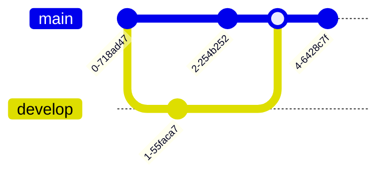

# Mermaid diagrams

---

## Flowchart

### Top to Down

```
flowchart TD
  A[Start] --> B{Is it raining?}
  B -- Yes --> C[Take umbrella]
  B -- No --> D[Go outside]
  C --> E[End]
  D --> E[End]
```


### Left to Right
```
flowchart LR
  A[Start] --> B{Is it raining?}
  B -- Yes --> C[Take umbrella]
  B -- No --> D[Go outside]
  C --> E[End]
  D --> E[End]
```


### Subgraphs

```
flowchart TD
  A[Start]
  subgraph Sub1
    B[Task 1]
    C[Task 2]
  end
  A --> B --> C
```


---


## Sequence
```
sequenceDiagram
  Alice->>John: Hello, how are you?
  John->>Alice: I'm good, thanks!
  Alice->>John: That's great to hear!
```


---

## Gantt Chart

```
gantt
  title A Gantt Chart Example
  dateFormat  YYYY-MM-DD

  section Section 1
  Task 1 :a1, 2025-01-10, 3d
  Task 2 :after a1  , 5d

  section Section 2
  Task 3 : 2025-01-15  , 2d
```


---

## Pie Chart

```
pie
  title Favorite Fruits
  "Apple" : 40
  "Banana" : 20
  "Orange" : 40
```


---

## Class Diagram

```
classDiagram
  Animal <|-- Dog
  Animal <|-- Cat

  Dog : +bark()
  Cat : -meow()
```


---

## State Diagram

```
stateDiagram-v2
  [*] --> Idle
  Idle --> Moving
  Moving --> Stopped
  Stopped --> Idle
```


---

## Entity Relationship Diagram (ERD)

```
erDiagram
  CUSTOMER {
    string name
    string address
  }

  ORDER {
    int order_id
    date order_date
  }

  CUSTOMER ||--o| ORDER : places
```


---

## Git Graph

```
gitGraph
  commit
  branch develop
  commit
  checkout main
  commit
  merge develop
  commit
```


---

## Journey

```
journey
  title My Journey

  section Start
    First step: 5: Me
    Second step: 4: Me

  section Middle
    Third step: 3: You
    Fourth step: 4: You

  section End
    Fifth step: 5: Me
```


---

## Mindmap

```
mindmap
  root
    Root Node
      Subnode 1
        Subsubnode 1.1
        Subsubnode 1.2
      Subnode 2
      Subnode 3
```


