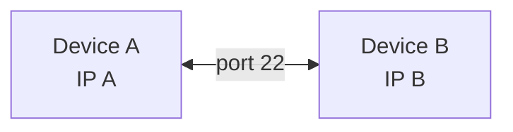

# Firewall

## Port Forwarding
### WAN --> LAN port forward
```
/ip firewall nat add chain=dstnat in-interface=<interface> protocol=tcp dst-port=<src-port> action=dst-nat to-addresses=<lan-device-ip> to-ports=<dst-port>
/ip firewall filter add chain=forward protocol=tcp dst-port=<src-port> dst-address=<lan-device-ip> action=accept
```

## Block traffic

### Between 2 devices
> [!IMPORTANT]
> **NOT TESTED YET**

Assume that you have:
- Device A: having IP-A
- Device B: having IP-B

And you want to communicate between these two devices only on port 22 and drop any other connection on other ports



Commands
```
# A --> B 
/ip firewall filter add chain=forward src-address=<deviceA-IP> dst-address=<deviceB-IP> protocol=tcp dst-port=22 action=accept comment="Allow SSH from A to B"
/ip firewall filter add chain=forward src-address=<deviceA-IP> dst-address=<deviceB-IP> protocol=tcp dst-port=!22 action=drop comment="Block all except port 22 from A to B"

# B --> A
/ip firewall filter add chain=forward src-address=<deviceB-IP> dst-address=<deviceA-IP> protocol=tcp dst-port=22 action=accept comment="Allow SSH from B to A"
/ip firewall filter add chain=forward src-address=<deviceB-IP> dst-address=<deviceA-IP> protocol=tcp dst-port=!22 action=drop comment="Block all except port 22 from B to A"
```