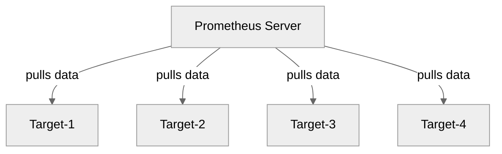
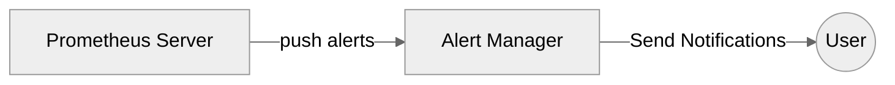
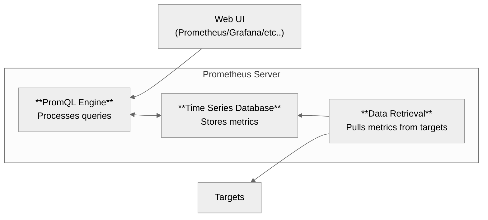

# Prometheus

Prometheus is a powerful monitoring and alerting toolkit that collects and stores metrics from various systems in a unified, **time-series database**.

It is **not a log collector**, but rather a **Time Series Database (TSDB)** designed to collect metrics such as CPU usage, memory consumption, and request rates from a variety of targets.

Prometheus **pulls metrics** from configured **targets** at specified intervals and stores them efficiently.

---
## Pull Model (Scrapes data)



Each **Target** can be:
- An Application
- A Docker Container
- A Kubernetes Pod or Node
- A VM or Physical Server
- Any other endpoint exposing metrics in the Prometheus format

And it motitors **units** like:
- CPU utilization
- Memory usage
- Disk I/O
- HTTP request rate
- And many more, depending on the **target** and **exporter** used (see below)

---

## Alerting

Prometheus can generate alerts based on predefined rules. These alerts are pushed to the Alert manager, which then handles notification logic.



All **targets** and **alerting rules** are defined in the Prometheus configuration file (`prometheus.yml`).

You can send notifications via:
- Email
- Slack
- And many more

---

## Architecture



- **Data Retrieval**: Pulls metrics from targets using HTTP
- **Time Series Database (TSDB)**: Stores the retrieved metrics
- **PromQL Engine**: Allows querying the stored metrics using PromQL
- **Web UI or Grafana**: Used to visualize and explore the metrics

> [!NOTE]
> You can push TSDB to a remote Storage too.

### Data Retrieval
To retrieve metrics from a service, the service must expose an endpoint that Prometheus can scrape. 

This is typically done through a Prometheus-compatible endpoint at:

`http://<ip-or-domain>/metrics`

The data exposed at this endpoint must be in a Prometheus text-based format (read [this](#format)).

A lot of times, services do not publish by default metrics in this endpoint or in the correct format, so exporters are needed to achieve that (read [this](#exportes)).

All **scraping rules** are defined in the Prometheus configuration file (`prometheus.yml`).

---

## Monitoring Types

### 1. Logs
Logs are timestamped records that track events in a system or application.

- Typically found in Linux at `/var/log/`

- Examples:
    - SSH login attempts (`/var/log/auth.log`)
    - Apache access logs (`/var/log/apache2/access.log`)

> [!IMPORTANT]
> Prometheus is not used to collect logs. 
> 
> Use tools like ELK (Elasticsearch, Logstash, Kibana) or Loki for log aggregation.

### 2. Metrics

Metrics are numeric values that represent the state of a system.

- Quantitative data such as counters
- Examples:
    - CPU usage
    - Number of HTTP requests
    - Uptime of a service
    - Disk space remaining

### Data model

The Prometheus format is a **text-based** format used to expose metrics in a way that Prometheus can  understand. 

The format consists of a series of lines, each representing a single metric or metadata about a metric. 
```
# HELP <metric_name> <A string description about this metric>
# TYPE <metric_name> <type>
<metric_name>{<label_1>="<value_1>", <label_2>="<value_2>", ...} <metric_value> <timestamp>
```
Where: 

- Metric Name: A descriptive name of the metric 
- Labels: Optional key-value pairs
- Metric Value: The actual measurement or value

### Metric Types

| Metric Type | Description | Use Case | Example |
|-------------|-------------|----------|---------|
| **Counter** | A monotonically increasing value | Tracking the **total** number of something | # of HTTP requests
| **Gauge**     | A value that can go up and down  | Monitoring the **current** number of something | Current CPU usage
| **Histogram** | A metric that measures the distribution of values in defined buckets | Measuring how big a value is or how long it last | Track response times for HTTP requests
| **Summaries** | | | 

---

## Exporters

In many cases, services do not expose metrics (see [here](#architecture)) by default in the Prometheus format. 

To enable Prometheus to collect metrics from these services, exporters are used. 

Exporters are intermediary services or applications that collect data from an application, system, or service and expose it in a format that Prometheus can understand.

[Official Documentation](https://prometheus.io/docs/instrumenting/exporters/)

**exporters** should also be defined in the Prometheus configuration file (`prometheus.yml`).

**Common exporters:**
    - [node_exporter](https://github.com/prometheus/node_exporter) (for system metrics)
    - [cadvisor](https://github.com/google/cadvisor) (for container metrics)
    - [blackbox_exporter](https://github.com/prometheus/blackbox_exporter) (for probing endpoints)

---

## Configuration
Prometheus uses a YAML configuration file titled `prometheus.yml` to define how it discovers targets, scrapes metrics, and stores data.

**Template**
```yaml
# ------------------------------------------------------------------
# Section 1: 
# Global settings applied to all scrape jobs unless overridden
# ------------------------------------------------------------------

global:
  scrape_interval: 15s      # How often to scrape targets (default: 1m)
  evaluation_interval: 15s  # How often to evaluate rules (default: 1m)

# ------------------------------------------------------------------
# Section 2:
# [Optional]
# Define recording rules and alerting rules
# ------------------------------------------------------------------

rule_files:
  - "rules/recording.rules.yml"
  - "rules/alerting.rules.yml"

# ------------------------------------------------------------------
# Section 3:
# This section tells Prometheus what to monitor and how to find it
# Define jobs and targets to scrape
# ------------------------------------------------------------------

scrape_configs:
- job_name: "prometheus"                # A label for the group of targets
  static_configs:                     # Manually define IPs or domain names
  - targets: ["localhost:9090"]       # List of endpoints to scrape metrics from (each should expose /metrics)

# Another one
- job_name: "demo"
  static_configs:
  - targets: 
    - demo.promlabs.com:10000   # Demo targets publicly available
    - demo.promlabs.com:10001
    - demo.promlabs.com:10002

# Maybe there will be more...
```

\* Instead of `static_config`, the **discovery service** can also be used.

### Rules

#### 1. Recording Rules
Recording rules precompute frequently-used or expensive queries and store their results as new time series.

```yaml
groups:
  - name: example-recording-rules
    interval: 30s
    rules:
        # Name of the new metric
      - record: instance:cpu_usage:rate5m
        # The PromQL expression to evaluate
        expr: rate(node_cpu_seconds_total{mode!="idle"}[5m])
```

When/Why to use?
- Improve performance by avoiding expensive computations during dashboard rendering.
- Simplify complex queries by giving them a name.

#### 2. Alerting Rules
Alerting rules define conditions for triggering alerts, which are sent to the Alertmanager.

```yaml
groups:
  - name: example-alerting-rules
    rules:
        # Name of the alert
      - alert: HighCPUUsage
        # PromQL expression to evaluate
        expr: rate(node_cpu_seconds_total{mode!="idle"}[5m]) > 0.85
        # Duration the condition must be true before firing
        for: 2m
        #  Extra metadata 
        labels:
          severity: warning
        # Human-readable info for dashboards or notifications
        annotations:
          summary: "High CPU usage detected on {{ $labels.instance }}"
          description: "CPU usage is above 85% for 2 minutes."
```

> [!TIP]
> For multiline **expr**, follow this approach
> ```
> expr: | 
>   ...
> ```

Best Practices:
- Keep rules modular: Use separate files for different types (e.g., cpu.rules.yml, memory.rules.yml, alerts.rules.yml).
- Use recording rules for dashboards to reduce query load.
- Alerting rules should be concise and actionable.

---

## Workflow

**How to have a running setup?**
Assume we want to monitor multiple Linux servers using a Prometheus server. To achieve this, follow these steps:

1. **Run `node_exporter` on All Target Servers**  

   Each server will expose metrics at:  
   ```
   http://<each-server-ip>:9100/metrics
   ```
2. **Prepare the Prometheus Configuration File (`prometheus.yml`)**  
In the `scrape_configs` section, list all target servers running node_exporter.  
3. **Start the Prometheus Server**
    Run Prometheus using your preferred method (e.g., Docker, systemd, or binary), and ensure it uses the correct configuration file.
2. **Access the Prometheus Web UI**
    Open a browser and navigate to:
    ```
    http://<prometheus-ip>:9090
    ```
3. **Verify Targets Health**
  In the Prometheus UI, go to: `Status` > `Targets`
  Ensure all your configured targets are listed and their status is UP
4. Now you can connect your Prometheus server to Grafana

---

### Usage
There are multiple ways to use Prometheus

#### Binary

##### Server 
Download the prometheus monitoring system from [here](https://github.com/prometheus/prometheus/releases) or:
```bash
VERSION="3.3.0"
wget "https://github.com/prometheus/prometheus/releases/download/v${VERSION}/prometheus-${VERSION}.linux-386.tar.gz"
tar xzvf prometheus-${VERSION}.linux-386.tar.gz
cd prometheus-${VERSION}.linux-386
sudo useradd --no-create-home --shell /bin/false prometheus
sudo mkdir -p /etc/prometheus
sudo install -o prometheus -g prometheus -m 0755 prometheus /usr/local/bin/prometheus
sudo install -o prometheus -g prometheus -m 0644 prometheus.yml /etc/prometheus/prometheus.yml
echo "@reboot prometheus /usr/local/bin/prometheus --config.file=/etc/prometheus/prometheus.yml >> /var/log/prometheus.log 2>&1" | sudo tee -a /etc/crontab > /dev/null
bash -c '/usr/local/bin/prometheus --config.file=/etc/prometheus/prometheus.yml &'
```

Then enable firewall
```bash
# Debian
sudo ufw enable
sudo ufw allow 9090
```

> [!IMPORTANT]
> Make sure that you have a proper server configuration file, that will retrieve from all desired targets metrics.

Access:
```bash
http://<server-ip-or-domain>:9090
```

##### VM/Physical Device
Download and run the *node_exporter* binary from [here](https://github.com/prometheus/node_exporter/releases)
```bash
VERSION="1.9.1"
wget https://github.com/prometheus/node_exporter/releases/download/v${VERSION}/node_exporter-${VERSION}.linux-386.tar.gz
tar xzvf node_exporter-${VERSION}.linux-386.tar.gz
cd node_exporter-${VERSION}.linux-386
sudo useradd --no-create-home --shell /bin/false prometheus
sudo install -o prometheus -g prometheus -m 0755 node_exporter /usr/local/bin/node_exporter
echo "@reboot prometheus /usr/local/bin/node_exporter >> /var/log/node_exporter.log 2>&1" | sudo tee -a /etc/crontab > /dev/null
bash -c '/usr/local/bin/node_exporter &'
```

---

## PromQL
PromQL (Prometheus Query Language) is the powerful query language used in Prometheus. You can use it to retrieve, manipulate, and visualize time series data. 

[PromQL Cheat Sheet](https://promlabs.com/promql-cheat-sheet/)

---

## Learning resources
- [Prometheus Fundamentals](https://www.youtube.com/playlist?list=PLyBW7UHmEXgylLwxdVbrBQJ-fJ_jMvh8h)