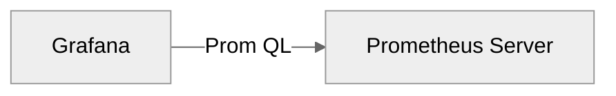

# Grafana

Grafana is a powerful open-source platform for monitoring and observability. 

It allows you to visualize and analyze metrics from various data sources like Prometheus, InfluxDB, MySQL, PostgreSQL, and more.

Grafana queries metrics from Prometheus (or other databases) using a query language like **PromQL**.

---

## Model

## Connection
**Default URL**: `http://<ip-or-domain>:3000`
**Default Credentials**
Username: **admin**
Password: **admin**

---

## > Prometheus

In order to connect a Prometheus server to Grafana:

1. `Home` > `Connections` > `Data sources` > `Add data source` > `Prometheus`
1. Set a unique name for the data source
2. Set Prometheus server URL (e.g., `http://localhost:9090`)
3. Click Save & Test to verify the connection

## > Dashboards
Dashboards in Grafana are composed of panels, each representing a visual element such as a graph, gauge, or stat.

### Panel Editor Structure
The panel editor is divided into three key sections:

1. Visualization (top): Displays resulting graph or visualization **[V]**
2. Data queries (bottom): To build and test queries **[D]**
3. Panel Options (left): Settings for the panel title, description, units, and other visual options **[P]**

### Create a new Panel (Vizualization)
1. Select the vizualization type (e.g. time series) **[P]**
2. Set time to display **[V]**
3. Set `Data source` **[D]**
4. Create queries **[D]**
5. `Run queries` **[D]** and visualize them **[V]**
6. Modify them as needed **[D]**
7. Give a `Title` to the panel **[P]**
8. Search and set `Unit` **[P]** to help Grafana display better the graphs
9. When ready, click `Save dashboard`

---
