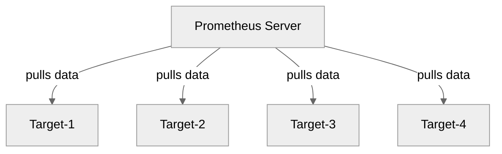
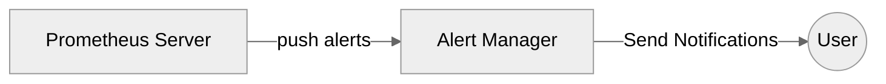
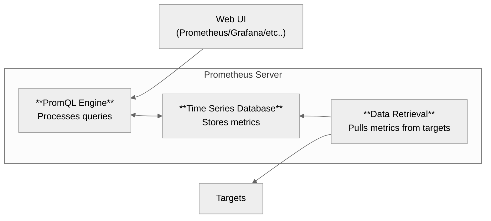

# Prometheus

Prometheus is a powerful monitoring and alerting toolkit that collects and stores metrics from various systems in a unified, **time-series database**.

It is **not a log collector**, but rather a **time-series database** designed to collect metrics such as CPU usage, memory consumption, and request rates from a variety of targets.

Prometheus **pulls metrics** from configured **targets** at specified intervals and stores them efficiently.

---
## Pull Model



Each **Target** can be:
- An Application
- A Docker Container
- A Kubernetes Pod or Node
- A VM or Physical Server
- Any other endpoint exposing metrics in the Prometheus format

And it motitors **units** like:
- CPU utilization
- Memory usage
- Disk I/O
- HTTP request rate
- And many more, depending on the **target** and **exporter** used (see below)

---

## Alerting

Prometheus can generate alerts based on predefined rules. These alerts are pushed to the Alert manager, which then handles notification logic.



All **targets** and **alerting rules** are defined in the Prometheus configuration file (`prometheus.yml`).

---

## Architecture



- **Data Retrieval**: Pulls metrics from targets using HTTP
- **Time Series Database**: Stores the retrieved metrics
- **PromQL Engine**: Allows querying the stored metrics using PromQL
- **Web UI or Grafana**: Used to visualize and explore the metrics

### Data Retrieval
To retrieve metrics from a service, the service must expose an endpoint that Prometheus can scrape. 

This is typically done through a Prometheus-compatible endpoint at:

`http://<ip-or-domain>/metrics`

The data exposed at this endpoint must be in a Prometheus text-based format (read [this](#format)).

A lot of times, services do not publish by default metrics in this endpoint or in the correct format, so exporters are needed to achieve that (read [this](#exportes)).

All **scraping rules** are defined in the Prometheus configuration file (`prometheus.yml`).

---

## Monitoring Types

### 1. Logs
Logs are timestamped records that track events in a system or application.

- Typically found in Linux at `/var/log/`

- Examples:
    - SSH login attempts (`/var/log/auth.log`)
    - Apache access logs (`/var/log/apache2/access.log`)

> [!IMPORTANT]
> Prometheus is not used to collect logs. 
> 
> Use tools like ELK (Elasticsearch, Logstash, Kibana) or Loki for log aggregation.

### 2. Metrics

Metrics are numeric values that represent the state of a system.

- Quantitative data such as counters
- Examples:
    - CPU usage
    - Number of HTTP requests
    - Uptime of a service
    - Disk space remaining

### Format

The Prometheus format is a **text-based** format used to expose metrics in a way that Prometheus can  understand. 

The format consists of a series of lines, each representing a single metric or metadata about a metric. 
```
<metric_name>{<label_1>="<value_1>", <label_2>="<value_2>", ...} <metric_value> <timestamp>
```
Where: 

- Metric Name: A descriptive name of the metric 
- Labels: Optional key-value pairs
- Metric Value: The actual measurement or value

### Metric Types

| Metric Type | Description | Use Case | Example |
|-------------|-------------|----------|---------|
| **Counter** | A monotonically increasing value | Tracking the total number of something | # of HTTP requests
| **Gauge**     | A value that can go up and down  | Monitoring the current number of something | Current CPU usage
| **Histogram** | A metric that measures the distribution of values in defined buckets | Measuring how big a value is or how long it last | Track response times for HTTP requests

---

## Exporters

In many cases, services do not expose metrics (see [here](#architecture)) by default in the Prometheus format. 

To enable Prometheus to collect metrics from these services, exporters are used. 

Exporters are intermediary services or applications that collect data from an application, system, or service and expose it in a format that Prometheus can understand.

[Official Documentation](https://prometheus.io/docs/instrumenting/exporters/)

**exporters** should also be defined in the Prometheus configuration file (`prometheus.yml`).

**Common exporters:**
    - [node_exporter](https://github.com/prometheus/node_exporter) (for system metrics)
    - [cadvisor](https://github.com/google/cadvisor) (for container metrics)
    - [blackbox_exporter](https://github.com/prometheus/blackbox_exporter) (for probing endpoints)