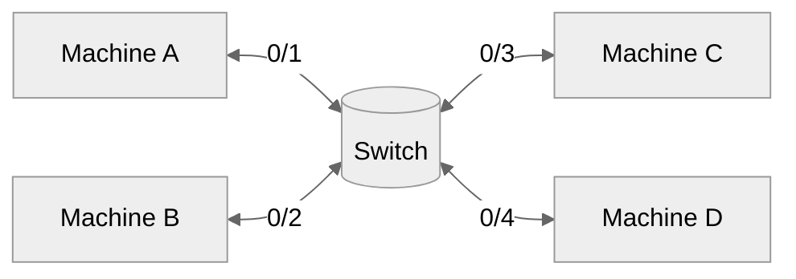
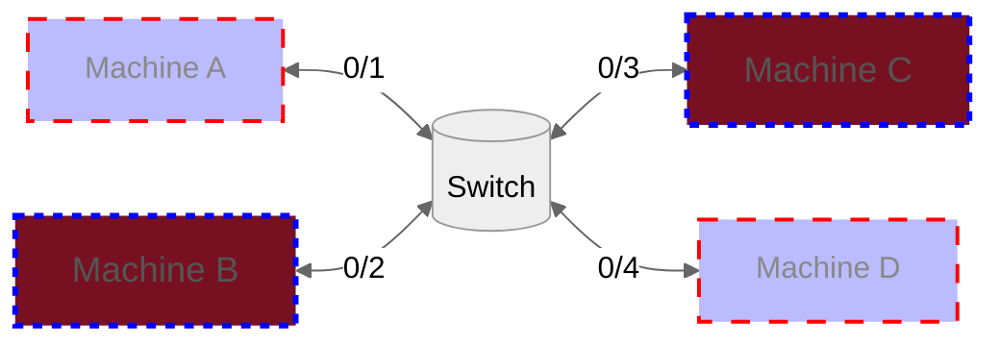
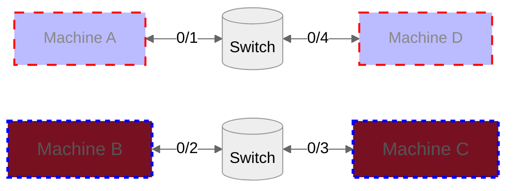

# VLAN
VLAN stands for **Virtual LAN** and is considered as a **separate broadcast domain** or **logical networks (subnet)**.

VLAN are implemented in **Layer 2** and the only way to go from a VLAN to another is via a **Layer 3** device like a router.

## VLANs vs Subnets
Both are created to separate a network into smaller pieces.

| VLAN | Subnet|
|-----| -------|
| Virtual separation | Physical separation | 
|  | Is created by using a Layer 3 device |

---

### Trunking Protocols
- **802.1Q:** (Industry standard)
- **ISL:** (Cisco specific, is not prefered to be used today)
- **VTP:** VLAN Trunking Protocol (Cisco proprietary)

In order to transfer VLAN information **between network devices** (e.g. switches) a trunking cable is required.

**Trunk/Tagged** ports: Contain multiple tag information
**Access/Untagged** Ports: Contain on only one tag

---
### **802.1Q**

#### 1. **Standard Ethernet Frame (802.3)**
| Preamble |  SFD   | Dest            | Src            | Len/Etype | Data/Payload  | FCS            |
| -------- | ----   |---------------- | -------------- | --------- | ------------- | -------------- |
| 7 bytes  | 1 byte | 6 bytes         | 6 bytes        | 2 bytes   | 42-1500 bytes | 4 bytes of CRC |

Where:
    - **SFD**: Start frame delimiter
    - **Dest**: MAC destination
    - **Src**: MAC source
    - **FCS**: Frame Check Sequence
    - **CRC**: Cyclic Redundancy Check

#### 2. **802.1Q Frame**
| Preamble |  SFD   | Dest            | Src            |  TAG        | Len/Etype | Data/Payload  | FCS            |
| -------- | ----   |---------------- | -------------- | ----------- | --------- | ------------- | -------------- |
| 7 bytes  | 1 byte | 6 bytes         | 6 bytes        |  (4)  bytes | 2 bytes   | 42-1500 bytes | 4 bytes of CRC |

Where **TAG** contains:
| TPID (0x8100) | PCP    | DEI   | VID     |
|-------------- | ------ | ----  | ------- |
| 2 bytes       | 3 bits | 1 bit | 12 bits |

Where:
    - **TPID**: Tag Protocol ID - set to a value of 0x8100 for **802.1Q**
    - **PCP**: Priority code point
    - **DEI**: Drop eligible indicator (formerly CFI - Canonical Format Indicator) 
    - **VID**:  VLAN identifier. 

##### VID 
4.094 VLANs total.
1. Values of **0x000 & 0xFFF are reserved**.  
- 0x000 means that it does not carry a VLAN ID. 
- 0xFFF is reserved for implementation use 
2. 0x001 is the default VLAN ID

---

### Topologies
Hardware devices create a **Physical topology** between devices, however techologies like VLANs are used to define in a **Logical** way the network. 

#### 1. Physical Topology

#### 2. Logical Topology

Example, we may want A-D and B-C to be in two different LANs, instead of using 2 separate switches, we can create VLANS to achieve the same.

Actual connection:

However based on the configuration, this is equivalent to: 

---

### Port assignment

#### 1. Static VLAN
Statically configure each port to be part of each VLAN

#### 2. Dynamic VLAN
Based on the MAC address of the device connected the port will be part of each VLAN

#### 3. Voice VLAN
VoIP

---

