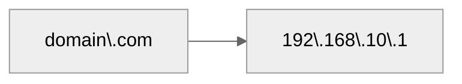
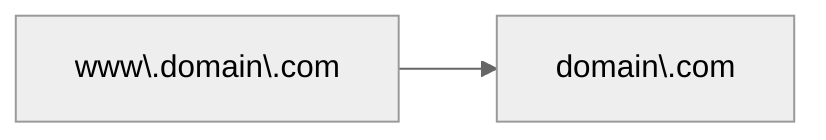

# DNS Records

## 1. DNS record types

### Common
| DNS Record Type | Description                                                                                                  | Mandatory Fields                                                                                                                 | Example                                                                                                               | Limitations/Usages                                                                                                     |
|-----------------|--------------------------------------------------------------------------------------------------------------|----------------------------------------------------------------------------------------------------------------------------------|-----------------------------------------------------------------------------------------------------------------------|-----------------------------------------------------------------------------------------------------------------------|
| **A**         | Maps a domain name to an IPv4 address.                                                                       | Domain name, Record Type (A), IPv4 address                                                                                        | `example.com. IN A 192.0.2.1`                                                                                           | Can have multiple A records for load balancing; typically one per subdomain.                                           |
| **AAAA**      | Maps a domain name to an IPv6 address.                                                                       | Domain name, Record Type (AAAA), IPv6 address                                                                                      | `example.com. IN AAAA 2001:db8::1`                                                                                      | Can have multiple AAAA records; similar usage to A records for IPv6.                                                  |
| **CNAME**     | Creates an alias from one domain name to another canonical domain name.                                      | Domain name, Record Type (CNAME), Canonical target domain                                                                            | `www.example.com. IN CNAME example.com.`                                                                              | Cannot coexist with other record types on the same name; only one CNAME record per alias.                             |
| **MX**        | Specifies mail exchange servers responsible for handling email for the domain.                               | Domain name, Record Type (MX), Priority, Mail server domain                                                                          | `example.com. IN MX 10 mail.example.com.`                                                                             | Multiple MX records allowed; lower priority values are preferred.                                                    |
| **NS**        | Lists the authoritative name servers for the domain.                                                         | Domain name, Record Type (NS), Name server domain                                                                                   | `example.com. IN NS ns1.example.com.`                                                                                 | Multiple NS records allowed for redundancy.                                                                         |
| **TXT**       | Holds arbitrary text data; commonly used for SPF records, domain verification, etc.                          | Domain name, Record Type (TXT), Text string                                                                                        | `example.com. IN TXT "v=spf1 include:_spf.example.com ~all"`                                                          | Multiple TXT records allowed; often used for various verification and policy purposes.                              |

## Rest
| DNS Record Type | Description                                                                                                  | Mandatory Fields                                                                                                                 | Example                                                                                                               | Limitations/Usages                                                                                                     |
|-----------------|--------------------------------------------------------------------------------------------------------------|----------------------------------------------------------------------------------------------------------------------------------|-----------------------------------------------------------------------------------------------------------------------|-----------------------------------------------------------------------------------------------------------------------|
| **SOA**       | Contains administrative information about the zone (primary name server, contact email, serial number, etc.).   | Domain name, Record Type (SOA), Primary name server, Responsible party email, Serial, Refresh, Retry, Expire, Minimum TTL           | `example.com. IN SOA ns1.example.com. hostmaster.example.com. 2021010101 7200 3600 1209600 3600`                        | Only one SOA record per zone; critical for zone configuration.                                                      |
| **PTR**       | Maps an IP address to a domain name (used for reverse DNS lookups).                                            | Reverse domain name, Record Type (PTR), Domain name                                                                                  | `1.2.0.192.in-addr.arpa. IN PTR example.com.`                                                                          | Used for reverse DNS; must correspond to a valid A or AAAA record in forward DNS.                                     |
| **SRV**       | Specifies the location (hostname and port) of servers for specific services.                                  | Service name, Protocol, Domain name, Record Type (SRV), Priority, Weight, Port, Target                                                 | `_sip._tcp.example.com. IN SRV 10 60 5060 sipserver.example.com.`                                                    | Multiple SRV records allowed; order and weight determine server selection.                                           |
| **SPF**       | Specifies authorized mail servers for the domain (historically its own type, now usually stored in TXT).         | Domain name, Record Type (SPF), SPF policy string                                                                                     | `example.com. IN SPF "v=spf1 include:_spf.example.com -all"`                                                          | Deprecated in favor of TXT records; only one SPF record is recommended if used.                                       |
| **CAA**       | Indicates which Certificate Authorities are permitted to issue SSL/TLS certificates for the domain.          | Domain name, Record Type (CAA), Flags, Tag, Value                                                                                    | `example.com. IN CAA 0 issue "letsencrypt.org"`                                                                       | Multiple CAA records allowed; each must have unique tag values.                                                       |
| **NAPTR**     | Enables dynamic service discovery (commonly used in VoIP and ENUM applications).                              | Domain name, Record Type (NAPTR), Order, Preference, Flags, Service, Regular Expression, Replacement                                    | `example.com. IN NAPTR 100 10 "U" "E2U+sip" "!^.*$!sip:info@example.com!" .`                                          | Multiple NAPTR records allowed; order and preference guide selection of services.                                   |
| **DNAME**     | Redirects an entire subtree of the domain name space to another domain.                                       | Domain name, Record Type (DNAME), Target domain                                                                                      | `alias.example.com. IN DNAME target.example.com.`                                                                     | Affects an entire subtree; cannot be combined with other records on the same label.                                   |
| **DNSKEY**    | Publishes a public key for DNSSEC, used to verify digital signatures.                                          | Domain name, Record Type (DNSKEY), Flags, Protocol, Algorithm, Public key                                                            | `example.com. IN DNSKEY 256 3 8 AwEAAagAIKlVZ...`                                                                     | Multiple DNSKEY records are common; used for validating DNSSEC signatures.                                            |
| **RRSIG**     | Contains cryptographic signatures for DNSSEC to ensure the authenticity of DNS records.                        | Domain name, Record Type (RRSIG), Type Covered, Algorithm, Labels, Original TTL, Signature Expiration, Signature Inception, Key Tag, Signer’s name, Signature | `example.com. IN RRSIG A 8 2 3600 20210101000000 20201201000000 12345 example.com. ABCDEFGHIJKLMNOP...`                 | One or more RRSIG records can exist per signed record set; tied to DNSSEC validation.                                  |
| **DS**        | Delegation Signer record linking a child zone to its parent zone in a DNSSEC-signed environment.                | Domain name, Record Type (DS), Key Tag, Algorithm, Digest Type, Digest                                                                | `example.com. IN DS 12345 8 2 49FD46E6C4B45C55D4AC...`                                                                 | Typically one DS record per delegation is used, though multiple may exist in certain configurations.                   |
| **NSEC**      | Provides proof of non-existence of a DNS record in a DNSSEC-signed zone (helps prevent zone enumeration).       | Domain name, Record Type (NSEC), Next Domain Name, Type Bit Maps                                                                      | `example.com. IN NSEC www.example.com. A MX RRSIG DNSKEY DS NSEC`                                                       | One NSEC record per owner name; reveals adjacent record types, which can be a security consideration.                  |
| **NSEC3**     | An improved (hashed) version of NSEC offering enhanced security against zone enumeration in DNSSEC.             | Domain name, Record Type (NSEC3), Flags, Algorithm, Iterations, Salt, Next Hashed Owner Name, Type Bit Maps                             | `example.com. IN NSEC3 1 0 10 AABBCCDD...`                                                                            | Only one NSEC3 record per owner name; provides hashed proofs to mitigate zone walking.                                 |

| Symbol | Name | Explanation | Extra | 
|--------| -----| ----------- | ------| 
|   **@**   | Apex | Represents the domain itself (e.g., domain.com)  | Often equivalent to leaving the name field blank in zone files

## 2. Nameservers

Typically 2 NS servers per domain.

- [Namecheap](https://www.namecheap.com/)
- [Godaddy](https://godaddy.com/)
- [DuckDNS](https://www.duckdns.org/)
- [Dynu](https://www.dynu.com/en-US/)
- [NoIP](https://noip.com/)
- [Cloudflare](https://www.cloudflare.com/)

## 3. DNS tools
- [Toolbox](https://mxtoolbox.com/)
- [DNSChecker](https://dnschecker.org/)

---

### A Record
| Name/Domain   |         IP        | 
|-------------- | ----------------- |
| domain.com    |  192.168.10.1     |

### MX Records
Points to your email hosting and typically 2 - 5 MX records exist.

| **Name/Domain**   | **Mail Server** * |  **Priority** |  **TTL**  |
|------------------ | -----------------| ------------- | ----------|
| domain.com        | aspmx.l.google.com   |   1 / 10 / 20  / 50 | 3600 | 

\* Different for each entry

### CNAME Records
Refer to an alias or redirect 
| Name          |  Destination      | 
|-------------- | ----------------- |
| www           | @                 |

### TXT Record
They allow administrators to attach textual information to a domain that external systems can read and validate. Usefull for:
- Domain Verification
- Email Security
- Custom Configurations

| Name          |  Content          | 
|-------------- | ----------------- |
| Anything      | Anything          |

