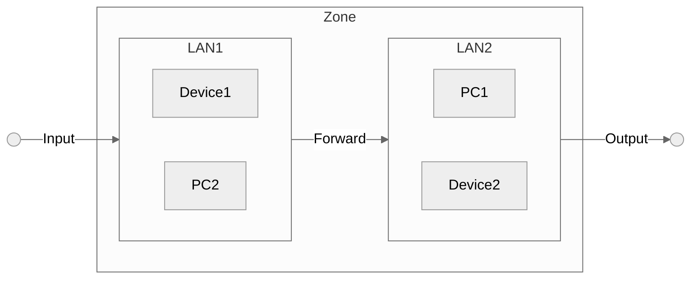

# Firewalls
Router firewalls are essential security components that monitor, filter, and control incoming and outgoing network traffic based on predetermined security rules. They protect networks by managing how data packets are handled, often sitting between a private network and the Internet.

## Zones
Zones are logical groupings of network interfaces or segments that share similar trust levels or security requirements.

## Chains
In many firewall systems (such as those using iptables on Linux), chains are ordered lists of rules that determine what happens to network packets. 

- **Input**: Outside-In
- **Output**: Inside-Out
- **Forward**: Inter Zone Traffic

## Behaviors (Policy Actions)
Firewall rules are typically designed to exhibit specific behaviors when processing packets:

For each chain we can specify behaviors like:
- **Accept**: Allow traffic
- **Reject**: Deny traffic
- **Drop**: Ignore/Do not handle traffic

## Masquerading (Network Address Translation - NAT)
Masquerading is a form of Network Address Translation (NAT) that allows multiple devices on a private network to access the Internet using a single public IP address. It works by:

- Hiding Internal Addresses: The router replaces the source IP address of outgoing packets with its own public IP.
- Maintaining a Mapping: The router keeps track of which internal device initiated the connection so that return traffic can be correctly forwarded back.

## MSS Clamping (Maximum Segment Size Clamping)
MSS Clamping is a technique used to adjust the Maximum Segment Size (MSS) of TCP packets. The MSS is the largest segment of data that can be received in a single TCP packet, and clamping it is useful in the following ways:

- Avoiding Fragmentation: By ensuring that TCP segments do not exceed the network’s Maximum Transmission Unit (MTU), clamping helps prevent packet fragmentation.
- Improving Connectivity: Particularly in VPNs or tunnels, where the effective MTU may be lower than standard Ethernet MTU, MSS clamping adjusts the MSS value on outbound TCP SYN packets. This helps ensure that packets will pass through the entire network path without requiring fragmentation.
