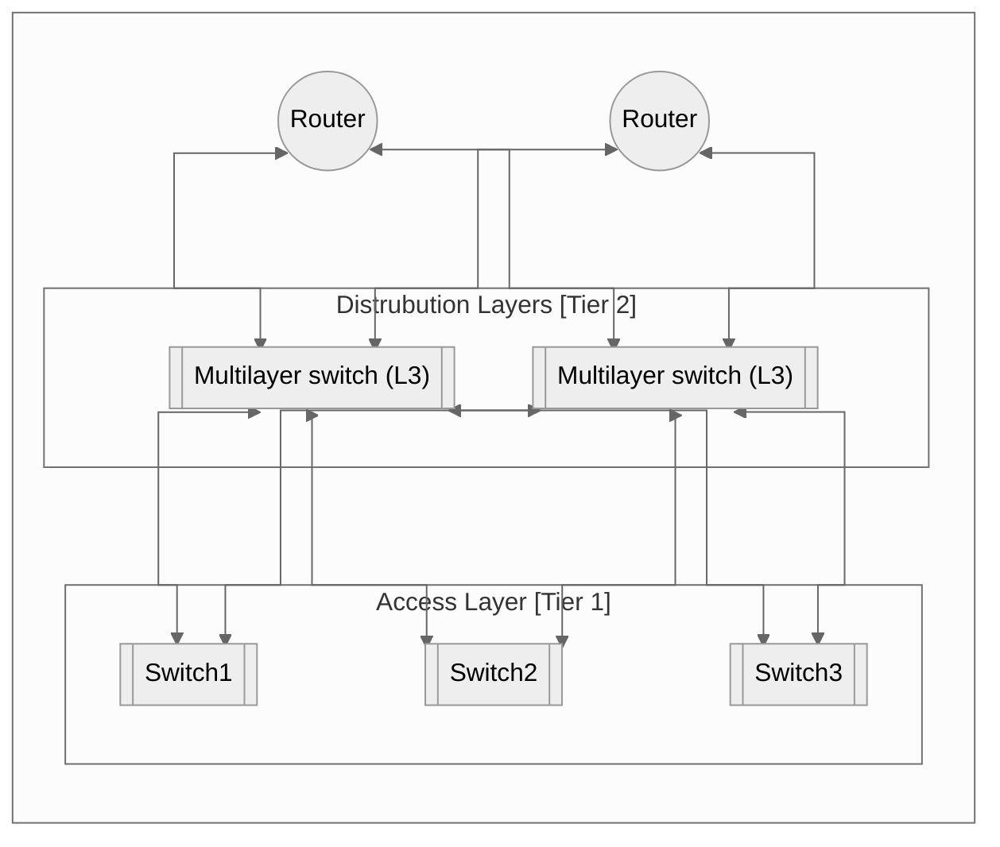

## 2 Tier Architecture - With redundancy

```mermaid
%%{ init: {'theme':'neutral', 'flowchart': { 'curve': 'stepAfter' } } }%%
flowchart LR

subgraph Network[" "]
    direction TB

    router1(("Router"))
    router2(("Router"))

    subgraph distrubution["Distrubution Layers [Tier 2]"]
        direction LR
        multilayer_switch1[["Multilayer switch (L3)"]]
        multilayer_switch2[["Multilayer switch (L3)"]]
    end
    
    subgraph access["Access Layer [Tier 1]"]
        direction LR
        switch1[["Switch1"]]
        switch2[["Switch2"]]
        switch3[["Switch3"]]
    end

    router1 <--> multilayer_switch1
    router1 <--> multilayer_switch2

    router2 <--> multilayer_switch1
    router2 <--> multilayer_switch2

    multilayer_switch1 <--> switch1
    multilayer_switch1 <--> switch2
    multilayer_switch1 <--> switch3

    multilayer_switch2 <--> switch1
    multilayer_switch2 <--> switch2
    multilayer_switch2 <--> switch3
end
```

\* The distribution layer is also referred to as the aggregation layer
