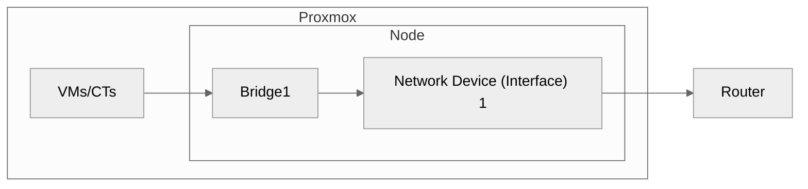

# Proxmox - Networking




> [!TIP]
> As a best practice:
> Separate **Management** (Web UI) network from **VM** network for better security and performance.
>
> ```mermaid
> %%{init: {'theme':'neutral'}}%%
> graph LR
> 
> subgraph Proxmox
>     direction LR
>     VMs/CTs --> Bridge1
>     web["Web UI"] --> Bridge2
> 
>     subgraph Node
>         Bridge1 --> netdev1["Network Device (Interface) 1"]
>         Bridge2 --> netdev2["Network Device (Interface) 2"]
>     end
> end
> 
> netdev1 --> Router
> netdev2 --> Router
> ```

---

## Settings
Network is available in the following levels:

- **Node**: Select Node > `System` > `Network`
- **VM**: Select VM > `Hardware` > `Network Device`
- **CT**: Select CT > `Network`

---

## Create 'External' bridge
This can be used as an example to create separate networks for management and VMs.

1. Node > `System` > `Network`
2. `Create` > `Linux Bridge`
3. Give name
4. `IPv4/CIDR`: Give your net info (e.g. 192.168.0.0/24)
5. `Bridge port`: Give the Network Device you want to use
6. Add comment
7. `Create`
8. `Apply Configuration`
9.  Now you can add this bridge to a VM

> [!IMPORTANT]
> With Proxmox we only need **one** Gateway, so, it is not problem that
> this new bridge will not have a Gateway

---

## Create 'Internal' bridge
This could be used as an example to connect VMs together.
1. Node > `System` > `Network`
2. `Create` > `Linux Bridge`
3. Give name
4. Add comment
5. Do not give anything else if not needed
6. `Create`
7. `Apply Configuration`
8. Now you can add this bridge to a VM

---

## Bonds
These can be used for either failovers or link aggregation

### Failover
1. `Create: Linux Bond`
2. Give a name
3. `Slaves`: give as comma separated the interfaces
4. `Mode`: `active-backup`
5. `bond-primary`: give the primary interface name
6. Assign the bond to the desired bridge
7. `Apply Configuration`

To verify: Node > `Shell` and run `cat /proc/net/bonding/<bond-name>`