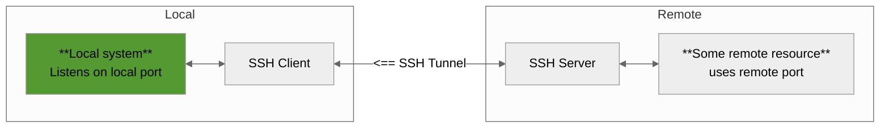
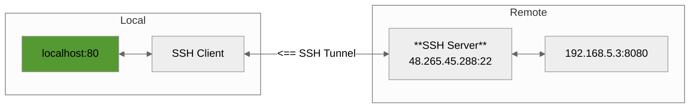
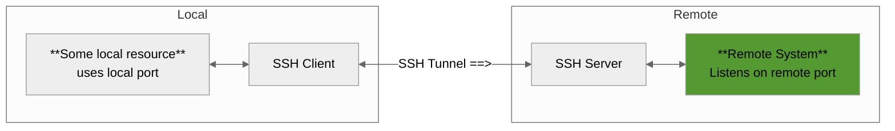
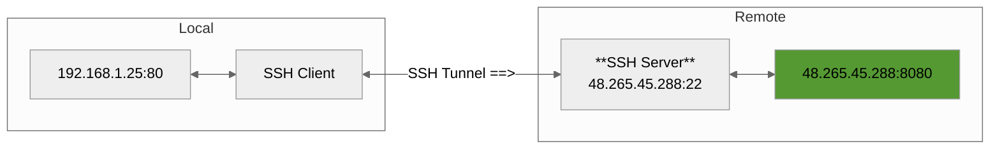

# SSH Tunneling

## 1. Local Port Forwarding 
Forward a port from the remote machine to your local machine.

Access remote resources (like http server), that for some reason you do not have access (maybe due to firewall rules, etc.) from a remote location to your machine.

```bash
ssh -L [local_ip-or-domain:]<local_port>:<remote_host-ip-or-domain>:<remote_port> -N <user>@<hostname/ip>
```

\* Use -N if you don’t need a shell session
\* [local_ip-or-domain:] is optional when the local machine is the same as the ssh client.



**Example**

```
ssh -L 80:192.168.5.3:8080 -N user@48.265.45.288
```



**Verify**
```
curl http://localhost:80
```

## 2. Remote Port Forwarding
Forward a port from your local machine to a remote machine.

Exactly the reverse logic as Local port forwarding.

```bash
ssh -R [remote_ip-or-domain:]<remote_port>:<local_host-ip-or-domain>:<local_port> -N <user>@<hostname/ip>
``` 

\* Use -N if you don’t need a shell session
\* [remote_ip-or-domain:] is optional when the remote machine is the same as the one we ssh to.



**Example**

```
ssh -R 8080:192.168.1.25:80 user@48.265.45.288
```



## 3. Dynamic Forwarding

Create an SSH SOCKS proxy for dynamic port forwarding

```bash
ssh -D <local_port> <user>@<hostname>
```